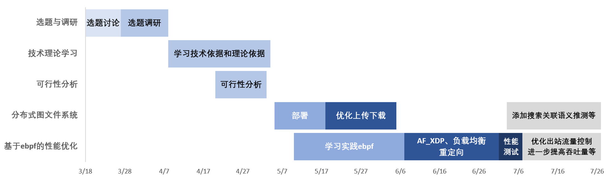

# 基于eBPF和DisGraFS的分布式文件系统网络IO优化

## 🐝小组名称：FutureWithinBuzzyBees

勤劳的小蜜蜂创造未来~🐝

## :champagne:小组成员

- PB21111706 常文正
- PB21111707 赵浩怡
- PB21111682 龚劲铭
- PB21061373 刘兆宸
- PB21111725 于硕

## :calendar:项目进度

| 时间 | 主题           | 内容                                                         | 备注         |
| ---- | -------------- | ------------------------------------------------------------ | ------------ |
| 3.18 | 初步选题       | 广泛地讨论了一些可能的选题方向并排除了一些，确定了几个大方向。 |              |
| 3.26 | 具体选题       | 在确定的几个大方向中跟老师交流意见最终确定项目具体选题       | 老师参与讨论 |
| 4.3  | 选题调研       | 在确定了具体选题的基础上，围绕选题进行相关项目的调查和文档的阅读，完成了调研报告初步的汇总 |              |
| 4.8  | 调研文档       | 讨论每个人的调研结果，修改完善了主题调研报告，并就未来可行性分析的报告进行了分工讨论 |              |
| 4.13 | 技术理论方向   | 小组讨论了项目相关的理论依据和技术依据，通过一些目前的技术确定了项目实现的路线雏形，并就雏形展开进一步调研 |              |
| 4.16 | 文件系统IO讨论 | 讨论文件IO的具体实现方向、进行可行性分析报告的小组分工，继续进行相关项目和论文的查阅调研 |              |
| 4.20 | 可行性分析讨论 | 讨论了可能的理论依据和技术依据，确定了较为准确的技术路线，开启了可行性分析的文档资料整理工作 |              |
| 4.22 | 可行性分析汇总 | 可行性分析讨论、文献资料汇总，进一步探讨技术路线和理论技术依据。 |              |
| 4.27 | 中期报告讨论   | 讨论中期报告分工事宜。                                       |              |
| 5.4  | 中期报告汇总   | 分享各自项目进度，汇总中期报告。                             |              |
| 5.11 | 例行会议       | 讨论关于老师对中期报告的反馈结果，并对接下来一周的工作进行了分工：初步部署DFS（DisGraFS）与找到DFS中hook的位置。 |              |
| 5.14 | 例行会议       | 讨论DisGraFS部署情况和eBPF优化路线                           |              |
| 5.17 | 例行会议       | 组员部署DisGraFS，讨论接下来一周的计划                       |              |
| 5.21 | 例行会议       | 与老师沟通了项目进一步的路线，讨论了可能的工作目标和工作方向，同时跟老师交流分享了目前的项目进度，得到老师提出的一些建议与指导 | 老师参与讨论 |
| 5.25 | 例行会议       | 根据老师指导意见明确项目下一步进展，决定将DisGraFS优化摆脱对客户端的重度依赖，同时将优化目标放在DisGraFS的Mainserver的文件发送与读取，重新修改和布置已经过时的tag_server相关API |              |
| 6.1  | 例行会议       | 完善了DisGraFS的Mainserver的文件下载与上传机制，讨论eBPF优化思路 |             |
| 6.4  | 例行会议       | 讨论eBPF具体到XDP的实现思路，讨论lab4分工                    |              |
| 6.8  | 例行会议       | 解决lab4, 讨论XDP各种思路的可行性，对考试周的到来进行时间规划                      |              |
| 6.11 | 例行会议       | 将下载文件的优化思路聚焦到AF_XDP技术，上传文件的优化思路聚焦到数据压缩和并行传输，同时配以XDP负载均衡、多端口接收等技术 |              |
| 6.14 | 考前总结  | 期末考前最后一次例会，讨论了考前的准备工作，以及考后的项目进展 |              |
| 6.15～7.3 | 考试周  | 期末考试，考试结束后讨论了考试的情况，以及接下来的项目进展 |              |
| 7.3 | 考后总结 | 期末考试后的第一次例会，讨论了项目进展与结题汇报的分工，在最后一周准备项目的收尾工作 |              |
|7.9| 结题汇报 | 项目结题汇报 | TO BE DONE |

## :soon:项目选题初步讨论结果

小组讨论了往届项目选题和目前顶会涉及到的部分选题，通过排除了一些不感兴趣、难度过大的选题，最后初步确定以下几个方向
1. 基于eBPF内核做xx系统/模块的优化
2. 基于FastDFS/Ceph做分布式文件存储系统的优化/拓展
3. 利用Ray提高分布式文件索引/计算的速度
4. 利用Rust改写/移植已有开源OS

### 经过项目调研后确定具体方向：

经过多个方面的项目调研，小组将注意力主要集中在eBPF和DFS上，并由此确定了多个选题：

- 利用eBPF实现动态追踪Linux系统调用和性能分析

- 利用eBPF实现基于角色的访问控制和审计系统

- 利用eBPF实现高效的网络负载均衡和流量监控

- 利用eBPF实现可编程的网络协议栈和虚拟化

- 利用eBPF实现一个高性能的存储数据路径

**与DFS的结合：**

- 利用eBPF实现分布式文件系统的性能监控和优化
- 利用eBPF提高分布式文件系统中程序的性能和可靠性
- ......

## :telescope:项目选题最终讨论结果

集中讨论了经过调研后的几个方向，结合老师的意见，小组最终确定项目选题为

==基于eBPF的高性能分布式文件系统存储访问优化==

## :computer:项目概述

我们的项目选题是基于eBPF的高性能分布式文件系统存储访问优化，目的是利用eBPF技术提高分布式文件系统的IO性能，减少用户态与内核态之间的数据拷贝次数。

我们的项目基于往届已有的分布式图文件系统DisGraFS展开，参考了2022年OSH的TOBEDONE小组和WowKiddy小组对DisGraFS进行的优化方案，结合我们自己的创新思路，旨在设计并实现一个基于eBPF的分布式文件系统存储访问优化方案。

>  项目调研报告见[research](./docs/research.md)

## :man_technologist:技术理论依据

> 详情请见可行性分析[feasibility](./docs/feasibility.md)

传统的分布式文件系统通常采用客户端-服务器模式，每个客户端与服务器之间需要频繁进行 IO 操作，包括读取和写入数据。然而，由于数据需要在用户态和内核态之间频繁地进行数据拷贝，传统的 IO 处理方式很难满足大规模数据存储和处理的需求。因此，如何提高分布式文件系统的 IO 性能成为了亟待解决的问题。

> eBPF 技术在解决 IO 性能问题方面具有独特的优势。eBPF 技术可以将一些 IO 操作从内核态移动到用户态，避免了数据在内核态和用户态之间频繁地进行数据拷贝，从而可以大大提高 IO 性能。此外，eBPF 还便于对 IO 操作进行监控和控制，提高系统的可靠性和安全性。

### XDP

使用XDP可以实现高效的数据存储与传输。具体实现步骤如下：

1. 创建一个eBPF程序，该程序需要做以下工作：
   - 分配共享内存区域，该区域用于存储数据。
   - 从网络中读取数据包，将数据包拷贝到共享内存区域中。。
   - 在eBPF程序中实现XDP，将数据包从网卡传输到共享内存区域中。
2. 对于接收到的数据包，可以使用XDP程序直接将数据包拷贝到共享内存区域中，避免了数据拷贝过程中的性能损失。

通过结合XDP技术，可以实现高效的数据存储与传输，降低数据传输过程中的性能损失，提高系统的整体性能，创新之处在于：

1. 使用XDP技术减少数据包处理的延迟和CPU占用率：XDP技术是一种高性能网络数据包处理技术，可以在网络驱动程序接收数据包时，使用eBPF程序来处理数据包，从而减少数据包处理的延迟和CPU占用率。通过结合XDP和eBPF技术，可以进一步提高系统的性能。

2. 使用 eBPF 技术的数据处理方案：它结合 XDP 技术，实现了零拷贝和高性能的数据传输。由于 eBPF 技术的优秀性能和灵活性，这种方案可以实现更加细粒度的数据控制和管理，从而进一步提高系统的性能和安全性。

### SM(Shared Memory)

1. 灵活性：eBPF和XDP技术允许用户自定义网络应用程序的逻辑，可以根据需要进行灵活的共享内存设计和实现，适应不同的场景和需求。

2. 安全性：eBPF和XDP技术具有良好的安全性，可以防止恶意应用程序对共享内存的非法访问和操作，保护系统的稳定性和安全性。

3. 可扩展性：eBPF和XDP技术可以方便地扩展和升级，可以根据需要进行新功能的添加和旧功能的替换，保持技术的前沿性和竞争力。

## 进展甘特图

## 总结和展望

本项目部署了分布式图文件系统DisgraFS，在功能方面和IO方面分别进行了优化.功能方面,摆脱对客户端的依赖,更新打标API,完善打标类型.

IO方面：使用http_filter、CPU‘s balance、socket_redirect、AF_XDP并进行了相应的性能监测

展望：我们希望继续完善该项目，如为客户端搜索添加相关语义推测、基于tc_bpf完善对出站流量的控制等，进一步提高其IO性能与泛用性.

