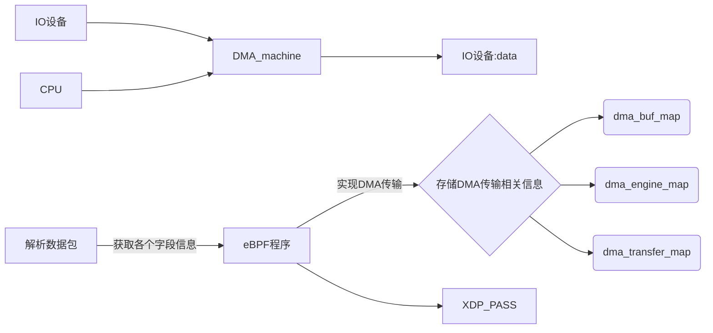

## 技术依据

### 1.分布式文件操作系统

### 2.使用eBPF与XDP技术实现一个兼备DMA能力的内核

#### 使用eBPF实现DMA

在Linux系统中，DMA可以通过eBPF实现，copilot帮我写了一段代码：

```c
#include <linux/bpf.h>
#include <linux/if_ether.h>
#include <linux/if_packet.h>
#include <linux/ip.h>
#include <linux/in.h>
#include <linux/tcp.h>

#define DMA_BUF_SIZE 4096

struct dma_buf {
    unsigned long phys_addr;
    unsigned int size;
};

struct dma_engine {
    unsigned int id;
    unsigned int status;
};

struct dma_transfer {
    unsigned int id;
    unsigned int status;
    unsigned int result;
    unsigned int error;
    unsigned int complete;
    unsigned int timeout;
    unsigned int cancel;
    unsigned int pause;
    unsigned int resume;
};

struct bpf_map_def SEC("maps") dma_buf_map = {
    .type = BPF_MAP_TYPE_ARRAY,
    .key_size = sizeof(unsigned int),
    .value_size = sizeof(struct dma_buf),
    .max_entries = 1024,
};

struct bpf_map_def SEC("maps") dma_engine_map = {
    .type = BPF_MAP_TYPE_ARRAY,
    .key_size = sizeof(unsigned int),
    .value_size = sizeof(struct dma_engine),
    .max_entries = 1024,
};

struct bpf_map_def SEC("maps") dma_transfer_map = {
    .type = BPF_MAP_TYPE_ARRAY,
    .key_size = sizeof(unsigned int),
    .value_size = sizeof(struct dma_transfer),
    .max_entries = 1024,
};

SEC("xdp")
int xdp_prog(struct xdp_md *ctx)
{
    void *data_end = (void *)(long)ctx->data_end;
    void *data = (void *)(long)ctx->data;

    struct ethhdr *eth = data;
    if (eth + 1 > (struct ethhdr *)data_end) {
        return XDP_DROP;
    }

    struct iphdr *ip = data + sizeof(struct ethhdr);
    if (ip + 1 > (struct iphdr *)data_end) {
        return XDP_DROP;
    }

    struct tcphdr *tcp = data + sizeof(struct ethhdr) + sizeof(struct iphdr);
    if (tcp + 1 > (struct tcphdr *)data_end) {
        return XDP_DROP;
    }

    // TODO: Implement DMA transfer using eBPF

    return XDP_PASS;
}

```

这段示例代码包含了一个名为dma_buf_map的eBPF映射，用于存储DMA缓冲区的物理地址和大小；一个名为dma_engine_map的eBPF映射，用于存储DMA引擎的状态；一个名为dma_transfer_map的eBPF映射，用于存储DMA传输的状态、结果、错误等信息。

在xdp_prog函数中，可以实现DMA传输的代码。具体实现方式取决于所使用的DMA引擎和设备

- dma_buf_map映射：用于存储DMA缓冲区的物理地址和大小。在这个映射中，每个键对应一个DMA缓冲区的ID，每个值是一个struct dma_buf结构体，包含了DMA缓冲区的物理地址和大小。通过这个映射，可以在eBPF程序中方便地访问和管理DMA缓冲区。

- dma_engine_map映射：用于存储DMA引擎的状态。在这个映射中，每个键对应一个DMA引擎的ID，每个值是一个struct dma_engine结构体，包含了DMA引擎的状态。通过这个映射，可以在eBPF程序中方便地访问和管理DMA引擎的状态。

- dma_transfer_map映射：用于存储DMA传输的状态、结果、错误等信息。在这个映射中，每个键对应一个DMA传输的ID，每个值是一个struct dma_transfer结构体，包含了DMA传输的状态、结果、错误等信息。通过这个映射，可以在eBPF程序中方便地访问和管理DMA传输的相关信息，例如传输是否完成、是否出现错误等。

### 3.使用Prometheus+Grafana进行性能监控与测试

"分布式监控是部署在分布式系统内的监控组件，它可以监视和显示集群中各节点的状态信息，它有运行在各个节点的进程，可以采集不同节点之间的通信消息，采集各个节点的资源利用率，最后将采集到的数据汇总到一个数据库，进行分析处理后以直观的图形化界面进行呈现。

- Prometheus

Prometheus 是一个开源系统监控和警报工具包，它将实时的指标数据（metrics）记录并存储在通过 Http 拉取模型构建的时间序列数据库中，有着较灵活的询问功能和实时告警功能。

- Grafana

Grafana 是一个跨平台的开源的度量分析和可视化工具，可以通过将采集的数据查询然后可视化的展示，并及时通知。
