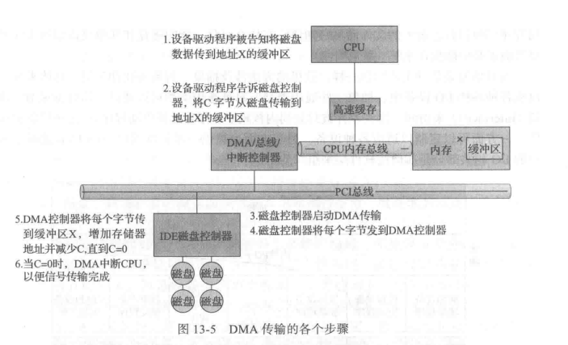

## 工作流程：

1. 挂载文件系统后，文件系统驱动程序向用户空间发送请求，用户空间查找对应标志检查是否支持该框架，如果支持则将eBPF程序加载到内核中（通过bpf_load_prog系统调用实现）。如果eBPF验证器检查扩展完整性失败，则使用普通的文件系统的功能，成功则启动JIT编译器处理扩展生成字节码。这里驱动程序本身不执行任何IO操作，也不自己处理请求。
2. 扩展安装在bpf_prog_type映射中，调用跳转需要文件系统驱动程序执行bpf_tail_call，同时一旦eBPF程序加载完毕，进程需要通知驱动程序内核扩展的信息
3. 文件系统接到eBPF加载完毕的通知，就可以开始执行在eBPF虚拟机环境下运行的扩展，文件IO可通过优化过的快速路径进行。

## 实现细节：

为文件系统提供eBPF支持，具体来说即借助eBPF添加额外的内核辅助函数，设计新的映射类型，以支持用户空间和内核的通信和高效IO。而这里同时也要修改文件系统驱动程序，使其首先调用eBPF扩展，在加载eBPF程序后，我们可以绕过用户空间守护程序，直接向下层文件系统传递IO请求。

## 理论依据

### IO性能:

（摘自教材）

I/O性能直接影响系统性能，但传统IO效率很低，导致IO效率的原因有：

1. 从CPU角度考虑：对于CPU执行设备驱动程序代码和随着进程阻塞和解除阻塞而公平并高效地调度，它增加了很大的负荷。由此导致的上下文切换增加了CPU及其硬件缓存的负担。

2. 从内存总线角度考虑：I/O也暴露了内核的中断处理机制的低效。此外，对于控制器和物理内存之间的数据复制，以及应用程序数据空间和内核缓存之间的数据复制，I/O加重了内存总线的负荷。
   虽然中断的效率要高于轮询，但每个中断导致系统执行状态改变，执行中断处理，再恢复状态，导致完整的上下文切换开销。

3. 网络流量也能导致高的上下文切换速率。

   例如，考虑从一台机器远程登录到另一台机器。在本地机器上输入的字符必须传到远程机器。在本地机器上，输入字符引起键盘中断;字符通过中断处理程序传到设备驱动程序，到内核，再到用户进程。用户进程执行一个网络IO系统调用，以将该字符送到远程机器。该字符流入本地内核，通过网络层来构造网络分组，再到网络设备驱动程序。网络设备驱动程序传输分组到网络控制器，以便发送字符并生成中断。中断通过内核传递回来，以便导致网络I/O系统调用完成。
   这时，远程系统的网络硬件收到数据包，并生成中断。通过网络协议解包得到字符，并传到适当的网络守护进程。网络守护进程确定与哪个远程登录会话有关，并传递数据包到适当的会话子进程。在整个流程中，有上下文切换和状态切换(图13-15)。通常，接收者会将该字符送回给发送者;这种方式会使工作量加倍。

### DMA:

#### 使用DMA的目的: 

减轻CPU负担

具体来说，对于执行大量传输的设备，例如磁盘驱动器，如果通过CPU来观察状态位并且按字节来发送数据到控制器寄存器（称为程序控制I/O ( Programmed I/O，PIO))，则似乎浪费了。许多计算机为了避免因PIO而增加CPU负担，将一部分任务交给一个专用的处理器DMA控制器。

#### DMA传输过程：

在启动DMA传输时,主机将DMA命令块写到内存。该块包含传输来源地址的指针、传输目标地址的指针、传输的字节数。CPU将这个命令块的地址写到DMA控制器，然后继续其他工作。DMA控制器继续直接操作内存总线，将地址放到总线，在没有主CPU的帮助的情况下执行传输。
DMA控制器与设备控制器之间的握手，通过一对称为DMA请求( DMA-request)和DMA确认（DMA-acknowledge)的线路来进行。当有数据需要传输时，设备控制器发送信号到 DMA请求线路。这个信号使得DMA 控制器占用内存总线，发送所需地址到内存地址总线，并发送信号到DMA确认线路。当设备控制器收到DMA 确认信号时，它就传输数据到内存,并且清除 DMA请求信号。
当完成整个传输时，DMA 控制器中断CPU。图13-5描述了这个过程。当DMA控制器占用内存总线时，CPU被暂时阻止访问内存，但是仍然可以访问主缓存或辅助缓存内的数据项。

为了改善I/O效率，可以采用多种方法:

1. 减少上下文切换的次数。
2. 减少设备和应用程序之间传递数据时的内存数据的拷贝次数。
3. 通过大传输、智能控制器、轮询（如果忙等可以最小化)，减少中断频率。
4. 通过DMA智能控制器和通道来为主CPU承担简单数据复制，增加并发。
5. 将处理原语移到硬件，允许控制器操作与CPU和总线操作并发。
6. 平衡CPU、内存子系统、总线和I/O 的性能，因为任何一处的过载都会引起其他部分的空闲。

在本项目中，主要通过DMA减少上下文切换和减少内存拷贝次数