# 可行性分析

- [可行性分析](#可行性分析)
  - [理论依据](#理论依据)
    - [分布式文件系统特性及选型](#分布式文件系统特性及选型)
    - [linux存储及缓存结构](#linux存储及缓存结构)
    - [linux内核中的IO读写方式](#linux内核中的io读写方式)
    - [Page Cache](#page-cache)
    - [linux中的网络协议栈](#linux中的网络协议栈)
    - [用户态与内核态之间的上下文切换](#用户态与内核态之间的上下文切换)
    - [eBPF的kernel-bypass特性](#ebpf的kernel-bypass特性)
    - [IO性能:](#io性能)
      - [使用DMA的目的:](#使用dma的目的)
      - [DMA传输过程：](#dma传输过程)
  - [技术依据](#技术依据)
    - [分布式图文件系统（DisGraFS)：](#分布式图文件系统disgrafs)
      - [图数据库](#图数据库)
      - [DisGraFS](#disgrafs)
        - [基本概念](#基本概念)
        - [整体架构](#整体架构)
        - [结构](#结构)
    - [eBPF](#ebpf)
      - [BPF Map实现内核态和用户态之间的通信](#bpf-map实现内核态和用户态之间的通信)
        - [**eBPF提供的映射数据结构类型**](#ebpf提供的映射数据结构类型)
        - [操作](#操作)
    - [DMA技术](#dma技术)
      - [传统I/O数据传输过程：](#传统io数据传输过程)
    - [DPDK技术（流行kernel-bypass技术方案）](#dpdk技术流行kernel-bypass技术方案)
    - [XDP技术（以BPF为核心）](#xdp技术以bpf为核心)
      - [优点](#优点)
      - [使用](#使用)
    - [共享内存（Shared Memory）](#共享内存shared-memory)
      - [基本原理](#基本原理)
      - [优缺点：](#优缺点)
        - [优点：](#优点-1)
        - [缺点：](#缺点)
      - [应用场景：](#应用场景)
    - [zIO技术](#zio技术)
      - [零拷贝技术](#零拷贝技术)
      - [不同实现方式对比](#不同实现方式对比)
      - [eBPF在零拷贝中的应用前景](#ebpf在零拷贝中的应用前景)
    - [Docker](#docker)
      - [实现原理](#实现原理)
      - [特点](#特点)
      - [容器 *vs* 虚拟机](#容器-vs-虚拟机)
      - [Docker的工作原理](#docker的工作原理)
      - [Docker的使用](#docker的使用)
  - [创新点](#创新点)
    - [DMA+XDP](#dmaxdp)
    - [SM(Shared Memory)](#smshared-memory)
  - [概要设计](#概要设计)
    - [DisGraFS的部署](#disgrafs的部署)
    - [技术路线的选择](#技术路线的选择)
      - [**1.共享内存**](#1共享内存)
      - [**2.kernel-bypass**](#2kernel-bypass)
      - [**3.DMA**](#3dma)
        - [DMA 参与下的数据拷贝——通过eBPF优化](#dma-参与下的数据拷贝通过ebpf优化)
    - [eBPF程序的编写与装载](#ebpf程序的编写与装载)
    - [IO性能优化效果检测](#io性能优化效果检测)
      - [Prometheus](#prometheus)
      - [Grafana](#grafana)
      - [IOstat](#iostat)
      - [其他选择工具](#其他选择工具)
  - [参考文献](#参考文献)


## 理论依据

### 分布式文件系统特性及选型

分布式文件系统（Distributed File System）管理的物理存储资源不直接连接在本地节点上，而是通过计算机网络与离散分布的不同节点相连。分布式文件系统的设计同样基于Client/Server模式：一个典型的网络可以包括多个供用户访问的服务器，也允许存在同时扮演客户机和服务器的双重角色，用户可以公开一个允许其他客户机访问的公共目录，而且访问这个目录对其他客户机来说就像使用本地驱动器一样方便。

1. 分布式文件系统的基本架构

- 存储组件：根据存储的数据类型可分为对象存储、块存储和文件存储三类，数据分配方式有哈希一致性分布（键值对）、顺序分布（有序切分）、自动均衡分布等。分布式文件系统的存储组件架构方式与数据量的大小、读写速度、维护难度息息相关。

| 存储方式 |                             特点                             |                      优点                       |                 缺点                 |             应用场景             |
| :------: | :----------------------------------------------------------: | :---------------------------------------------: | :----------------------------------: | :------------------------------: |
|  块存储  |            直接将裸磁盘空间整个映射给操作系统使用            | 通过RAID与LVM等手段对数据提供了保护；读写效率高 |  不利于不同操作系统主机间的数据共享  |      主机或数据库的磁盘阵列      |
| 文件存储 | 软硬一体化，只要有匹配的操作系统与软件就可以对外提供FTP与NFS服务 |    对软硬件要求低；方便文件共享；不需要专网     |             读写效率下降             | 一般用于FTP、NFS类服务器共享数据 |
| 对象存储 | 有自己的CPU、内存、网络和磁盘，比块存储和文件存储更上层，一般由云服务商提供REST API服务 |  具备块存储的高速读写以及文件存储的可共享特性   | 比块存储读写性能差，比文件存储成本高 |   内置大容量硬盘的分布式服务器   |

- 管理组件：主要负责元数据的存储及对存储组件的管理调度，有“中心化”和“去中心化”两种技术路线，目前为了维护方便，主流技术为前者，即管理组件定为一个节点集群中的总控节点。通过总控节点调度可以实现负载均衡（工作节点通过定时发送心跳包将节点负载相关的信息发送给主控节点，主控节点计算出工作节点的负载以及需要迁移的数据，生成迁移任务放入迁移队列中等待执行）。

- 接口组件：负责提供接口服务给应用使用，与数据传输协议（tcp/udp）相关联，形态主要包括 SDK、REST、CLI 命令行终端、FUSE 挂载机制等。

2. 分布式文件系统的性能要求

- 数据持久性
- 数据一致性
- 数据安全性：在多租户场景下对用户私人重要数据有完备的权限保护机制。
- 节点高可用性：总控节点能通过心跳包等机制及时检测单机故障，并通过备份复制、日志记录、纠删码等机制对数据进行恢复。
- 节点可伸缩性：在数据量大幅度增加时能实现新增节点及节点扩容，并进行新的节点负载均衡操作。
- 读写缓存一致性

3. 当前主流分布式文件系统选型对比

| 文件系统  |   数据存储   | 开发语言 |             集群节点通讯协议             | FUSE挂载 | POSIX兼容（是否可像本地文件系统一样使用） |                             特性                             |                         易用性                          |                             缺点                             |
| :-------: | :----------: | :------: | :--------------------------------------: | :------: | :---------------------------------------: | :----------------------------------------------------------: | :-----------------------------------------------------: | :----------------------------------------------------------: |
|   HDFS    |     文件     |   Java   |                   TCP                    |   支持   |                  不支持                   |  支持大数据批量读写，吞吐量高；一次写入，多次读取，顺序读写  |                安装简单，官方文档专业化                 | 难以满足毫秒级别的低延时数据访问；不支持多用户并发写相同文件；不适用于大量小文件 |
|   Ceph    | 对象/文件/块 |    C     |                   TCP                    |   支持   |                   支持                    |                     分布式，没有单点依赖                     |                安装简单，官方文档专业化                 |                         不够成熟稳定                         |
|  MooseFS  |      块      |    C     |                   TCP                    |   支持   |                   支持                    |                          比较轻量级                          | 安装简单，官方文档多，且提供Web界面的方式进行管理与监控 |                     对主服务器有单点依赖                     |
| GlusterFS |   文件/块    |    C     |                 TCP/RDAM                 |   支持   |                   支持                    |       无元数据服务器，堆栈式架构，具有线性横向扩展能力       |                安装简单，官方文档专业化                 | 客户端节点负载增加，遍历文件目录时较为复杂和低效，不建议使用较深路径 |
|  FastDFS  |   文件/块    |    C     |                   TCP                    |  不支持  |                  不支持                   | 系统无需支持POSIX，降低了系统的复杂度，处理效率更高；实现了软RAID，增强系统的并发处理能力及数据容错恢复能力；支持主从文件，支持自定义扩展名；主备Tracker服务，增强系统的可用性 |               安装简单，国内社区相对活跃                | 不支持断点续传，不适合大文件存储；不支持POSIX，通用性较低；对跨公网的文件同步，存在较大延迟，需要应用做相应的容错策略；同步机制不支持文件正确性校验；通过API下载，存在单点的性能瓶颈 |
| MogileFS  |     文件     |   Perl   |                   TCP                    |  不支持  |                  不支持                   |          键值对型元文件系统；效率相比MooseFS高很多           |                            -                            |                              -                               |
|  JuiceFS  | 对象+数据库  |    Go    | TCP+S3网关、元数据引擎Redis/SQL 类/TKV类 |   支持   |                   支持                    | 完整兼容 HDFS API，可节点存算分离；适用于k8s等云原生环境；支持多端共享和内核页缓存 |           上手简单，官方文档专业化，社区活跃            |     对读有较大优化，对写则和原生的对象存储写差距不会太大     |

### linux存储及缓存结构


目前受限于存储设备的存取速率和硬件成本，现代计算机的存储结构呈现为金字塔型。越往塔顶，存取效率越高、但成本也越高，所以容量也就越小。上层一般作为下层的Cache层来使用。


用户态程序中可以使用许多跨平台封装好的文件操作函数，为了减少这些函数调用带来的系统调用成本，用户态具有自己的缓冲实现，若用户代码以较小规模不断的读或写文件的话，通过buffer对读写操作进行高度聚合是可以提高程序运行效率的。但是用户态缓冲区的存在并不总是带来效率的提高，当数据高频地在用户态和内核态之间进行传输时，用户态缓冲区作为必经之路的话会明显降低IO效率。此外，系统调用的read/write和真实存储设备之间也存在一层buffer，即Kernel buffer cache。

在Linux下，文件的缓存习惯性称为Page Cache（内核页缓存），这与更低一级的设备内部缓存（Buffer Cache）相区别。 Page Cache和文件系统比较相关，文件系统负责将文件内容映射到实际的物理磁盘；Buffer Cache用于缓存存储设备块（比如磁盘扇区）的数据，而不关心是否有文件系统的存在（文件系统的元数据就缓存在Buffer Cache中）。

### linux内核中的IO读写方式


由图可见，从系统调用的接口再往下，Linux下的IO栈致大致有三个层次：

- 文件系统层：内核拷贝系统调用参数指定的用户态数据到文件系统page cache中，并适时向下层同步
- 块层：管理块设备的IO队列，对IO请求进行合并、排序（与IO调度算法有关）
- 设备层：通过DMA与内存直接交互，完成数据和具体设备之间的交互

**write(socket_fd, tmp_buf, len);**
传统写：用户程序进行系统调用后，参数等数据需经过用户态和内核态两个缓冲区，由CPU和DMA控制器各拷贝一次，才可与底层设备进行交互，在发起系统调用时和系统调用返回时，各有一次上下文切换；
**read(file_fd, tmp_buf, len);**
传统读：用户程序进行系统调用后，若这块数据已经存在于用户进程的页内存中，就直接从中读取数据至用户态缓冲区，如果数据不存在，则需先将数据从磁盘加载到内核空间的读缓存中，再拷贝到用户进程的页内存中，期间也会触发 2 次上下文切换，1 次 DMA 拷贝和 1 次 CPU 拷贝。

### Page Cache


Page Cache 的本质是由 Linux 内核管理的内存区域。若数据曾经被访问过且被加载到page cache中，则下一次访问时无需通过磁盘I/O，直接命中内存缓存即可，可提高数据访问速度；Page cache还有预读能力，基于程序的局部性原理，通过一次I/O 将多页装入 Page Cache，能够减少磁盘 I/O 次数， 进而提高系统磁盘 I/O 吞吐量。但page cache也有其劣势，最直接的缺点是需要占用额外物理内存空间，在物理内存空间紧张时可能会导致频繁的 swap 操作，反而导致系统的磁盘 I/O 负载上升。

Page cache的写同步机制（数据一致性）：广义上缓存同步方式有两种，即Write Through（写穿）和Write back（写回）。对应到Linux的Page Cache上的Write Through就是指write操作将数据拷贝到Page Cache后立即和下层进行同步的写操作，完成下层的更新后才返回。而Write back正好相反，指的是写完Page Cache就可以返回了，此时Page Cache到下层的更新操作是异步进行的。Linux下默认使用的是Write back机制。

### linux中的网络协议栈

TCP/IP 协议框架体系内，我们一般将网络划分为五层，从下到上依次为：物理层、数据链路层、网络层、传输层和应用层，下层协议对上层协议透明，即上层协议无需关注下层协议的实现逻辑和机制。

- 物理层：主要提供各种连接的物理设备，如各种网卡，串口卡等。
- 链路层：主要提供对物理层进行访问的各种接口卡的驱动程序，如网卡驱动等。
- 网络层：是负责将网络数据包传输到正确的位置，最重要的网络层协议是 IP 协议，此外还有如 ICMP，ARP，RARP 等协议。
- 传输层：为应用程序之间提供端到端连接，主要为 TCP 和 UDP 协议。
- 应用层：顾名思义，主要由应用程序提供，用来对传输数据进行语义解释的 “人机交互界面层”，比如 HTTP，SMTP，FTP 等协议。


Linux内核网络协议栈涉及其中三层，分别为数据链路层、网络层和传输层，不涉及物理层，应用层的任务也是由用户空间程序来实现的。
Linux内核网络协议栈和网络设备驱动程序为两个很重要的结构（sk_buff和net_device）。
Linux内核网络协议栈的任务：

- 接收数据包时：Linux内核网络协议栈将接收到的数据包从网络设备驱动程序传递给网络层（通常为IPv4或IPv6）。接下来，如果数据包目的地为当前设备，Linux内核网络协议栈就将其传递给传输层（应用TCP或UDP协议侦听套接字socket）；如果数据包需要转发，就将其交还给数据链路层进行传输。
- 发送数据包时：Linux内核网络协议栈将本地生成的出站数据包，从传输层依次传递给网络层和数据链路层，再由网络设备驱动程序进行传输。期间可能有根据协议规则（如NAT）对数据包进行修改、丢弃数据包、重组数据包、发送错误消息等。
  网络设备驱动程序的主要任务如下：

- 接收目的地为当前主机的数据包，并将其传递给网络层，之后再将其传递给传输层。
- 传输当前主机生成的外出数据包或转发当前主机收到的数据包。

### 用户态与内核态之间的上下文切换

> 用户程序有**用户态**和**内核态**两种状态，用户态就是执行在用户空间中，不能直接执行系统调用。必须先切换到内核态，也就是系统调用的相关数据信息必须存储在内核空间中，然后执行系统调用。

操作硬盘等资源属于敏感操作，为了内核安全，用户线程不能直接调用。而是采用了操作系统内核提供了系统调用接口，用户线程通过系统调用来实现文件读写。所以直接与硬盘打交道的是操作系统内核。

操作系统将内存分为**内核空间**和**用户空间**：

1. 内核空间中主要负责 操作系统内核线程以及用户程序系统调用。
2. 用户空间主要负责用户程序的非系统调用。

> 内核空间比用户空间拥有更高的操作级别，只有在内核空间中才可以调用操作硬件等核心资源。

当发生用户态和内核态之间的切换的时候，运行栈的信息发生了变化，对应的CPU中的寄存器信息也要发生变换。但是用户线程完成系统调用的时候，还是要切换回用户态，继续执行代码的。所以要将发生系统调用之前的用户栈的信息保存起来，也就是将寄存器中的数据保存到线程所属的某块内存区域。这就涉及到了数据的拷贝，同时用户态切换到内核态还需要安全验证等操作。所以用户态和内核态之间的切换是十分耗费资源的。

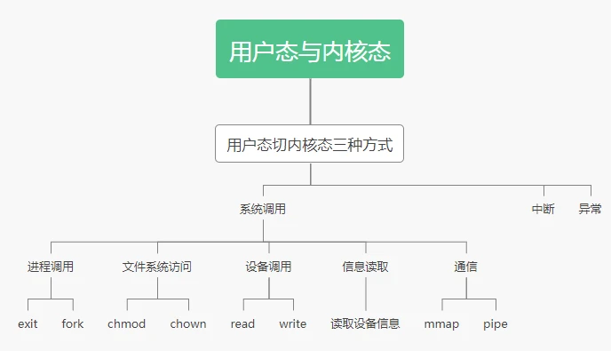

### eBPF的kernel-bypass特性

eBPF (extended Berkeley Packet Filter) 是一个灵活的内核特性，它可以用于在 Linux 内核中实现各种功能，如网络数据包过滤、性能分析、安全检测等。其中，eBPF 的 bypass 特性可以使得网络数据包不必再经过协议栈中的多个层次，直接被传递到用户空间，从而提高了数据包的处理效率。

eBPF 使用了一种特殊的虚拟机（eBPF VM），它可以在内核中直接执行用户提供的程序，从而避免了在内核态和用户态之间进行数据拷贝的开销。

具体来说，eBPF 程序会被编译成一组特殊的指令，这些指令可以被 eBPF VM 直接解释执行。eBPF VM 会在内核中创建一个安全的执行环境，从而保证 eBPF 程序不会破坏内核的稳定性和安全性。当 eBPF 程序需要访问用户态的数据时，它可以使用 eBPF 提供的特殊指令，直接访问用户态的内存，而无需进行数据拷贝。同样，当 eBPF 程序需要将数据传递给用户空间时，它也可以使用特殊指令，直接将数据传递给用户空间，而无需进行数据拷贝。

因此，使用 eBPF 可以避免内核态和用户态之间的数据拷贝，提高数据处理的效率，并减少内核和用户态之间的上下文切换次数，从而提高系统的整体性能。

### IO性能:

（摘自教材）

I/O性能直接影响系统性能，但传统IO效率很低，导致IO效率的原因有：

1. 从CPU角度考虑：对于CPU执行设备驱动程序代码和随着进程阻塞和解除阻塞而公平并高效地调度，它增加了很大的负荷。由此导致的上下文切换增加了CPU及其硬件缓存的负担。

2. 从内存总线角度考虑：I/O也暴露了内核的中断处理机制的低效。此外，对于控制器和物理内存之间的数据复制，以及应用程序数据空间和内核缓存之间的数据复制，I/O加重了内存总线的负荷。
   虽然中断的效率要高于轮询，但每个中断导致系统执行状态改变，执行中断处理，再恢复状态，导致完整的上下文切换开销。

3. 网络流量也能导致高的上下文切换速率。

   例如，考虑从一台机器远程登录到另一台机器。在本地机器上输入的字符必须传到远程机器。在本地机器上，输入字符引起键盘中断;字符通过中断处理程序传到设备驱动程序，到内核，再到用户进程。用户进程执行一个网络IO系统调用，以将该字符送到远程机器。该字符流入本地内核，通过网络层来构造网络分组，再到网络设备驱动程序。网络设备驱动程序传输分组到网络控制器，以便发送字符并生成中断。中断通过内核传递回来，以便导致网络I/O系统调用完成。
   这时，远程系统的网络硬件收到数据包，并生成中断。通过网络协议解包得到字符，并传到适当的网络守护进程。网络守护进程确定与哪个远程登录会话有关，并传递数据包到适当的会话子进程。在整个流程中，有上下文切换和状态切换(图13-15)。通常，接收者会将该字符送回给发送者;这种方式会使工作量加倍。

#### 使用DMA的目的: 

减轻CPU负担

具体来说，对于执行大量传输的设备，例如磁盘驱动器，如果通过CPU来观察状态位并且按字节来发送数据到控制器寄存器（称为程序控制I/O ( Programmed I/O，PIO))，则似乎浪费了。许多计算机为了避免因PIO而增加CPU负担，将一部分任务交给一个专用的处理器DMA控制器。

#### DMA传输过程：

在启动DMA传输时,主机将DMA命令块写到内存。该块包含传输来源地址的指针、传输目标地址的指针、传输的字节数。CPU将这个命令块的地址写到DMA控制器，然后继续其他工作。DMA控制器继续直接操作内存总线，将地址放到总线，在没有主CPU的帮助的情况下执行传输。
DMA控制器与设备控制器之间的握手，通过一对称为DMA请求( DMA-request)和DMA确认（DMA-acknowledge)的线路来进行。当有数据需要传输时，设备控制器发送信号到 DMA请求线路。这个信号使得DMA 控制器占用内存总线，发送所需地址到内存地址总线，并发送信号到DMA确认线路。当设备控制器收到DMA 确认信号时，它就传输数据到内存,并且清除 DMA请求信号。
当完成整个传输时，DMA 控制器中断CPU。图13-5描述了这个过程。当DMA控制器占用内存总线时，CPU被暂时阻止访问内存，但是仍然可以访问主缓存或辅助缓存内的数据项。


为了改善I/O效率，可以采用多种方法:

1. 减少上下文切换的次数。
2. 减少设备和应用程序之间传递数据时的内存数据的拷贝次数。
3. 通过大传输、智能控制器、轮询（如果忙等可以最小化)，减少中断频率。
4. 通过DMA智能控制器和通道来为主CPU承担简单数据复制，增加并发。
5. 将处理原语移到硬件，允许控制器操作与CPU和总线操作并发。
6. 平衡CPU、内存子系统、总线和I/O 的性能，因为任何一处的过载都会引起其他部分的空闲。

## 技术依据

### 分布式图文件系统（DisGraFS)：

#### 图数据库

图数据库是一个使用图结构对数据进行存储和管理的非关系型数据库，它使用节点、边和属性来表示和存储数据。其最大特点有3个：高维、高性能、高效率。相比于传统的关系型数据库中的关系表（二维表），图数据库采用的是可描述复杂关联关系的高维拓扑结构，在十亿级别的数据量时，仍能保持较好的性能。图数据库可以高效进行关联查询、数据插入，并且提供了针对图查询的语言。

- 不依赖于用户对文件进行的自命名和归类，其查询关键词仅仅取决于文件的内容，非常适用于多用户情境。
- 文件/数据库的维护、关键词提取、查询过程中的计算等任务可以不再集中于一台机器，实现算力、存储和网络资源的合理的分配。
- 客户端无需在本地安装任何软件即可通过网页访问系统，服务端不依赖于特定平台，高可扩展性可以使更多边缘资源易于整合入系统，也确保了系统对各种平台用户的可用性。

#### DisGraFS

DisGraFS——分布式图文件系统


[DisGraFS](https://github.com/OSH-2021/x-DisGraFS.git)为改善传统分布式文件系统的上述问题，提出了分布式图文件系统的概念，统一了单机图文件系统和分布式文件系统的优点。将图结构与思想应用于分布式文件系统上面，使得分布式图文件系统兼具图文件系统方便用户快速搜索，模糊搜索，查找相关文件的特点以及分布式文件系统的海量文件存储，云存储的特点。同时吸取前人的经验，整个项目开发过程均使用便于跨平台的语言和属性，以满足当今以及未来社会对于多设备，多平台的大容量，快搜索的文件系统的需求。

##### 基本概念

- 图文件系统：逻辑上抛弃树状结构，文件之间用“关系”连接。基于语义的局部性：有共同特征的文件相连
- 分布式图文件系统：底层存储采用分布式存储，语义识别采用分布式计算，用图结构描述文件之间的关系

##### 整体架构

DisGraFS分为5个部分：索引服务器、分布式存储集群、分布式计算集群、网页端和客户端。

- 索引服务器：与分布式计算集群的通信、网页端部署的位置，目前也负责构建与维护图数据库（但若有需要，也可将图数据库的部分分离出去）；
- 分布式存储集群：基于 Juicefs 的分布式储存系统，管理、存储和调度分布式存储系统中的所有文件；
- 分布式计算集群：基于 Ray 的分布式计算系统，将文本语义识别、图像识别、语音识别以及元数据提取等任务分散给计算集群中的多个计算机；

- 网页端：直观显示文件所构成的图，并将用户在图上的操作以友好方式展示；
- 客户端：客户端负责直接接收用户对文件系统的操作，并针对不同的平台对其进行实现。

##### 结构

- 中央索引服务器负责调度、维护图数据库、提供用户接口

- 分布式存储集群：JuiceFS + 阿里云 OSS
- 图数据库：Neo4j
- 网页前端：Neo4j 官方提供的 ds.js 和 pototo.js 框架
- 文件语义识别：文本（python库pke）、图像（imagga）、语音（speech_recognition）、视频（tingTag）
- 分布式计算集群：RAY + VLAB

### eBPF

#### BPF Map实现内核态和用户态之间的通信

`BPF Map`用于用户空间和内核空间之间的数据交换、信息传递。

`BPF Map`是驻留在内核中的以键/值方式存储的数据结构，可以被任何知道它们的BPF程序访问。在用户空间运行的程序可以通过使用文件描述符来访问`BPF Map`。可以在`BPF Map`中存储任何类型的数据，只要事先正确指定数据大小。在内核中，键和值都被视为二进制的方式来存储。

**Map常见用途**

- 一个 eBPF 程序编写有关事件的指标和其他数据，供用户空间代码稍后查询；
- 用户空间代码编写配置信息，以便 eBPF 程序读取并相应地执行；
- 一个 eBPF 将数据写入 map，供另一个 eBPF 程序读取，这种方式允许跨多个内核事件同步信息；

##### **eBPF提供的映射数据结构类型**

1. 数组映射（Array Map）：数组映射是一种基于整数索引的映射，可以使用一个整数键来查找和更新元素值。数组映射通常用于实现计数器和状态信息等功能。
2. 哈希映射（Hash Map）：哈希映射是一种基于哈希表的映射，可以使用任意键值对来查找和更新元素值。哈希映射通常用于实现高效的数据查找和存储功能。
3. 红黑树映射（Red-Black Tree Map）：红黑树映射是一种基于红黑树的映射，可以使用任意键值对来查找和更新元素值。红黑树映射通常用于实现需要有序遍历的数据结构。
4. 双向链表映射（Linked List Map）：双向链表映射是一种基于双向链表的映射，可以使用一个整数键来查找和更新元素值。双向链表映射通常用于实现队列和缓冲区等数据结构。
5. 原子映射（Atomic Map）：原子映射是一种基于原子操作的映射，可以在多线程环境下实现线程安全的数据访问。原子映射通常用于实现计数器和状态信息等功能。

##### 操作

**BPF Map更新**

`bpf_map_update_elem`实现保存更新功能。

- 内核程序

  [^1]: 源文件定义：[kernel/bpf/helpers.c](https://github.com/torvalds/linux/blob/v5.0/kernel/bpf/helpers.c)

  ```c
  BPF_CALL_4(bpf_map_update_elem, struct bpf_map *, map, void *, key,
  	   void *, value, u64, flags)
  ```

- 用户程序

  [^2]: 头文件定义[tools/lib/bpf/bpf.h](https://github.com/torvalds/linux/blob/v5.0/tools/lib/bpf/bpf.h)

  ```c
  LIBBPF_API int bpf_map_update_elem(int fd, const void *key, const void *value,
  				   __u64 flags);
  ```

- 区别

  - 内核程序可以直接访问映射，并原子性地更新元素。
  - 用户程序需要使用文件描符来引用映射，所以更新操作不是原子性的。

**BPF Map读取**
`bpf_map_lookup_elem`实现读取映射元素功能。

```c
void *bpf_map_lookup_elem(struct bpf_map *map, const void *key)
```

**BPF Map删除**
`bpf_map_delete_element`实现删除映射元素功能。

```c
int bpf_map_delete_elem（int fd， const void *key);¶
```

**BPF Map迭代**
`bpf_map_get_next_key`实现迭代遍历映射元素功能。

**BPF Map查找删除**
`bpf_map_lookup_and_delete_elem`实现内核查找和删除映射元素功能。

**BPF Map并发访问**
BPF通过BPF自旋锁（bpf_spin_lock和bpf_spin_unlock）来防止竞争条件, 可以在操作映射元素时对访问的映射元素进行锁定, 自旋锁仅适用于数组、哈希、cgroup存储映射。

### DMA技术

**DMA**是一种内存访问技术。DMA（Direct Memory Access，直接存储器访问）可以在不需要 CPU 参与的情况下实现内存的读取或写入，因为不依赖 CPU 的大量中断负载，因而可以实现数据的快速传送，提高系统的并发性能。

DMA 的传输过程必须经过 DMA 请求，DMA 响应，DMA 传输，DMA 结束 4 个步骤：

- DMA 请求：CPU 对 DMA 芯片进行设置，说明需要传送的字节数，有关的设备和内存地址，然后启动 DMA；
- DMA 响应：DMA 向 CPU 请求总线控制权，CPU 处理完当前总线数据后就让出总线；
- DMA 传输：DMA 控制器直接控制内存与 I/O 接口进行数据传输；
- DMA 结束：DMA 传输结束后，把总线控制权交还给 CPU，并向 I/O 接口发送结束信号。

#### 传统I/O数据传输过程：

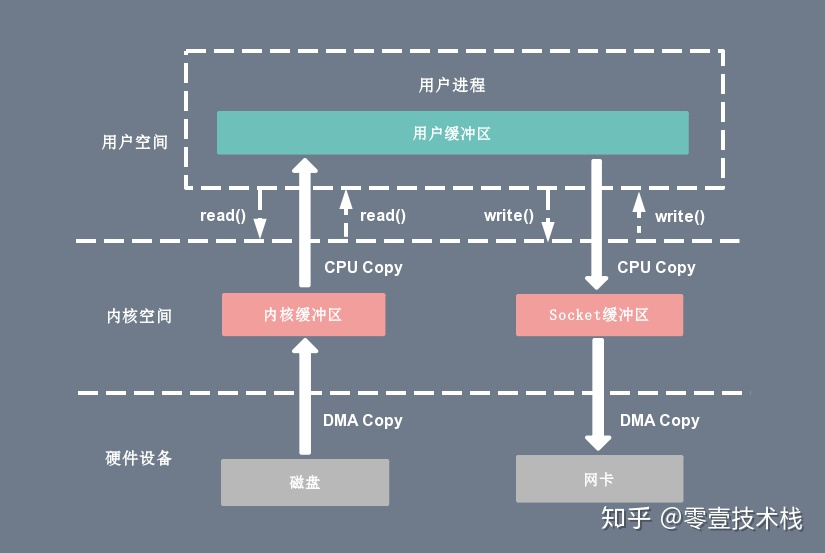

在没有 DMA 技术前，I/O 的过程是这样的：

- CPU 发出对应的指令给磁盘控制器，然后返回；
- 磁盘控制器收到指令后，于是就开始准备数据，会把数据放入到磁盘控制器的内部缓冲区中，然后产生一个**中断**；
- CPU 收到中断信号后，停下手头的工作，接着把磁盘控制器的缓冲区的数据一次一个字节地读进自己的寄存器，然后再把寄存器里的数据写入到内存，而在数据传输的期间 CPU 是无法执行其他任务的。


传统的 I/O 方式需要经过**四次**拷贝才能把磁盘上的数据输出到网络端口：

1. 执行 read 系统调用，从用户态切换到内核态，CPU 向 DMA 控制器芯片下发指令，将磁盘数据通过直接内存访问的方式拷贝到内核缓冲区中；
2. CPU 接收到 DMA 结束拷贝的信号，将内核缓冲区的数据拷贝到用户缓冲区中，read 调用结束，返回到用户态；
3. 用户程序执行 write 系统调用，从用户态切换到内核态，CPU 将数据从用户缓冲区中拷贝到Socket 发送缓冲区中；
4. CPU 下发指令，让 DMA 控制器来处理数据，将 Socket 发送缓冲区的数据拷贝到网卡进行网络传输，write 调用结束。


由此可以看出传统的文件传输开销很大，期间共**发生了 4 次用户态与内核态的上下文切换**，还**发生了 4 次数据拷贝**，其中两次是 DMA 的拷贝，另外两次则是通过 CPU 拷贝的，过多的数据拷贝无疑会消耗 CPU 资源，大大降低了系统性能。

### DPDK技术（流行kernel-bypass技术方案）

DPDK(Data Plane Development Kit)是数据平面开发工具包，由能加速在各种CPU架构上运行的数据包处理库组成，是一种高性能抓包技术。传统的数据包捕获瓶颈往往在于Linux Kernel，数据流需要经过内核态和用户态数据拷贝的消耗，系统调用的消耗，中断处理的消耗等。


- （左边）：网卡 -> 驱动 -> 内核协议栈 -> Socket 接口 -> 业务。
- （右边）：网卡 -> DPDK 轮询模式 -> DPDK 基础库 -> 业务。
  DPDK对此进行了一定程度的优化，核心可以概括为:

- UIO+mmap 实现零拷贝（zero copy）
- UIO+PMD 减少中断和CPU上下文切换
- HugePages 减少TLB miss

UIO+PMD，前者旁路了内核，后者主动轮询避免了硬中断，DPDK 从而可以在用户态进行收发包的处理。带来了零拷贝（Zero Copy）、无系统调用（System call）的优化。同时，还避免了软中断的异步处理，也减少了上下文切换带来的 Cache Miss。

1. UIO，DPDK 的基石

Linux 提供了 UIO（User Space I/O）机制，使用 UIO 可以通过 read() 感知中断，通过 mmap() 实现和网卡设备的通讯。UIO 的实现机制是：对用户态暴露文件接口。当注册一个 UIO 设备 uioX 时，就会出现系统文件 /dev/uioX，对该文件的读写就是对网卡设备内存的读写。除此之外，对网卡设备的控制还可以通过 /sys/class/uio 下的各个文件的读写来完成。
DPDK 架构在 Linux 内核中安装了 IGB_UIO模块，以此借助 UIO 技术来截获中断，并重设中断回调行为，从而绕过内核协议栈后续的处理流程，并且 IGB_UIO 会在内核初始化的过程中将网卡硬件寄存器映射到用户态。此外，DPDK 还在用户态实现了一套精巧的内存池技术，内核态和用户态之间的的内存交互不进行拷贝，只做控制权转移。这样，当收发数据包时，就减少了内存拷贝的开销。

2. PMD（Poll Mode Driver），DPDK 的核心优化

Linux 内核在抓包时有两种方式可供选择，一种是中断方式，另外一种是轮询方式，两种方式各有优缺点。目前的linux内核协议栈主要为硬中断处理方式。

针对 Intel 网卡，DPDK 实现了基于轮询方式的 PMD网卡驱动，该驱动由用户态的 API 以及 PMD Driver 构成。内核态的 UIO Driver 屏蔽了网卡发出的中断信号，然后由用户态的 PMD Driver 采用主动轮询的方式。除了链路状态通知仍必须采用中断方式以外，均使用无中断方式直接操作网卡设备的接收和发送队列。PMD Driver 从网卡上接收到数据包后，会直接通过 DMA 方式传输到预分配的内存中，同时更新无锁环形队列中的数据包指针，不断轮询的应用程序很快就能感知收到数据包，并在预分配的内存地址上直接处理数据包，整个过程非常简洁。
然而网络空闲时 CPU 会长期处于空转状态，带来了电力能耗的问题。所以，DPDK 引入了 中断 DPDK 模式，即 PMD 在长时间没数据包需要处理时自动进入睡眠，改为中断通知，接收到收包中断信号后，切换为主动轮询。这就是所谓的链路状态中断通知。
此外，PMD 还同时支持物理和虚拟两种网络接口，支持 Intel等网卡设备，以及支持基于 KVM、VMware等虚拟化网络接口。

### XDP技术（以BPF为核心）

DPDK技术虽然性能较高，但其缺点也显而易见：改变了现有操作系统的工作方式，很难与现有操作系统集成，应用此技术的网络应用程序需要重新实现之前由操作系统提供的一些功能，（如4-7层网络协议），破坏了原有操作系统内核提供的安全性等。

XDP技术减少上下文切换次数的思路与DPDK不同，它将网络包处理流程放到了内核中位于网络协议栈之前的位置。这样，在处理网络数据包时，不用经历kernel/userspace context switching的代价，也不用经历网络协议栈的复杂流程，同时又保留了操作系统控制网络硬件的能力。目前XDP现在已经完全集成到了Linux内核中。


XDP系统由4个主要部分组成：

- XDP driver hook：这是XDP程序的接入点，当网络数据包从硬件中收到时会被执行。
- eBPF virtual machine：执行XDP程序的字节码，并且JIT编译到机器码
- BPF maps：key/value store，用来在整个XDP系统中做数据的交互
- eBPF verifier：在程序加载到内核之前静态的分析代码以确保代码会crash或者损坏运行的内核

1. XDP driver hook

XDP的挂载点在驱动中的位置非常靠前，甚至早于kernel为packet分配sk_buff。如果一个网卡挂载了XDP程序，那么每当网卡收到一个packet，XDP程序都会通过网卡驱动的hook点运行一次。这里的运行是以内核中的库函数调用形式完成，这意味着不需要context switching到用户空间。
在XDP程序中，只能看到一个context对象，这个对象包含了两个数据：packet数据和相关的元数据。因为XDP的hook点在构建sk_buff之前，所以XDP程序中第一件事情是要根据网络协议解析packet，完成一些封装解封装的场景。context对象中的元数据包括了这个packet从哪个网卡收到，接收队列是哪个等信息。

在XDP程序的结束，需要对packet做出一个结论。结论有4种可能：

- XDP_DROP或XDP_ABORTED：丢包，区别在于后者会触发一个eBPF程序错误
- XDP_TX：将处理后的packet发回给相同的网卡
- XDP_PASS：将处理后的packet传递给内核协议栈
- XDP_REDIRECT：需要一个额外的参数来表明Redirect的目的地，这个额外的参数由在XDP程序返回之前通过一个helper函数设置。

2. BPF maps

eBPF程序是受内核事件驱动而执行，每次执行都是在一个相同的初始状态，并且在代码中不能有类似全局变量的持久化内存存储。为了弥补这一点，Linux内核提供了helper函数来访问BPF maps。BPF map可以被运行在内核中不同位置的eBPF程序共享，也可以被eBPF程序和用户空间程序共享。map类型包括了通用的hash map，数组，radix tree。BPF map可以是全局的，也可以是per-CPU的。XDP程序还可以通过BPF map定义自己的全局数据，也可以通过kernel helper函数访问kernel内的工具，kernel helper函数可以让XDP程序在不使用完整的内核协议栈的前提下，选择性的使用内核网络协议栈的功能，例如路由表。

BPF maps有几个作用：

- 同一个eBPF程序的不同调用之间的数据保存，例如对packet做统计
- 不同eBPF之间的全局协调工具，例如，一个eBPF程序可以监测CPU负载，并且在CPU负载过高时，指示XDP程序丢包
- 用户空间程序和内核eBPF程序之间的通信机制，这里可以用于SDN场景下Control plane和Data plane之间数据交互

#### 优点

1. 高性能：XDP能够在网卡接收到数据包后直接在内核态进行处理，避免将数据包拷贝到用户态的开销，从而大大提高网络应用的性能。
2. 灵活编程：XDP提供了一组API和工具，使开发者可以方便地实现自己的数据包处理逻辑，例如防火墙、负载均衡、DDoS防御、网络监测等，支持灵活的规则匹配和动态更新。
3. 可扩展性：XDP框架的设计很灵活，可以通过动态加载和卸载eBPF程序，支持动态调整数据包处理逻辑，从而满足不同场景的需求。
4. 安全性：XDP程序运行在内核态，具有更高的权限和更好的安全性，可以避免用户态程序的漏洞和攻击。

#### 使用

**主要使用场景**——网络场景

**XDP框架提供了以下几个主要的API和工具**

1. xdp_prog：用于在网卡的XDP挂载点上加载和执行eBPF程序，实现数据包的处理和转发。
2. libbpf：用于编译和加载eBPF程序，提供了一组API和工具，使开发者可以方便地管理和调试eBPF程序。
3. bpftool：用于管理和调试eBPF程序，提供了一组命令行工具，可以查询和修改eBPF程序的状态和参数。
4. tc命令：用于配置和管理内核中的Traffic Control（TC）规则，可以在数据包发送和接收的各个阶段插入eBPF程序，实现数据包的过滤、修改和转发等功能。

**例子——XDP技术处理网络包提高IO效率**

- 准备工作

  将eBPF程序绑定到网卡的XDP挂载点上

  ```bash
  sudo bpftool prog load ./prog.o /sys/fs/bpf/xdp_prog
  sudo ip link set dev eth0 xdp object /sys/fs/bpf/xdp_prog sec xdp
  ```

- 程序示例

  ```c
  #include <linux/bpf.h>
  #include <linux/if_ether.h>
  #include <linux/ip.h>
  #include <linux/in.h>
  #include <linux/udp.h>
  #include <linux/xdp.h>
  
  SEC("xdp")
  int bpf_prog(struct xdp_md *ctx)
  {
      void *data = (void *)(long)ctx->data;
      void *data_end = (void *)(long)ctx->data_end;
  
      struct ethhdr *eth = data;
      if (eth + 1 > data_end) {
          return XDP_DROP;
      }
  
      struct iphdr *ip = (struct iphdr *)(eth + 1);
      if (ip + 1 > data_end) {
          return XDP_DROP;
      }
  
      struct udphdr *udp = (struct udphdr *)(ip + 1);
      if (udp + 1 > data_end) {
          return XDP_DROP;
      }
  
      u16 src_port = udp->source;
      u16 dst_port = udp->dest;
      if (src_port == htons(1234) && dst_port == htons(5678)) {
          eth->h_dest[0] = eth->h_source[0];
          eth->h_dest[1] = eth->h_source[1];
          eth->h_dest[2] = eth->h_source[2];
          eth->h_dest[3] = eth->h_source[3];
          eth->h_dest[4] = eth->h_source[4];
          eth->h_dest[5] = eth->h_source[5];
  
          eth->h_source[0] = 0x02;
          eth->h_source[1] = 0x00;
          eth->h_source[2] = 0x00;
          eth->h_source[3] = 0x00;
          eth->h_source[4] = 0x00;
          eth->h_source[5] = 0x01;
  
          return XDP_TX;
      }
  
      return XDP_PASS;
  }
  ```

  该程序使用XDP技术处理网络包，从xdp_md结构体中获取网络包的指针和长度信息，并解析出以太网头、IP头和UDP头等信息。函数中判断网络包的源端口和目标端口是否为1234和5678，并根据需要修改以太网头的源和目的MAC地址。最后使用XDP_TX返回值来直接传送网络包给网卡，从而减少了网络包处理中的拷贝次数。

  **xdp_md结构体**

  xdp_md（eXpress Data Path Meta-Data）结构体是XDP框架中的一个重要数据结构，用于在eBPF程序中访问网络数据包的元数据信息。该结构体定义如下：

  ```c
  struct xdp_md {
      __u32 data;
      __u32 data_end;
      __u32 data_meta;
      __u32 ingress_ifindex;
      __u32 rx_queue_index;
  };
  ```

  各字段定义如下：

  1. `data`：指向数据包的起始地址。
  2. `data_end`：指向数据包的结束地址。
  3. `data_meta`：指向数据包元数据的起始地址，可以用于存储一些自定义的元数据信息。
  4. `ingress_ifindex`：表示数据包接收的网络接口的索引。
  5. `rx_queue_index`：表示数据包接收的网络接口的接收队列的索引。

  通过访问xdp_md结构体中的字段，eBPF程序可以获取到网络数据包的各种元数据信息，例如数据包的起始地址、结束地址、接收接口的索引等。这些信息可以用于进行数据包的过滤、修改和转发等操作，实现自定义的网络数据包处理逻辑。

  不过需要注意，xdp_md结构体中的`data`和`data_end`字段只表示数据包的有效载荷部分，不包括数据包头和尾部的其他信息。如果需要访问数据包头和尾部的其他信息，可以通过其他数据结构如skb、sk_buff等来获取。

- 监测

  ```bash
  sudo tcpdump -i eth0 -nn udp port 5678
  sudo ping -c 1 localhost
  sudo tcpdump -i lo -nn udp port 1234
  ```

### 共享内存（Shared Memory）

#### 基本原理 

共享内存是指多个进程可以访问同一块物理内存，使得它们可以直接地共享数据而不需要进行数据的拷贝。在基于eBPF实现共享内存的过程中，我们可以利用eBPF提供的map数据结构，将内核态和用户态之间共享的数据存储在map中。进程可以通过eBPF提供的系统调用访问这些map，从而实现共享内存。

#### 优缺点： 

##### 优点：

1. 共享内存可以避免数据的拷贝，提高数据传输的性能。
2. 可以方便地实现多个进程之间的数据共享，简化程序设计。
3. 具有高效的数据传输和共享方式，提高了程序的执行效率。

##### 缺点：

1. 共享内存需要进程间的协调和同步，否则会导致数据的一致性问题。
2. 共享内存的空间有限，需要进行管理和分配。
3. 共享内存存在内存泄漏和死锁的风险，需要特殊的设计和处理。

#### 应用场景：

1. 在高性能计算中，共享内存可以加速多个进程之间的数据传输和通信。
2. 在分布式系统中，共享内存可以实现多个节点之间的数据共享和通信。
3. 在网络传输中，共享内存可以提高数据传输的性能和效率。

基于eBPF实现的共享内存技术可以应用于以上场景，利用eBPF提供的map数据结构，实现内核态和用户态之间的高效数据传输和共享，提高程序的执行效率和性能。

### zIO技术

#### 零拷贝技术

零拷贝有几种实现方式，如下：

- **mmap + write**：mmap 是一个系统调用，主要作用就是将用户缓冲区与内核中的读缓冲区进行映射，映射后这一步就不需要进行数据拷贝了，而 write 操作实际上是从内核读缓冲区中把数据拷贝到 Socket 发送缓冲区，整个过程减少了一次拷贝操作，但是系统调用切换没有减少。


- **sendfile**：sendfile 同样省去了将数据在内核和用户空间中拷贝，与 mmap 不同的是，sendfile 不需要借助 write 调用，而是一次完整的内核拷贝过程，减少了两次 CPU 上下文切换。
- 
- **sendfile + DMA gather copy**：对 sendfile 系统调用做了修改，引入了 gather 操作，不需要将内核缓冲区的数据拷贝到 Socket 中，而是将它对于的数据描述信息（内存地址、文件描述符，文件长度等）记录到 Socket 缓冲区中，最后由 DMA 根据这些文件描述信息从内核读缓冲区中找到数据，直接拷贝到网卡设备中。
- **splice**：splice 系统调用可以在内核空间的读缓冲区和网络缓冲区之间建立管道（pipeline），从而避免了两者之间的 CPU 拷贝操作。

#### 不同实现方式对比

在 Linux 中零拷贝技术主要有 3 个实现思路：用户态直接 I/O、减少数据拷贝次数以及写时复制技术（可忽略）。

|        不同IO方式        |                           实现特点                           |                         系统调用函数                         | 拷贝次数（CPU+DMA） | 上下文切换次数 |
| :----------------------: | :----------------------------------------------------------: | :----------------------------------------------------------: | :-----------------: | :------------: |
|       mmap + write       | mmap建立了内核读缓冲区与用户空间缓冲区的虚拟内存映射，从而省去了一次CPU拷贝然而从read buffer到socket buffer的CPU拷贝仍存在，且内存映射总是要求对齐页边界，可能会造成内存浪费 | tmp_buf = mmap(file_fd, len);write(socket_fd, tmp_buf, len); |         1+2         |       4        |
|         sendfile         | 数据在内核空间内部的纯粹传输，省去了数据在用户空间和内核空间之间的来回拷贝 |              sendfile(socket_fd, file_fd, len);              |         1+2         |       2        |
| sendfile+DMA gather copy | 在sendfile的基础上，DMA引入了 gather 操作，代替CPU将内核read buffer中的数据位置信息等记录到相应的 socket buffer中，并将数据批量地从读缓冲区（read buffer）拷贝到网卡设备中 |                 sendfile及DMA的网卡硬件支持                  |         0+2         |       2        |
|          splice          | splice可以在内核空间的读缓冲区（read buffer）和网络缓冲区（socket buffer）之间建立管道（pipeline），从而避免了两者之间的 CPU 拷贝操作 |     splice(fd_in, off_in, fd_out, off_out, len, flags);      |         0+2         |       2        |
|       用户态直接IO       | 用户态程序可直接访问硬件设备，数据直接跨过内核进行传输，只适用于不需要内核缓冲区处理的应用程序，且缺乏安全保护机制 |                        自缓存应用程序                        |          0          |       0        |
|        缓冲区共享        | 让每个进程都维护一个缓冲区池，这个缓冲区池被内核空间和用户空间共享，可避免一系列拷贝操作，但该技术需要软硬件紧密合作，目前还处于试验阶段并不成熟，实现比较好的是Solaris 上的 fbuf |                         整体API改写                          |          0          |       0        |

#### eBPF在零拷贝中的应用前景

传统IO数据传输需要进行四次数据拷贝，大大降低了数据传输的效率，利用eBPF的kernel bypass特性，实现零拷贝技术，避免了用户态和内核态之间的多次拷贝，从而实现高性能分布式文件系统文件存储与读取接口。

以下是其中几种设想的方式：

1. 使用eBPF共享内存：eBPF程序可以在内核中创建共享内存区域，并允许用户空间应用程序访问该内存区域。这使得应用程序可以直接读取或写入内存，而不必在内核和用户空间之间进行数据拷贝。这种方式可以减少数据拷贝次数和提高传输性能。
2. 结合DMA技术：DMA技术可以实现数据的直接内存访问，可以在避免CPU的干预下，将数据从外设直接传输到内存或者从内存直接传输到外设。结合eBPF，可以使用共享内存的方式将数据传递给eBPF程序，然后通过DMA直接传输到外设，避免了在内核和用户空间之间进行数据拷贝。
3. 利用eBPF Socket：eBPF Socket是一种特殊的Socket，它可以在内核空间和用户空间之间直接传输数据，而不必拷贝数据到用户空间。应用程序可以使用eBPF Socket向内核发送数据，eBPF程序可以直接从Socket读取数据，然后将其传输到外设中。

### Docker

#### 实现原理

Linux下Docker被称为NameSpace和Control groups的原语。

- NameSpace

  Linux下的一种资源隔离方案，NameSpace下的资源互不干扰。

- Control groups

  即cgroup，目的为控制容器中进程对资源的访问。

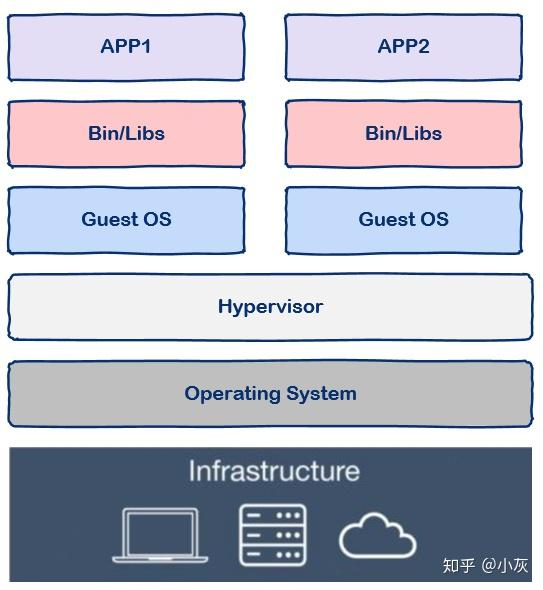

#### 特点

- 是image的可运行实例。可以使用 DockerAPI 或 CLI 创建、启动、停止、移动或删除容器。
- 可以在本地计算机、虚拟机上运行或部署到云中。
- 可移植（可以在任何操作系统上运行）。
- 与其他容器隔离，运行自己的软件、二进制文件和配置。

#### 容器 *vs* 虚拟机

虚拟机通过操作系统实现隔离，而容器技术只隔离应用程序应用程序的运行时环境（运行所依赖的库、配置等），但容器之间可以共享同一个操作系统。因此容器的启动速度快于虚拟机。

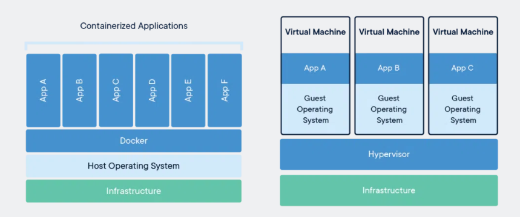

#### Docker的工作原理

docker使用client-server模式，docker client负责处理用户输入的命令，如`docker build`、`docker run`;真正执行工作的是server (docker daemon)。

1. docker build——编译dockerfile

   client接收到请求后转发给docker daemon，由后者根据dockerfile创建出可执行程序image。

   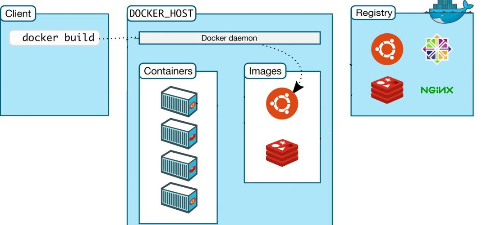

2. docker run

   docker daemon接收到该命令后找到具体的image，加载到内存开始执行。

   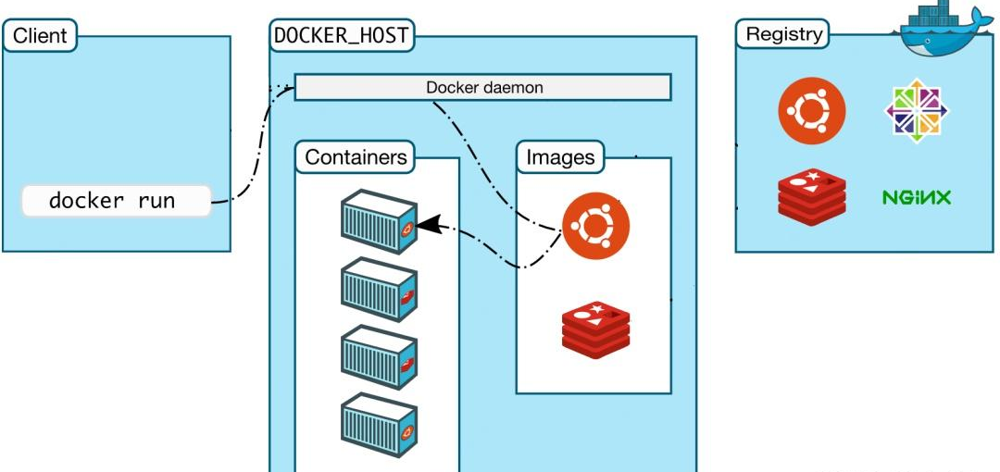

3. docker pull

   docker daemon接收该命令后向docker registry发送下载image，从公共仓库Docker Hub下载公共image。

   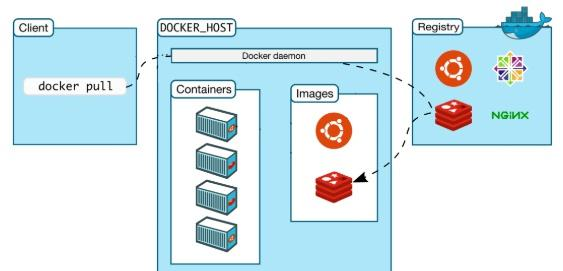

#### Docker的使用

1. 官方给出的Dockerfile示例代码

   ```dockerfile
   # syntax=docker/dockerfile:1
      
   FROM node:18-alpine
   WORKDIR /app
   COPY . .
   RUN yarn install --production
   CMD ["node", "src/index.js"]
   EXPOSE 3000
   ```

2. 生成容器映像

   `docker build -t getting-started .`

3. 启动应用程序

   `docker run -dp 3000:3000 getting-started`

   > -dp:
   >
   > 使用该标志在“分离”模式下（在后台）运行新容器。还可以使用该标志在主机的端口 3000 到容器的端口 3000 之间创建映射。 如果没有端口映射，将无法访问该应用程序。

4. 查看容器

   `docker ps`

## 创新点

传统的分布式文件系统通常采用客户端-服务器模式，每个客户端与服务器之间需要频繁进行 IO 操作，包括读取和写入数据。然而，由于数据需要在用户态和内核态之间频繁地进行数据拷贝，传统的 IO 处理方式很难满足大规模数据存储和处理的需求。因此，如何提高分布式文件系统的 IO 性能成为了亟待解决的问题。

> eBPF 技术在解决 IO 性能问题方面具有独特的优势。eBPF 技术可以将一些 IO 操作从内核态移动到用户态，避免了数据在内核态和用户态之间频繁地进行数据拷贝，从而可以大大提高 IO 性能。此外，eBPF 还便于对 IO 操作进行监控和控制，提高系统的可靠性和安全性。

### DMA+XDP

结合DMA和XDP可以实现高效的数据存储与传输。具体实现步骤如下：

1. 创建一个eBPF程序，该程序需要做以下工作：
   - 分配共享内存区域，该区域用于存储数据。
   - 从网络中读取数据包，将数据包拷贝到共享内存区域中。
   - 触发DMA操作，将数据从共享内存区域中拷贝到磁盘或者其他存储介质上。
   - 在eBPF程序中实现XDP，将数据包从网卡传输到共享内存区域中。
2. 对于接收到的数据包，可以使用XDP程序直接将数据包拷贝到共享内存区域中，避免了数据拷贝过程中的性能损失。
3. 需要利用DMA技术将共享内存区域中的数据拷贝到磁盘或者其他存储介质上，提高数据的存储效率。

通过结合eBPF、DMA和XDP技术，可以实现高效的数据存储与传输，降低数据传输过程中的性能损失，提高系统的整体性能，创新之处在于：

1. 使用XDP技术减少数据包处理的延迟和CPU占用率：XDP技术是一种高性能网络数据包处理技术，可以在网络驱动程序接收数据包时，使用eBPF程序来处理数据包，从而减少数据包处理的延迟和CPU占用率。通过结合XDP和eBPF技术，可以进一步提高系统的性能。

2. 使用 eBPF 技术的 DMA+XDP 数据处理方案：它结合了 DMA 技术和 XDP 技术，实现了零拷贝和高性能的数据传输。由于 eBPF 技术的优秀性能和灵活性，这种方案可以实现更加细粒度的数据控制和管理，从而进一步提高系统的性能和安全性。

### SM(Shared Memory)

1. 灵活性：eBPF和XDP技术允许用户自定义网络应用程序的逻辑，可以根据需要进行灵活的共享内存设计和实现，适应不同的场景和需求。

2. 安全性：eBPF和XDP技术具有良好的安全性，可以防止恶意应用程序对共享内存的非法访问和操作，保护系统的稳定性和安全性。

3. 可扩展性：eBPF和XDP技术可以方便地扩展和升级，可以根据需要进行新功能的添加和旧功能的替换，保持技术的前沿性和竞争力。

## 概要设计

### DisGraFS的部署

DisGraFS采用JuiceFS作为底层的分布式文件系统。目前，JuiceFS有两个版本，在DisGraFS中，学长们采用的是开源版本

为了访问JuiceFS内的数据，需要先将JuiceFS挂载为当前操作系统的一个磁盘/文件夹。具体到DisGraFS，客户端和Ray分布式计算集群都需要挂载JuiceFS：客户端需要直接通过挂载的接口来操作文件，而Ray集群需要从JuiceFS中将用户上传的文件取出进行语义识别。

juiceFS具体部署可以参考官方文档，这里不赘述，部署后进行挂载。

在bash中运行Linux版的`juicefs`

```
./juicefs mount redis://:disgrafs@juicefs.disgrafs.tech ~/jfs -v --writeback
```

Linux下可以挂载到任意文件夹，但如果挂载的文件夹需要sudo权限，那么也要用sudo运行`juicefs`。同样按下`Ctrl + C`结束程序即可自动卸载。

> **注意！**直接从网络上下载的`juicefs`可执行文件在一些Linux系统上由于不受信而无法执行，这时需要先执行`chmod 777 juicefs`。

而后使用DisGraFS客户端文件完成分布式图文件系统部署工作。

### 技术路线的选择

经过前几次的会议和调研报告,我们将思路focus到了3个方向，具体实现过程中会按照实际情况选择最适合我们项目的技术路线：

#### **1.共享内存**

- 优点：

可以在不同的进程之间共享数据，提高程序的并发性和效率,对数据的传输和处理速度比较快，适用于实时性要求较高的应用。

- 缺点：需要操作系统的支持，对操作系统的版本和配置有一定的要求；对数据的访问和同步需要进行额外的处理，增加了编程复杂性；不适用于跨机器的数据传输。
- 前景和可行性：
  实现共享内存技术需要一定的编程经验和对操作系统的了解，但相对来说比较可行。

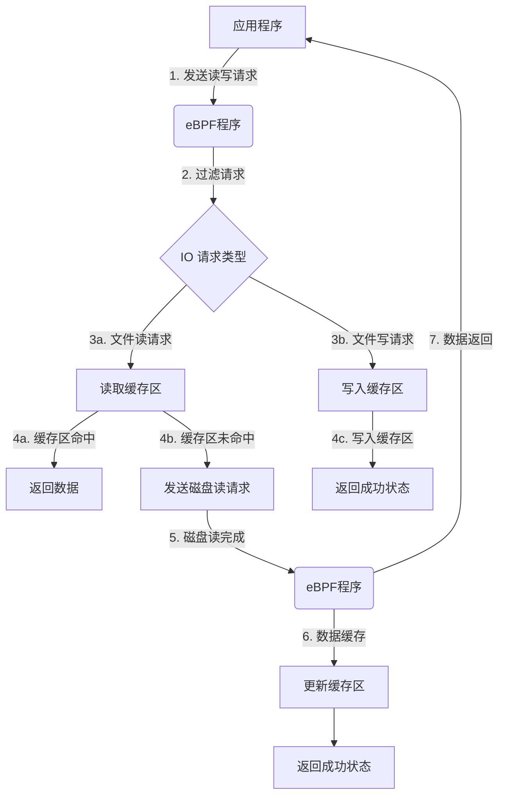

共享内存相关控制

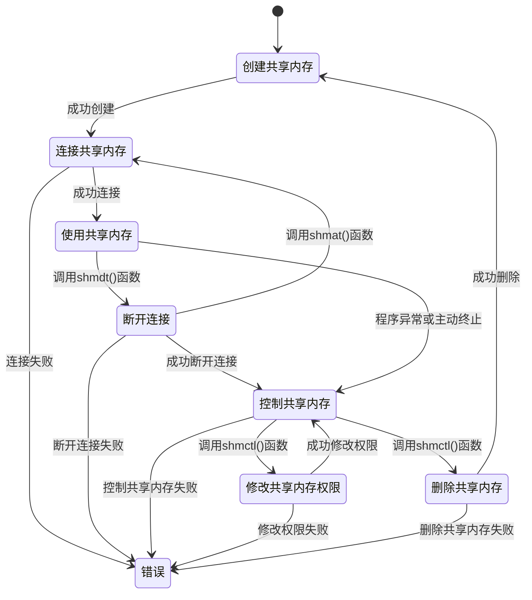

#### **2.kernel-bypass**

- 优点：可以绕过操作系统内核，直接访问硬件和网络设备，提高数据传输和处理的速度和吞吐量；可以在用户空间进行更灵活和高效的数据处理，提高程序的性能和可维护性；可以通过 eBPF 和 XDP 技术实现更多样化和高级的网络性能优化，例如数据包过滤、修改和状态跟踪。
- 缺点：需要对操作系统和网络协议有更深入的了解和掌握；可能会增加系统的安全风险和稳定性问题。

#### **3.DMA**

- 优点：可以提高数据传输的速度和吞吐量；对 CPU 的占用较小；
- 缺点：需要硬件支持，对硬件要求较高；不适用于所有类型的数据传输，例如共享内存和用户空间的数据传输；对数据传输的类型和大小有一定的限制。

> 使用eBPF与XDP技术实现一个兼备DMA能力的内核
>
> 在没有任何优化技术使用的背景下，操作系统为此会进行 4 次数据拷贝：

4 次 copy：

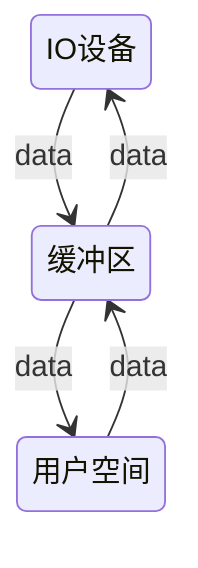

物理设备 Input-> 内存(内核态)->内存内部拷贝(经由CPU调控)->内存(内核态)->Output

#####  DMA 参与下的数据拷贝——通过eBPF优化

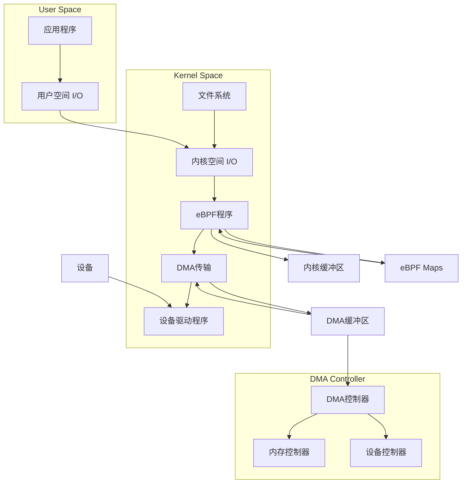
具体流程如下：

1. 应用程序向文件系统发起写入请求，数据被复制到用户空间 I/O 缓冲区中。

2. 文件系统将数据传递给内核空间 I/O，数据被复制到内核缓冲区中。

3. eBPF 程序在内核空间 I/O 中运行，它可以使用 eBPF Maps 访问内核缓冲区中的数据，并对数据进行过滤和处理。

4. eBPF 程序通过 DMA Maps 执行 DMA 传输，将数据从内核缓冲区直接传输到 DMA 缓冲区中。

5. DMA 控制器将数据从 DMA 缓冲区传输到设备控制器中，然后再将数据传输到设备中。

6. 设备驱动程序接收数据，并将其传输到设备中。

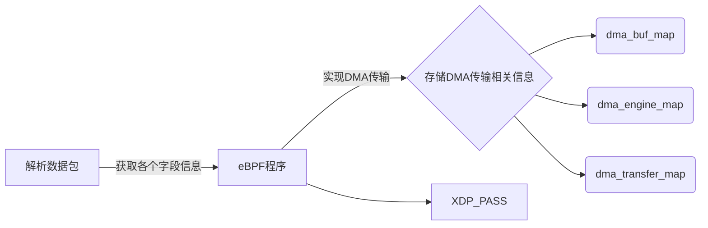

- dma_buf_map映射：用于存储DMA缓冲区的物理地址和大小。在这个映射中，每个键对应一个DMA缓冲区的ID，每个值是一个struct dma_buf结构体，包含了DMA缓冲区的物理地址和大小。通过这个映射，可以在eBPF程序中方便地访问和管理DMA缓冲区。

- dma_engine_map映射：用于存储DMA引擎的状态。在这个映射中，每个键对应一个DMA引擎的ID，每个值是一个struct dma_engine结构体，包含了DMA引擎的状态。通过这个映射，可以在eBPF程序中方便地访问和管理DMA引擎的状态。

- dma_transfer_map映射：用于存储DMA传输的状态、结果、错误等信息。在这个映射中，每个键对应一个DMA传输的ID，每个值是一个struct dma_transfer结构体，包含了DMA传输的状态、结果、错误等信息。通过这个映射，可以在eBPF程序中方便地访问和管理DMA传输的相关信息，例如传输是否完成、是否出现错误等。

在Linux系统中，DMA可以通过eBPF实现，copilot帮我写了一段代码：

```c
#include <linux/bpf.h>
#include <linux/if_ether.h>
#include <linux/if_packet.h>
#include <linux/ip.h>
#include <linux/in.h>
#include <linux/tcp.h>

#define DMA_BUF_SIZE 4096

struct dma_buf {
    unsigned long phys_addr;
    unsigned int size;
};

struct dma_engine {
    unsigned int id;
    unsigned int status;
};

struct dma_transfer {
    unsigned int id;
    unsigned int status;
    unsigned int result;
    unsigned int error;
    unsigned int complete;
    unsigned int timeout;
    unsigned int cancel;
    unsigned int pause;
    unsigned int resume;
};

struct bpf_map_def SEC("maps") dma_buf_map = {
    .type = BPF_MAP_TYPE_ARRAY,
    .key_size = sizeof(unsigned int),
    .value_size = sizeof(struct dma_buf),
    .max_entries = 1024,
};

struct bpf_map_def SEC("maps") dma_engine_map = {
    .type = BPF_MAP_TYPE_ARRAY,
    .key_size = sizeof(unsigned int),
    .value_size = sizeof(struct dma_engine),
    .max_entries = 1024,
};

struct bpf_map_def SEC("maps") dma_transfer_map = {
    .type = BPF_MAP_TYPE_ARRAY,
    .key_size = sizeof(unsigned int),
    .value_size = sizeof(struct dma_transfer),
    .max_entries = 1024,
};

SEC("xdp")
int xdp_prog(struct xdp_md *ctx)
{
    void *data_end = (void *)(long)ctx->data_end;
    void *data = (void *)(long)ctx->data;

    struct ethhdr *eth = data;
    if (eth + 1 > (struct ethhdr *)data_end) {
        return XDP_DROP;
    }

    struct iphdr *ip = data + sizeof(struct ethhdr);
    if (ip + 1 > (struct iphdr *)data_end) {
        return XDP_DROP;
    }

    struct tcphdr *tcp = data + sizeof(struct ethhdr) + sizeof(struct iphdr);
    if (tcp + 1 > (struct tcphdr *)data_end) {
        return XDP_DROP;
    }

    // TODO: Implement DMA transfer using eBPF

    return XDP_PASS;
}

```

这段示例代码包含了一个名为dma_buf_map的eBPF映射，用于存储DMA缓冲区的物理地址和大小；一个名为dma_engine_map的eBPF映射，用于存储DMA引擎的状态；一个名为dma_transfer_map的eBPF映射，用于存储DMA传输的状态、结果、错误等信息。

在xdp_prog函数中，可以实现DMA传输的代码。具体实现方式取决于所使用的DMA引擎和设备.

### eBPF程序的编写与装载

eBPF是一种在内核中运行的程序，使用eBPF的步骤大致如下：

- 编写eBPF程序，使用C语言或者其他支持的语言，定义eBPF程序的逻辑和功能
- 编译eBPF程序，使用clang或者其他编译器，将eBPF程序编译成二进制格式
- 加载eBPF程序，使用bpf()系统调用或者其他工具，如bpftool、libbpf等，将eBPF程序加载到内核中，并绑定到相应的钩子点
- 运行eBPF程序，当触发相应的事件时，如网络包到达、系统调用执行等，eBPF程序会自动运行，并执行相应的操作
- 交互eBPF程序，使用bpf()系统调用或者其他工具，如bpftrace、bpf_perf_event等，与eBPF程序进行交互，如读取或修改eBPF映射中的数据、获取eBPF事件的输出

实现细节：

为文件系统提供eBPF支持，具体来说即借助eBPF添加额外的内核辅助函数，设计新的映射类型，以支持用户空间和内核的通信和高效IO。而这里同时也要修改文件系统驱动程序，使其首先调用eBPF扩展，在加载eBPF程序后，我们可以绕过用户空间守护程序，直接向下层文件系统传递IO请求。

### IO性能优化效果检测

分布式监控是部署在分布式系统内的监控组件，它可以监视和显示集群中各节点的状态信息，它有运行在各个节点的进程，可以采集不同节点之间的通信消息，采集各个节点的资源利用率，最后将采集到的数据汇总到一个数据库，进行分析处理后以直观的图形化界面进行呈现。以下为一些拟选择部署的监测系统：

#### Prometheus

Prometheus也可以用来监测分布式文件系统的IO性能。Prometheus是一个流行的开源监测系统，主要用于监测分布式系统的性能和状态。它使用Pull模型来获取监测指标，可以收集来自各种不同来源的指标数据，并提供数据可视化和警报功能。Prometheus支持许多不同的监测目标类型，包括HTTP、DNS、JVM、数据库等等。在监测分布式文件系统时，可以使用Prometheus来监测各种性能指标，如读写延迟、吞吐量、文件传输速率等。同时，Prometheus还支持很多第三方工具和插件，可以扩展其功能，如Grafana等。

#### Grafana

Grafana是一个流行的开源监控和可视化工具，可以与各种数据源集成，包括时间序列数据库和日志文件。可以将其用于监测分布式文件系统的各种指标，例如磁盘IO、网络吞吐量、CPU利用率等，并生成可视化报告，以便用户可以轻松地查看和理解系统性能。

主机基础监控效果如下：

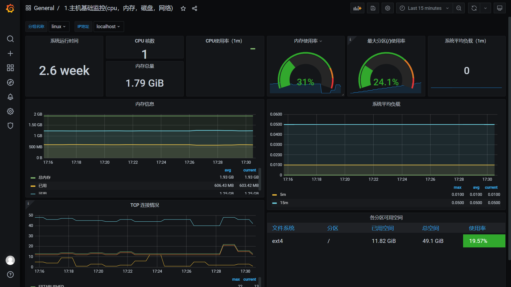

#### IOstat

iostat是一个Linux系统下的磁盘监控工具，它可以实时地收集和报告磁盘的使用情况和性能数据，包括IOPS、吞吐量和延迟等。iostat也可以显示CPU的使用情况。

iostat的基本用法是：iostat [选项\] [间隔时间] [次数]。

其中，选项可以用来指定显示的内容和格式，如-c表示只显示CPU统计，-d表示只显示设备报告，-x表示显示扩展的I/O统计，-k表示以千字节为单位显示数据，-m表示以兆字节为单位显示数据等。间隔时间和次数可以用来指定显示的频率和次数，如iostat -k 2 3表示每隔2秒显示一次磁盘和CPU统计，共显示3次

可以尝试将iostat的输出导入grafana来比较分布式文件系统的IO性能

#### 其他选择工具

1. fio：fio是一个用于测试I/O性能的工具。它可以测试不同的I/O引擎、文件系统和参数，以评估I/O系统的性能。fio支持多线程测试和可视化报告。
2. ioping：ioping是一个I/O性能测试工具，用于检测磁盘、文件系统和I/O子系统的延迟。它通过模拟访问磁盘上的文件或目录，并测量响应时间和吞吐量来测试I/O性能。
3. blktrace：blktrace是一个用于跟踪块设备I/O的工具。它可以捕获、存储和分析系统块设备上的所有I/O操作，包括磁盘操作、文件系统操作和块层操作等。
4. bpftrace：bpftrace是一个可以使用eBPF实现的动态跟踪框架。它提供了高级跟踪功能，如函数跟踪、系统调用跟踪、内存分配跟踪等，可以帮助分析分布式文件系统的I/O性能问题。

具体实践过程会根据实际情况选择合适的工具进行性能检测。

## 参考文献

[1] DisGraFS. (2021). OSH-2021/x-DisGraFS. GitHub. https://github.com/OSH-2021/x-DisGraFS

[2] SimpleClearFileIO. (n.d.). GitHub. https://github.com/spongecaptain/SimpleClearFileIO

[3] xdp-project. (n.d.). xdp-tutorial. GitHub. https://github.com/xdp-project/xdp-tutorial/

[4] Docker. (n.d.). How to build, share, and run applications. Docker Documentation. Retrieved April 23, 2023, from https://docs.docker.com/

[5] Torvalds, L. (2019). bpf.h. GitHub. Retrieved April 23, 2023, from https://github.com/torvalds/linux/blob/v5.0/include/uapi/linux/bpf.h

[6] The Linux Kernel documentation. (n.d.). BPF_MAP_TYPE_DEVMAP and BPF_MAP_TYPE_DEVMAP_HASH. Retrieved April 23, 2023, from https://docs.kernel.org/bpf/map_devmap.html

[7] Electrode: Accelerating Distributed Protocols with eBPF. (2023). In USENIX Symposium on Networked Systems Design and Implementation (NSDI '23). USENIX Association. https://www.usenix.org/conference/nsdi23/presentation/zhou

[8] Faster Software Packet Processing on FPGA NICs with eBPF Program Warping. (2022). In USENIX Annual Technical Conference (ATC '22). USENIX Association. https://www.usenix.org/conference/atc22

[9] 深入浅出 eBPF. (n.d.). 专注于 Linux 内核技术 eBPF (Linux/Kernel/XDP/BCC/BPFTrace/Cilium). Retrieved April 23, 2023, from https://www.ebpf.top/https://www.ebpf.top/)

[10] 详解块存储、文件存储、对象存储区别. (2021). Retrieved April 23, 2023, from https://zhuanlan.zhihu.com/p/280128756

[11] 分布式文件系统对比与选型参考. (2020). Retrieved April 23, 2023, from https://blog.csdn.net/yym373872996/article/details/105650908

[12] 浅析三款大规模分布式文件系统架构设计. (2021). Retrieved April 23, 2023, from https://zhuanlan.zhihu.com/p/620985766

[13] 分布式文件系统设计，该从哪些方面考虑？. (2021). Retrieved April 23, 2023, from https://cloud.tencent.com/developer/article/1645680

[14] 详细讲解Linux内核IO技术栈原理. (2021). Retrieved April 23, 2023, from https://zhuanlan.zhihu.com/p/484945013

[15] 深入剖析Linux IO原理和几种零拷贝机制的实现. (2020). Retrieved April 23, 2023, from https://zhuanlan.zhihu.com/p/83398714

[16] DMA零拷贝技术. (2021). Retrieved April 23, 2023, from https://zhuanlan.zhihu.com/p/377237946

[17] 深入理解Linux 的Page Cache. (2021). Retrieved April 23, 2023, from https://zhuanlan.zhihu.com/p/436313908

[18] Linux操作系统原理—内核网络协议栈. (2021). Retrieved April 23, 2023, from https://zhuanlan.zhihu.com/p/379915285

[19] Linux内核网络（一）——初探内核网络. (2020). Retrieved April 23, 2023, from https://zhuanlan.zhihu.com/p/363718587#

[20] DPDK——数据平面开发技术. (2021). Retrieved April 23, 2023, from https://zhuanlan.zhihu.com/p/551653482

[21] DPDK解析. (2020). Retrieved April 23, 2023, from https://zhuanlan.zhihu.com/p/363622877

[22] 一文看懂eBPF｜eBPF实现原理. (2021). Retrieved April 23, 2023, from https://zhuanlan.zhihu.com/p/484788508

[23] Kernel Dataplane XDP简介. (2020). Retrieved April 23, 2023, from https://zhuanlan.zhihu.com/p/321387418#

[24] 使用ebpf优化FUSE的性能. (2021). Retrieved April 23, 2023, from https://zhuanlan.zhihu.com/p/518531067
