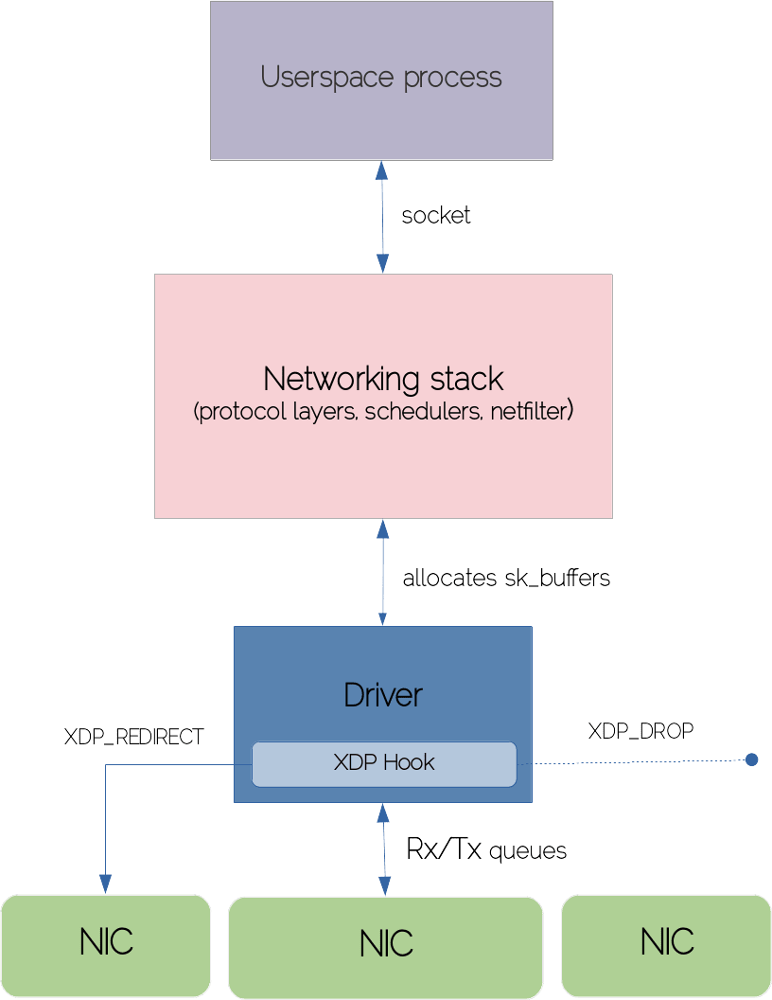
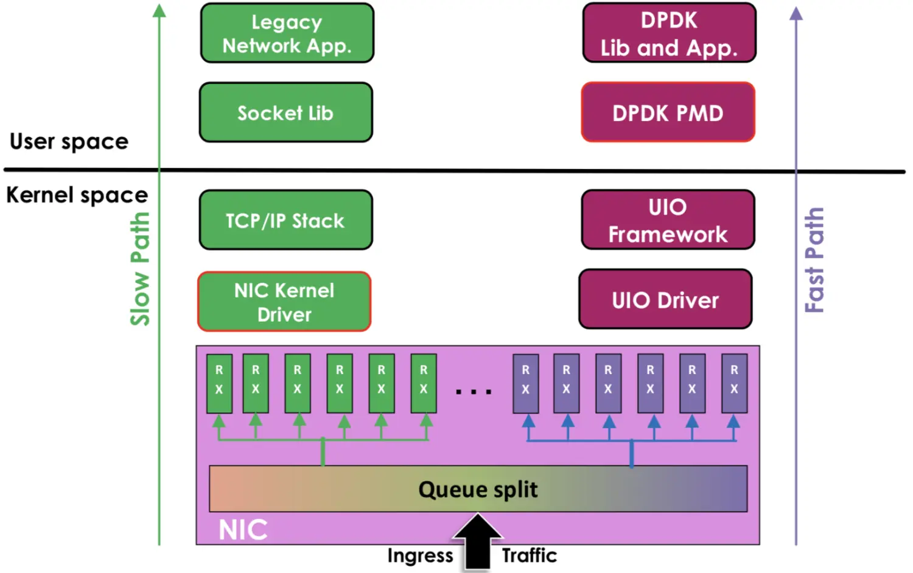
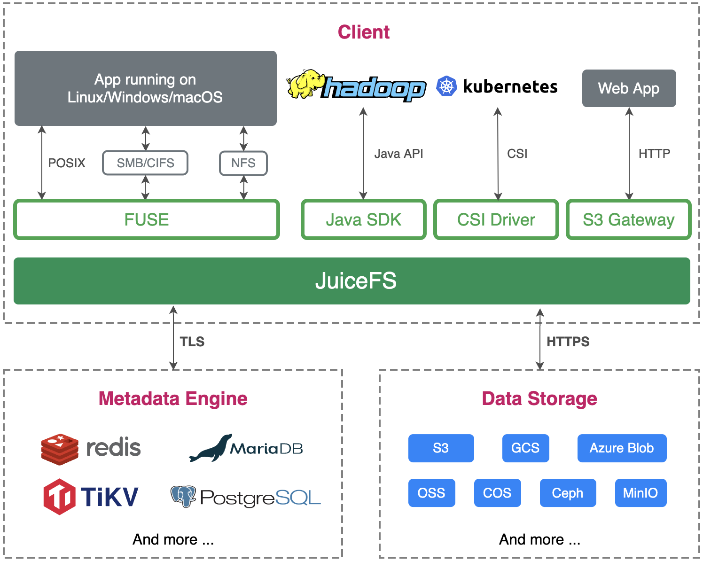

### 目标

要改善分布式文件系统的文件接口性能，可以尝试以下几种方法：

1. 减少网络通信：文件系统通常需要在多个节点之间进行数据交换，这会导致网络通信延迟。因此，减少节点之间的通信可以帮助提高性能。您可以通过使用缓存技术、增加本地副本、优化网络拓扑结构等方法来减少网络通信。
2. 使用更快的磁盘：磁盘性能是影响文件系统性能的一个关键因素。您可以考虑使用更快的磁盘，如SSD（固态硬盘），以提高文件系统的性能。
3. 优化文件系统的设计：您可以考虑对文件系统的设计进行优化，例如减少文件系统的元数据大小、增加文件系统的并发性、减少文件系统的锁定竞争等。
4. 采用更快的文件系统接口：您可以考虑使用更快的文件系统接口，如使用更高效的API或协议。例如，使用一些更高效的协议，如RDMA或NVMe-oF，可以提高性能。
5. 采用更好的负载均衡策略：您可以考虑采用更好的负载均衡策略，以避免某些节点负载过重的问题，从而提高整个文件系统的性能。例如，使用动态负载均衡策略可以在运行时根据节点的负载情况来动态调整负载均衡。

> 其中老师不让碰1，2是硬件无法优化，所以我们要做的实际上就是4，也许会涉及到3和5

### DMA

DMA能够将数据直接从磁盘读到内核空间页缓冲中，或者将数据从内核空间页缓冲直接写回到磁盘上，但是不能直接在用户地址空间和磁盘之间进行数据传输。这样，数据在传输过程中需要在应用程序地址空间（用户空间）和内核缓冲（内核空间）之间进行多次数据拷贝操作，这些数据拷贝操作所带来的CPU以及内存开销是非常大的1。                                                            

> DMA零拷贝技术：https://zhuanlan.zhihu.com/p/377237946

### XDP

eBPF 和 XDP 是基于 eBPF 实现的高性能、可编程的数据平面技术。XDP 位于网卡驱动层，当数据包经过 DMA 存放到 ring buffer 之后，分配 skb 之前，即可被 XDP 处理。这样，可以通过使用 eBPF 和 XDP 来减少数据拷贝次数，并直接将 DMA 读取到内核空间页缓冲中的数据通过 xdp 进行网络数据传输来提高数据传输效率1。

可以使用eBPF在内核中执行程序来完成从硬盘中读取数据并通过网络发送的过程。eBPF程序可以使用内核提供的函数来进行文件系统操作，比如打开文件、读取文件内容等。一旦数据被读取到内核缓冲区中，eBPF程序可以使用BPF套接字（BPF socket）来将数据直接发送到网络，从而避免了用户态和内核态之间的数据拷贝。

但是，要使用eBPF进行这种操作需要注意以下几点：

1. eBPF程序的执行是有限制的，它不能执行所有的操作。例如，eBPF程序不能执行阻塞操作或者调用一些不安全的内核函数。
2. eBPF程序需要编写和编译成特定的格式，以便能够在内核中执行。这可能需要一些特定的开发工具和知识。
3. 为了能够在内核中执行eBPF程序，需要确保内核版本支持eBPF并启用了相关的功能。

### DPDK

DPDK（Data Plane Development Kit）是一种数据平面开发工具包，它提供了一组高效的API和库，可以帮助开发者在用户空间中构建高性能的网络应用程序。DPDK通过绕过操作系统内核，直接访问网络硬件，避免了操作系统内核的网络协议栈和系统调用的开销，从而提高了网络传输的效率和吞吐量。DPDK的主要应用场景包括高性能虚拟化、高速数据包处理、SDN等领域。

### 可能的路径结合DPDK

DPDK和eBPF都可以用于实现高性能分布式文件系统的访存IO，但是它们的作用和方式略有不同。

DPDK主要是用于构建高性能的网络应用程序，它提供了一组高效的API和库，可以帮助开发者在用户空间中绕过操作系统内核，直接访问网络硬件，避免了操作系统内核的网络协议栈和系统调用的开销，从而提高了网络传输的效率和吞吐量。DPDK可以用于实现高性能的网络文件系统，但是它主要侧重于网络传输的部分，而对于存储部分的优化支持相对较少。

相比之下，eBPF主要是用于优化内核性能，可以在内核中执行程序并修改网络流量、访问控制、系统跟踪等操作，能够更加细粒度地控制和优化系统性能，包括文件系统的访存IO。eBPF可以通过在内核中插入程序来优化文件系统的访存IO，减少用户态和内核态之间的数据拷贝，提高文件传输效率。

因此，DPDK更适合用于构建高性能的网络应用程序，而eBPF更适合用于优化内核性能和实现系统级别的优化。在具体实现分布式文件系统的访存IO时，可以根据具体情况选择DPDK或者eBPF，或者将它们结合起来使用，以实现最优的性能优化效果。

### How

一般的DFS存储节点在往客户端发送数据时需要经过以下处理：

1. 读取存储介质中的数据：存储节点需要从硬盘、SSD等存储介质中读取数据，这通常需要进行一些I/O操作。
2. 内核态和用户态之间的数据传输：读取数据后，存储节点将数据从内核态传输到用户态，这可能涉及到一些数据拷贝。
3. 数据加工处理：存储节点可能需要对数据进行加工处理，例如进行压缩或解密等操作。
4. 发送数据：最后，存储节点将处理好的数据通过网络发送给客户端。发送数据通常也需要进行一些I/O操作。

传统的DFS存储节点通常是通过read读取数据后再通过write发送给客户端，这样会涉及到多次的数据拷贝和上下文切换，可能导致性能瓶颈。为了提高性能，可以使用eBPF来优化这个过程，通过在内核态中进行数据处理和发送，避免了数据从内核态到用户态的拷贝，提高了数据传输的效率。

可以使用eBPF来优化数据在内核态和用户态之间的传输，从而减少数据拷贝带来的性能瓶颈。具体的实现方式可以使用eBPF来拦截系统调用，例如read和write系统调用，在内核态中直接完成数据传输和处理，并将处理好的结果返回给用户态程序，从而减少数据从内核态到用户态的拷贝。另外，还可以使用eBPF来优化网络数据包的处理，例如在网络数据包接收时，可以使用eBPF来拦截网络数据包，并在内核态中直接进行数据处理和转发，从而减少数据在内核态和用户态之间的拷贝。这些优化可以显著提升系统的性能表现，特别是在高并发、大规模数据访问的场景下。

eBPF（Extended Berkeley Packet Filter）程序的实现流程大致如下：

1. 编写eBPF程序：使用LLVM等工具链编写eBPF程序，eBPF程序通常是一段精简的C代码，可以通过编译器编译成eBPF字节码。eBPF程序可以用来处理各种事件，如网络数据包、系统调用、内核事件等。
2. 加载eBPF程序：使用bpf()系统调用加载eBPF程序到内核中，该系统调用需要传递eBPF字节码以及相关参数。在加载eBPF程序时，可以指定eBPF程序的运行环境、事件过滤规则等。
3. 绑定eBPF程序：将eBPF程序与特定的事件（如网络接口、文件描述符等）绑定，以便在事件发生时自动触发eBPF程序执行。
4. 执行eBPF程序：当事件发生时，内核将自动触发eBPF程序执行，eBPF程序将处理事件并返回结果。在处理事件时，eBPF程序可以访问内核数据结构，调用内核函数，甚至可以发出网络请求等。
5. 卸载eBPF程序：使用bpf()系统调用卸载eBPF程序。卸载eBPF程序时，需要确保程序不再与任何事件绑定，以免引起不必要的问题。

需要注意的是，eBPF程序运行在内核态中，具有访问内核数据结构和执行内核函数的能力，因此编写eBPF程序需要特别注意安全性和稳定性，避免对系统造成不良影响。此外，由于eBPF程序运行在内核态中，调试和追踪eBPF程序可能会比较困难，需要使用特殊的工具来辅助调试。

### FAQ

Q:eBPF程序在内核态中运行会有额外的上下文切换和延迟吗

> eBPF程序在内核态中运行会有一定的上下文切换和延迟，但是相对于用户态和内核态之间的数据拷贝来说，这些影响非常小，可以忽略不计。这是因为eBPF程序是在内核态中运行，可以直接访问内核数据结构，无需经过用户态和内核态之间的数据拷贝，从而避免了拷贝带来的性能瓶颈。另外，eBPF还具有高效的事件过滤和处理能力，可以在内核态中高效地处理网络数据包、系统调用等事件，从而显著提升系统的性能表现。
>
> 虽然eBPF程序在内核态中运行会有一定的上下文切换和延迟，但是这种影响通常非常小，且可以通过优化程序的设计和实现来进一步减少。此外，eBPF还支持JIT编译和BPF程序的动态更新，可以在运行时对程序进行优化和调整，进一步提升系统的性能表现。因此，eBPF是一种非常高效、灵活、可扩展的技术，可以为系统的性能优化提供非常强大的支持。

Q：XDP技术到底是干嘛的

> XDP（eXpress Data Path）是一种高性能、低延迟的数据包处理技术，可以直接在内核网络数据包处理路径上操作，避免了数据包的复制和用户态和内核态之间的上下文切换，从而提高网络应用程序的性能。
>
> XDP可以用于很多网络应用，比如DDoS防御、防火墙、负载均衡、网络监控等等。XDP处理数据包的速度非常快，能够支持高达数百万数据包每秒的速度，并且可以根据需要进行灵活的定制，包括过滤、重定向、修改数据包等等。
>
> XDP的核心是eBPF技术，eBPF允许在内核态运行安全的、可编程的代码，XDP则是利用eBPF实现了一种高性能、低延迟的数据包处理框架。

Q：数据不都传输到内存中了吗，为什么需要四次数据拷贝

> 即使数据都在内存中，但是数据需要从内核态（kernel space）拷贝到用户态（user space），这就涉及到内核和用户空间之间的数据交互。具体来说，涉及到以下四次数据拷贝：
>
> 1. 在应用程序中，通过read系统调用将数据从网络读入内核缓冲区（kernel buffer）中。
>
> 2. 将数据从内核缓冲区拷贝到内核态的套接字缓冲区（socket buffer）中。
>
> 3. 将数据从套接字缓冲区拷贝到用户态的应用程序缓冲区中。
>
> 4. 最后，应用程序才能够使用数据。
>
> 这些数据拷贝会增加CPU的使用率和延迟，因此需要尽可能减少这些数据拷贝。XDP技术就是为了解决这个问题而出现的。