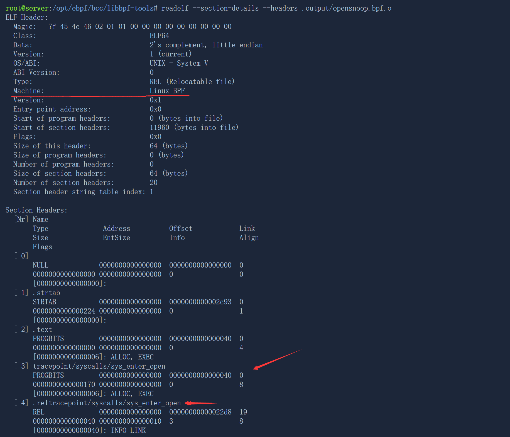

## practice for eBPF

### 钩子机制
我们通过eBPF的钩子机制来实现一个so-called 可拓展内核,下面以bcc工具包中的opensnoop为例:

其中每一个前面都有一个`SEC()`宏，该宏对应于`readelf`列出的可执行部分,它定义了代码应该附加到的eBPF挂钩（SEC（“tracepoint/<category>/<name>”）。在我们的案例中，eBPF跟踪点sys_enter_open和sys_enter_openat，因为无论何时发出open和openat syscall（“已输入”，因此为sys_enter），都应该调用我们的eBPF代码。跟踪点是内核代码中的静态标记，可以用来在运行的内核中附加（eBPF）代码。这些跟踪点通常被放置在感兴趣的位置或常见的位置，以测量性能。

比如:

```c
SEC("tracepoint/syscalls/sys_enter_openat")
int tracepoint__syscalls__sys_enter_openat(struct trace_event_raw_sys_enter* ctx)
{
	...
}

static __always_inline
int trace_exit(struct trace_event_raw_sys_exit* ctx)
{
	...
}

SEC("tracepoint/syscalls/sys_exit_open")
int tracepoint__syscalls__sys_exit_open(struct trace_event_raw_sys_exit* ctx)
{
	return trace_exit(ctx);
}
SEC("tracepoint/syscalls/sys_exit_openat")
int tracepoint__syscalls__sys_exit_openat(struct trace_event_raw_sys_exit* ctx)
{
	return trace_exit(ctx);
}
```

比如用readelf运行编译出来的.o文件`readelf --section-details --headers .output/opensnoop.bpf.o`



`bpftool` 可以用于编译、加载、卸载和查询 BPF 程序，以及查询内核中的 BPF 虚拟机（BPF VM）状态。

我们可以查看内核空间状态(对应BPF VM):`bpftool prog list`

再在另一个终端打开opensnoop `./opensnoop`

再`bpftool prog list`,发现最后多了几个BPF program，即上面的tracepoint

### BPF maps

  eBPF Map是一种特殊类型的哈希表，它被用于在eBPF程序和内核空间之间传递数据。eBPF程序可以使用Map来存储和检索数据，而内核空间可以使用Map来共享数据。

  挂载BPF程序后我们可以查看映射`bpftool map list`

```shell
root@server:~/bcc/libbpf-tools# bpftool map list
8: hash  name start  flags 0x0
        key 4B  value 16B  max_entries 10240  memlock 245760B
        btf_id 56
9: perf_event_array  name events  flags 0x0
        key 4B  value 4B  max_entries 1  memlock 4096B
11: array  name opensnoo.rodata  flags 0x480
        key 4B  value 13B  max_entries 1  memlock 4096B
        btf_id 56  frozen
```

这些均是工具包opensnoop.bpf.c定义的

- 写自己的bpf程序

  只需了解接口修改我们的opensnoop.bpf.c文件,比如加上一行`   bpf_printk("Hello world");`,后续可以根据其id对其进行追踪修改

  ```c
     /* emit event */
     bpf_perf_event_output(ctx, &events, BPF_F_CURRENT_CPU,
                   &event, sizeof(event));
  
     bpf_printk("Hello world");
  
  cleanup:
     bpf_map_delete_elem(&start, &pid);
     return 0;
  }
  ```

  

## 总结

要编写一个简单的 eBPF 程序，只需使用 XDP 挂钩来统计包含 IP 头的数据包的源 IP 地址的数量。程序使用 BPF 哈希映射来存储每个源 IP 地址的包计数，并在 XDP 挂钩函数中使用 BPF 哈希映射来更新计数。可以使用 bcc 工具包中的 build 脚本将程序编译为 .eBPF 文件，并使用 bpftool 命令将程序加载到内核中。可以使用 bpftool 命令查看内核中的 BPF 映射并打印源 IP 计数器的值。卸载程序可以使用 bpftool 命令将其从内核中删除。


   
#### 附 
[opensnoop源代码](./lzc_assets/opensnoop.bpf.c)

2.环境安装

1. 首先要确保你的内核支持eBPF
2. [安装参考](https://github.com/iovisor/bcc/blob/master/INSTALL.md)