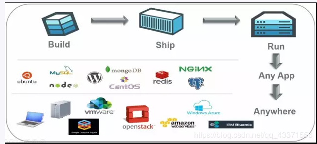
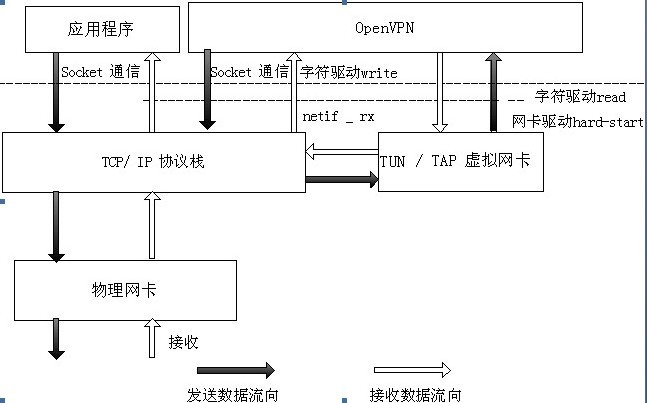

# 项目概览

> 实现可用性高的基于互联网网页的小型分布式文件系统。

## 分布式文件系统

分布式文件系统（Distributed File System）管理的物理存储资源不直接连接在本地节点上，而是通过计算机网络与离散分布的不同节点相连。分布式文件系统的设计同样基于Client/Server模式：一个典型的网络可以包括多个供用户访问的服务器，也允许存在同时扮演客户机和服务器的双重角色，用户可以公开一个允许其他客户机访问的公共目录，而且访问这个目录对其他客户机来说就像使用本地驱动器一样方便。

随着社会经济的发展与信息化进程的加速，台式计算机、智能手机、平板电脑和更多智能可携带式设备正疯狂涌入当前的家庭和小微企业。新型dfs相对于传统dfs而言，应致力于克服单点服务的不足，充分利用分散在各种智能设备上的存储空间，同时在文件访存效率、文件安全性、资源丰富性等方面作出一定优化。

当前离散式存储设备的特点：

- 单机存储容量小，通常不超过1TB
- 间歇性在线联网，时常处于离线状态
- 位置变动范围大，局域网难以覆盖
- 设备性能与专用服务器相比较低
- 设备不运行在统一操作系统上

## 容器化技术（与虚拟机、微服务做对比）

**容器（Container）是极轻量级的操作系统虚拟化，它封装了所有运行应用程序所必需的相关细节比如应用依赖以及操作系统，这些组件被打包成一个镜像（Images）并可以在不同环境下复用。容器之间的进程是相互隔离的，其中一个容器的升级或者变化不会影响其他容器。由此可见，容器具有高可移植性、高兼容性和高可扩展性。**

虚拟机（VM）是一种充当虚拟计算机系统的虚拟环境，它模拟出了自己的整套硬件，包括 CPU、内存、网络接口和存储器等。与容器相比，虚拟机的尺寸较大，通常以千兆字节为度量单位，但可用资源也大大增加，且包含它们自己的操作系统，所以可以同时执行多个资源密集型功能。

微服务就是将应用的各个部分分解成耦合度更低的、更小更专业化的服务。这样有利于专注于应用的特定方面进行维护、更新、测试、部署，而不会影响应用的整体性能。

### Docker

Docker的主要目标是“Build, Ship and Run Any App, Anywhere”， 也就是通过对应用组件的封装、分发、部署、运行等生命周期的管理， 使用户的 APP及其运行环境能够做到“一次封装，到处运行”。Docker 集版本控制、克隆继承、环境隔离等特性于一身，提出一整套软件构建、部署和维护的解决方案。

## 基于OpenVPN的局域网（与SSL VPN做对比）

参考原文：<https://cloud.tencent.com/developer/article/1706635>

从SSL VPN到OpenVPN：简单来说，VPN就是通过密钥交换、封装、认证、加密手段在公共网络上建立起私密数据传输通道，同时保障传输数据的完整性、私密性和有效性的一种技术。传统SSL VPN根据应用协议的类型做相应的端口代理，在client和server之间建立SSL安全连接，但这种实现方式搭建繁琐、普适度低。 OpenVPN对其进行升级优化，使之在利用SSL来保证网络通讯安全性的同时，避免了传统SSL VPN仅提供简单的部分网络应用的不足，具有支持多协议、多平台的特点。

工作原理：在client端,Linux OS支持一个名为**tun**的设备，该设备的驱动程序中包含字符设备驱动和网卡驱动两部分。**网卡驱动负责符合TCP/IP协议的数据包的接受和发送，字符设备驱动通过read和write函数完成用户态和核心态之间的数据读写**，两个驱动互相配合实现SSL VPN功能。同时网卡驱动具有配置IP地址和路由的功能。在server端，服务器需要配置一个虚拟IP地址池和一个自用的静态虚拟IP地址（静态地址和地址池必须在同一个子网中），然后为每一个成功建立SSL连接的客户端动态分配一个虚拟IP地址池中未分配的地址。该代理服务器成为每个客户端在虚拟网络上的网关，负责数据包的截获、报文分析、封装。发送。OpenVPN的服务器和客户端支持tcp和udp两种连接方式，只需在服务端和客户端预先定义好使用的连接方式和端口号，客户端和服务端就在这个连接的基础上进行SSL握手。

## 纠删码（Erasure Code）（与多副本作对比）

参考原文：<https://zhuanlan.zhihu.com/p/69374970>

多副本技术简单来说就是一个数据拷贝多份完全一样的副本，分别存放在集群中随机挑选的多个不同节点上。N副本技术可以允许N-1个节点同时故障时数据仍然不丢失。

Erasure Code 是一种编码技术，它可以将 n 份原始数据，增加 m 份数据，并能通过 n+m 份中的任意 n 份数据，还原为原始数据。即**如果有任意小于等于 m 份的数据失效，仍然能通过剩下的数据还原出来**。纠删码技术在分布式存储系统中的应用主要有三类，阵列纠删码 （Array Code）、**里德-所罗门类纠删码 RS（Reed-Solomon）**和低密度奇偶校验纠删码 LDPC（LowDensity Parity Check Code），目前主流是RS纠删码。EC也被称为“云时代RAID替代品”。

|比较项|多副本（N)|纠删码（N+M）|
|:--:|:--:|:--:|
|可用容量|1/N（较小）|N/(N+M)（较大）|
|读写性能|较快|较慢（小块IO尤为明显）|
|重构性能|无校验计算（较快）|有校验计算（较慢）|
|节点容错数|N-1|M|
|适用场景|块存储、小文件|大文件|

## 总览

众多部署了客户端的机器成为存储节点共同存储文件碎片，一个专用的中央服务器维护系统的状态，对文件系统的访问采用 web 前端。客户端机器可以通过贡献存储空间的方式加入分布式文件系统，也可以通过网页访问分布式文件系统。这使得我们的分布式文件系统具备较为便捷的访问方式与利用闲置设备的潜力。

**亮点包括**：

- 客户端采用容器化技术封装，部署便捷；
- 采用Java实现跨平台；
- 采用网页浏览器实现文件访问，方便灵活；
- 采用纠删码在节约存储空间的同时提高了系统容错性；
- 提供多用户权限使用方式，扩展存储空间的同时方便文件共享；
- 对文件先加密后存储，提高文件安全性；
- 通过设备历史在线状态的统计，优化上传文件时分配碎片的策略，提高服务可用性。

可改进处包括：将编解码以及切分文件等工作转移到浏览器端实现，并且将文件传输的数据连接分离出来，直接在存储节点和浏览节点之间建立连接，减轻中央服务器负担，提高文件传输效率；在设备离线率较高的情况下通过其他方法保证文件的成功获取。
