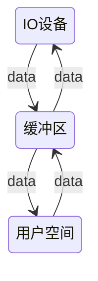
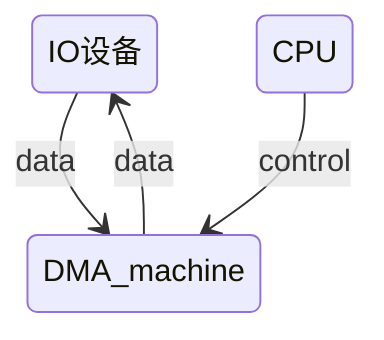

# 基于eBPF对DFS(分布式文件系统)中IO效率的优化

删除套话~~感觉那些不用我说~~,正文如下:(一开始写成可行性分析了,但是感觉放在这里问题不大)
> docs:删除了之前所有的内容,更新如下,本篇虽然篇幅不长但内容相对集中,主要是读了汇总文档后的小结和部分可行性分析.

# Analysis of Feasibility

## 理论依据

首先要理解为什么/如何来提高我们的IO性能,概括性的来说就是减少数据的拷贝次数.

####  1. 传统的数据的四次拷贝与四次上下文切换

在没有任何优化技术使用的背景下，操作系统为此会进行 4 次数据拷贝：

4 次 copy：




物理设备 Input-> 内存(内核态)->内存内部拷贝(经由CPU调控)->内存(内核态)->Output

#### 2. DMA 参与下的数据拷贝

​    DMA 技术很容易理解，本质上，DMA 技术就是我们在主板上放一块独立的芯片。在进行内存和 I/O 设备的数据传输的时候，我们不再通过 CPU 来控制数据传输，而直接通过 DMA 控制器（DMA Controller，简称 DMAC）。这块芯片，我们可以认为它其实就是一个协处理器（Co-Processor），DMAC 的价值在如下情况中尤其明显：当我们要传输的数据特别大、速度特别快。比如说，我们用千兆网卡或者硬盘传输大量数据的时候，如果都用 CPU 来搬运的话，肯定忙不过来，所以可以选择 DMAC。

​    原本，计算机所有组件之间的数据拷贝（流动）必须经过 CPU。现在，DMAC 代替了 CPU 负责内存与磁盘、内存与网卡之间的数据搬运，CPU 作为 DMAC 的控制者.



比如sendfile技术,它直接将传入数据传出而不需要CPU做额外处理,故可以不经过用户空间而直接把数据流传送给网卡(输出设备).这种sendfile方式 依赖于 DMA 技术，将原本由四次CPU全程负责的拷贝减少到两次,因此可以预期时间可能可以缩短为原来的**一半**左右.(一个实例Kakfa)这就是所谓的**零拷贝**（Zero-copy）技术，因为我们没有在内存层面去拷贝数据，也就是说全程没有通过 CPU 来搬运数据，所有的数据都是通过DMA来进行传输的。

#### 3.RDMA:x:

RDMA 即 Remote Direct Memory Access，其区别于 DMA（Direct Memory Access）。在数据中心领域，RDMA 是一种绕过远程主机操作系统内核访问其内存中数据的技术，由于不经过操作系统，不仅节省了大量 CPU 资源，同样也提高了系统吞吐量、降低了系统的网络通信延迟，尤其适合在大规模并行计算机集群中有广泛应用。在基于 NVMe over Fabric 的数据中心中，RDMA 可以配合高性能的 NVMe SSD 构建高性能、低延迟的存储网络[1]。

RDMA 技术基于 DMA 技术的硬件技术实现，此项技术特点在于在于不需要 CPU 干预而直接访问远程主机内存（应当说成 CPU 不需要负责数据搬运，仅仅需要管理），重点是为解决网络传输中服务器端数据处理的延迟。但是相较于DMA需要特殊的网络适配器和驱动程序支持，这些硬件和软件通常只存在于高端服务器和数据中心设备中,故可能难以实现:cry:

#### 4.XDP

XDP 是Linux 内核中提供高性能、可编程的网络数据包处理框架。XDP的原理是在数据包进入内核网络协议栈之前，通过在网络接口驱动程序中注册一个eBPF程序，实现对数据包的快速处理和过滤，从而提高网络性能和安全性。关于这方面的入门可看参考资料^[3]^

## 技术依赖

1.一个分布式文件操作系统().

根据文档貌似是延续前人的项目(但是部署他们项目的时间成本以及他们的关联性貌似与我们选题相关性不是那么大?)个人建议直接用一个比如JuiceFS这种框架搭一个简单版本的分布式文件系统.

2.使用eBPF与XDP技术实现一个兼备DMA能力的内核

#### 使用eBPF实现DMA

在Linux系统中，DMA可以通过eBPF实现，以下是一个简单的示例：

```c
#include <linux/bpf.h>
#include <linux/pkt_cls.h>

SEC("action")
int dma_action(struct __sk_buff *skb)
{
    void *data = (void *)(long)skb->data;
    void *data_end = (void *)(long)skb->data_end;

    /* 检查数据包是否符合要求 */
    if (data + sizeof(struct ethhdr) > data_end)
        return TC_ACT_OK;

    /* 获取数据包的MAC地址 */
    struct ethhdr *eth = data;
    unsigned char *mac = eth->h_dest;

    /* 进行DMA传输 */
    /* ... */

    return TC_ACT_OK;
}
char __license[] SEC("license") = "GPL";

```

这个示例使用了eBPF的TC（Traffic Control）功能，对接收到的数据包进行了简单的DMA传输。在这个示例中，我们定义了一个名为`dma_action`的eBPF程序，它会被TC调用来处理每个接收到的数据包。在程序中，我们首先获取了数据包的指针`data`和`data_end`，然后检查了数据包是否符合要求。如果数据包符合要求，我们就获取了数据包的MAC地址，并进行了DMA传输。

> 需要注意的是，这个示例只是一个简单的演示，实际的DMA传输可能需要进行更多的处理和检查。同时，由于eBPF程序运行在内核中，因此需要特殊的权限才能够加载和运行。

3.使用Prometheus+Grafana进行性能监控与测试

"分布式监控是部署在分布式系统内的监控组件，它可以监视和显示集群中各节点的状态信息，它有运行在各个节点的进程，可以采集不同节点之间的通信消息，采集各个节点的资源利用率，最后将采集到的数据汇总到一个数据库，进行分析处理后以直观的图形化界面进行呈现。

- Prometheus

Prometheus 是一个开源系统监控和警报工具包，它将实时的指标数据（metrics）记录并存储在通过 Http 拉取模型构建的时间序列数据库中，有着较灵活的询问功能和实时告警功能。

- Grafana

Grafana 是一个跨平台的开源的度量分析和可视化工具，可以通过将采集的数据查询然后可视化的展示，并及时通知。"

​																						~~----此部分为复制内容~~

## 参考资料

\[1] [一个讲后台文件IO的github仓库](https://github.com/spongecaptain/SimpleClearFileIO)

[2] 调研报告\_汇总_cwz.md

[3] [XDP的github教程库](https://github.com/xdp-project/xdp-tutorial/)

