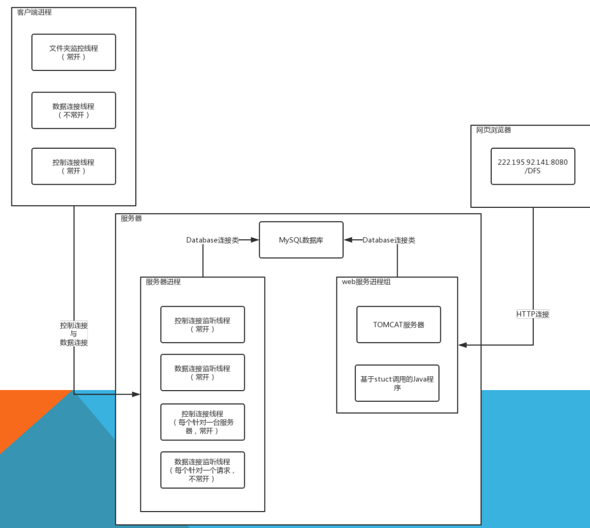
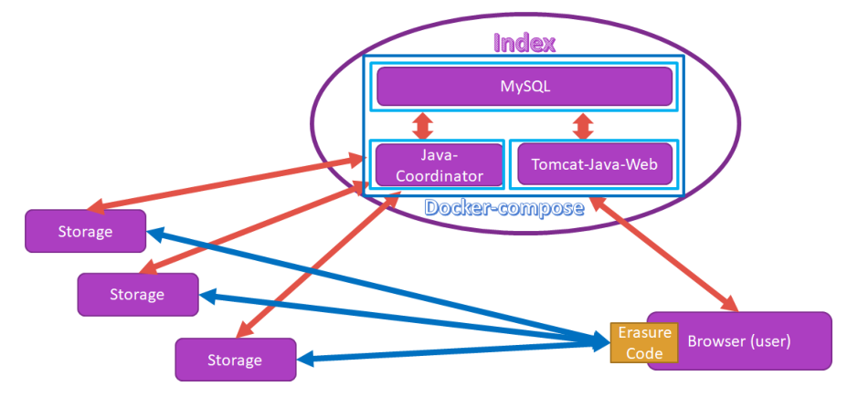
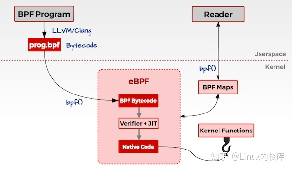
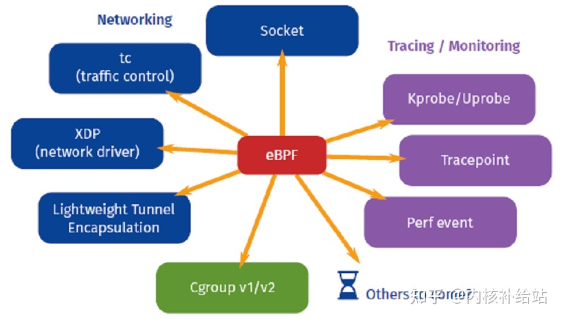
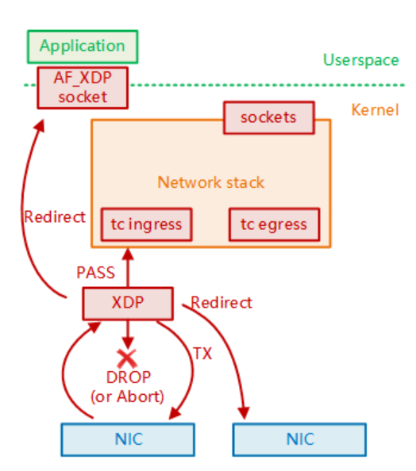

# 调研报告

[TOC]

## 项目简介

本项目基于往届已有的DisGraFS展开，利用eBPF减少数据拷贝次数，从而提高分布式文件系统的IO性能；用户通过网页端使用。

## 项目背景

### 分布式文件系统

#### 概念

分布式文件系统（Distributed File System）是指文件系统管理的物理存储资源不直接连接在本地节点上，而是通过计算机网络与节点（可简单的理解为一台计算机）相连。分布式文件系统的设计同样基于客户机/服务器模式：一个典型的网络可能包括多个供用户访问的服务器，但对等特性允许一些系统扮演客户机和服务器的双重角色。用户可以公开一个允许其他客户机访问的目录，一旦被访问，这个目录对客户机来说就像使用本地驱动器一样。

#### 特点

- 权限管理：公有和私有兼具，用户的角色和权限问题

- 可用性：将底层虚拟化，减少用户使用时的环境配置成本，通过浏览器接口提供给用户使用

- 可扩展性：可加入新的设备

#### 发展必要性

1. 目前各大商业网盘传输速度受限、空间收费等特点不能很好地满足我们对存储的需求。

2. 分布式的意义：

   - 解决大规模运算，存储，管理中，单个计算机算力不足，存储空间不足，连接过慢，负载过高的问题

   - 将数据存储在多个节点上，可以调高数据的可靠性和可用性

### 历界相关项目

#### OSH-2017/DFS

特点：

- 面向小型文件系统
- 使用Erasure Code编码
- 利用MySQL数据库存储所有的元数据
- WEB服务
- 数据传输中心化，所有文件都要经过中央服务器的中转

#### OSH-2020/dontpanic

基于2017年DFS项目优化。

优化内容：

- 容器化服务器端-采用 Docker 容器化技术，实现服务器端的方便部署，降低使用门槛

- 多用户权限支持

- 保留目录节点

- 目录节点验证用户身份，提高数据安全性

- P2P思想，实现点对点数据传输，减轻中央服务器负担

- 纠删码——Reed-Solomon算法

  > 目前，纠删码技术在分布式存储系统中的应用主要有三类，阵列纠删码 （Array Code）、里德-所罗门类纠删码 RS（Reed-Solomon）和低密度奇偶校验纠删码 LDPC（LowDensity Parity Check Code）。

- WebSocket协议实现浏览器和客户端直连以直接传输数据
- 碎片分配策略——提高下载成功率

#### OSH-2021/DisGraFS

DisGraFS——分布式图文件系统

##### 基本概念

- 图文件系统：逻辑上抛弃树状结构，文件之间用“关系”连接。基于语义的局部性：有共同特征的文件相连
- 分布式图文件系统：底层存储采用分布式存储，语义识别采用分布式计算，用图结构描述文件之间的关系

##### 整体架构

DisGraFS分为5个部分：索引服务器、分布式存储集群、分布式计算集群、网页端和客户端。

- 索引服务器：与分布式计算集群的通信、网页端部署的位置，目前也负责构建与维护图数据库（但若有需要，也可将图数据库的部分分离出去）；
- 分布式存储集群：基于 Juicefs 的分布式储存系统，管理、存储和调度分布式存储系统中的所有文件；
- 分布式计算集群：基于 Ray 的分布式计算系统，将文本语义识别、图像识别、语音识别以及元数据提取等任务分散给计算集群中的多个计算机；

- 网页端：直观显示文件所构成的图，并将用户在图上的操作以友好方式展示。
- 客户端：客户端负责直接接收用户对文件系统的操作，并针对不同的平台对其进行实现。

##### 结构

- 中央索引服务器负责调度、维护图数据库、提供用户接口

- 分布式存储集群：JuiceFS + 阿里云 OSS
- 图数据库：Neo4j
- 网页前端：Neo4j 官方提供的 ds.js 和 pototo.js 框架
- 文件语义识别：文本（python库pke）、图像（imagga）、语音（speech_recognition）、视频（tingTag）
- 分布式计算集群：RAY + VLAB

##### 功能与操作

##### 新增文件

1. 用户在网页端启动客户端，将分布式存储集群挂载在本地电脑上；
2. 用户将需要上传的文件拖入JuiceFS对应的盘，此时分布式存储系统对文件进行切分并通过合理的调度将文件分布式的存储在存储集群中；
3. 分布式存储集群发信息给索引服务器，索引服务器将信息转发给分布式计算集群，开始对文件进行内容识别并且打出标签；
4. 打标完成后，分布式计算集群将标签以及文件其他信息一起发送返回给索引服务器，索引服务器根据收到的标签以及文件信息更新图数据库。

##### 文件搜索

1. 用户在网页端提出文件搜索请求，网页端将搜索关键字（可以是标签，也可以是文件名）上传至索引服务器；
2. 索引服务器根据关键字创建搜索语句，在图数据库中搜索，将具有相关标签的所有文件通过图和列表两种方式返回至网页端；

3. 用户可以根据网页端返回的图，直接通过点击获得某一文件的标签与信息，或者获得具有某一标签的所有文件，实现根据文件内容进行搜索以及在图上直接搜索邻顶的目标。

##### 文件获取

1. 用户在关键词搜索返回的文件中找到自己需要的文件，点击打开文件的按键，服务器将消息传给 JuiceFS 分布式存储集群；

2. 分布式存储集群找到需要打开的文件，将其下载到用户本地存储空间并将其打开。

##### 删除文件

1. 用户在客户端提出删除文件的请求，客户端将目标文件名上传至索引服务器；
2. 索引服务器将信息传递给分布式存储集群，分布式存储集群将文件删除；
3. 索引服务器根据文件名删除图数据库中对应的节点，更新图数据库。

#### OSH-2022/WowKiddy

基于2021年DisGraFS项目，根据文件自然属性的逻辑关联，完善分布式文件系统的缓存机制；加入监控部件。

- 主动缓存逻辑cache，加速相同逻辑关联的文件的访问
- 前端支持图片视频预览

- 监控部件检测各类运行指标

#### OSH-2022/TOBEDONE

基于DisGraFS，参考2020年dontpanic项目，添加监控运维模块。

- 实现真正的的远程存储集群，用户所有操作在网页端进行
- 完善网页端操作，简化用户操作
- 引入监控模块，监控数据图形可视化
- 运维工作者可以远程唤醒或关闭存储节点

### 总结与思考

以上的往届项目均涉及分布式文件系统，2022年的两个项目在DisGraFS基础上进行优化，但当前的分布式文件系统的IO性能仍有优化空间。

传统的分布式文件系统通常采用客户端-服务器模式，每个客户端与服务器之间需要进行频繁的IO操作，而用户态和内核态之间频繁的数据拷贝使得IO效率降低。

### eBPF

#### BPF-Berkeley Packet Filter

目的为提供一种过滤包的办法，且避免从内核空间到用户空间的无用的数据包复制行为。它可以载入用户态代码并且在内核环境下运行，内核提供 BPF 相关的接口，用户可以将代码编译成字节码，通过 BPF 接口加载到 BPF 虚拟机中。

#### eBPF架构

- BPF map：统计摘要数据
- perf-event：用户空间获取实时监测数据

#### 一般eBPF工作逻辑

1. BPF Program 通过 LLVM/Clang 编译成 eBPF 定义的字节码 prog.bpf
2. 通过系统调用 bpf() 将 bpf 字节码指令传入内核中
3. 经过 verifier 检验字节码的安全性、合规性
4. 在确认字节码安全后将其加载对应的内核模块执行，通过 Helper/hook 机制，eBPF 与内核可以交换数据/逻辑。BPF 观测技术相关的程序程序类型可能是kprobes/uprobes/tracepoint/perf_events 中的一个或多个，其中：
   - kprobes：实现内核中动态跟踪。 kprobes 可以跟踪到 Linux 内核中的函数入口或返回点，但是不是稳定 ABI 接口，可能会因为内核版本变化导致，导致跟踪失效。理论上可以跟踪到所有导出的符号 /proc/kallsyms 。
   - uprobes：用户级别的动态跟踪。与 kprobes 类似，只是跟踪的函数为用户程序中的函数。
   - tracepoints：内核中静态跟踪。tracepoints 是内核开发人员维护的跟踪点，能够提供稳定的 ABI 接口，但是由于是研发人员维护，数量和场景可能受限。
   - perf_events：定时采样和 PMC 。

5. 用户空间通过 BPF map 与内核通信。

#### eBPF的使用场景

- 网络场景

  依赖eBPF的网络加速方案——XDP（eXpress Data Path）

  

  此前的kernel bypass实现方式是：将网络硬件完全交由某个专门的用户空间应用（userspace application）接管，从而避免内核和用户态上下文切换的昂贵性能开销。但是，操作系统被旁路（绕过）之后，它的应用隔离（application isolation） 和安全机制（security mechanisms）就都失效了；一起失效的还有各种经过已经 充分测试的配置、部署和管理工具。

  基于这个问题，XDP被提出。XDP与内核网络栈协同工作，将硬件的控制权完全留在内核范围内，带来以下优点:

  - 保持了内核的安全边界
  - 无需对网络配置或管理工具做任何修改，可以选择性地复用内核网络栈中的现有功能，例如路由表或 TCP/IP 协议栈，在保持配置接口不变的前提下，加速关键性能路径（critical performance paths）
  - 保证 eBPF 指令集和 XDP 相关的编程接口（API）的稳定性
  - 与常规 socket 层交互时，没有从用户态将包重新注入内核的昂贵开销

  XDP 程序能将数据包重定向到用户空间应用（userspace application）打开的特殊类型 socket。这可以用于加速客户端和服务端在同一台机器的网络密集型应用（network-heavy applications running on the local machine）。而拷贝数据包会使该方式的性能降低，进而产生了对基于eBPF的零拷贝的讨论，即：在内核空间中实现零拷贝技术，避免数据在用户空间和内核空间之间拷贝，从而提高IO效率。

## 立项依据

1. 个人/家庭有使用分布式存储提高数据安全性的需求，同时有分散在若干个人设备的碎片化存储资源可以利用。
2. eBPF 技术可以将一些 IO 操作从内核态移动到用户态，避免了数据在内核态和用户态之间频繁地进行数据拷贝，从而可以大大提高 IO 性能。此外，eBPF 还可以对 IO 操作进行监控和控制，提高系统的可靠性和安全性。
3. 传统的分布式文件系统在数据传输过程中需要频繁地进行内核空间和用户空间之间的数据拷贝，导致系统开销较大，影响IO性能。因此，对于分布式文件系统的IO性能优化十分必要。

面对前述现状，我们希望在前人试验基础上，基于eBPF实现具有高性能IO的分布式文件系统，并向用户提供网页端使用。

## 前瞻性/重要性分析

随着数据爆炸时代的到来，传统的文件系统无法满足大规模数据存储和处理的需求，分布式文件系统可以通过横向扩展满足大规模数据存储和处理需求。分布式系统的IO效率是影响其整体性能的重要因素，因此对I/O操作进行优化十分必要。

eBPF在云计算、容器、网络、安全等领域都有广泛的应用，利用eBPF提高分布式文件系统的IO性能充分利用了其避免多次拷贝的优点。

## 相关工作

[1] :[The eXpress data path: fast programmable packet processing in the operating system kernel](https://dl.acm.org/doi/10.1145/3281411.3281443)

[2] :[IngramWang/DFS_OSH2017_USTC ](https://github.com/IngramWang/DFS_OSH2017_USTC)

[3] :[OSH-2020/x-dontpanic: team dontpanic in ustc-osh-2020 (github.com)](https://github.com/OSH-2020/x-dontpanic)

[4] :[OSH-2021/x-DisGraFS: Distributed Graph Filesystem (github.com)](https://github.com/OSH-2021/x-DisGraFS)

[5] :[OSH-2022/x-WowKiddy: 2022 USTC OSH project (github.com)](https://github.com/OSH-2022/x-WowKiddy)

[6] :[OSH-2022/x-TOBEDONE: team TOBEDONE in USTC-OSH-2022 (github.com)](https://github.com/OSH-2022/x-TOBEDONE)

