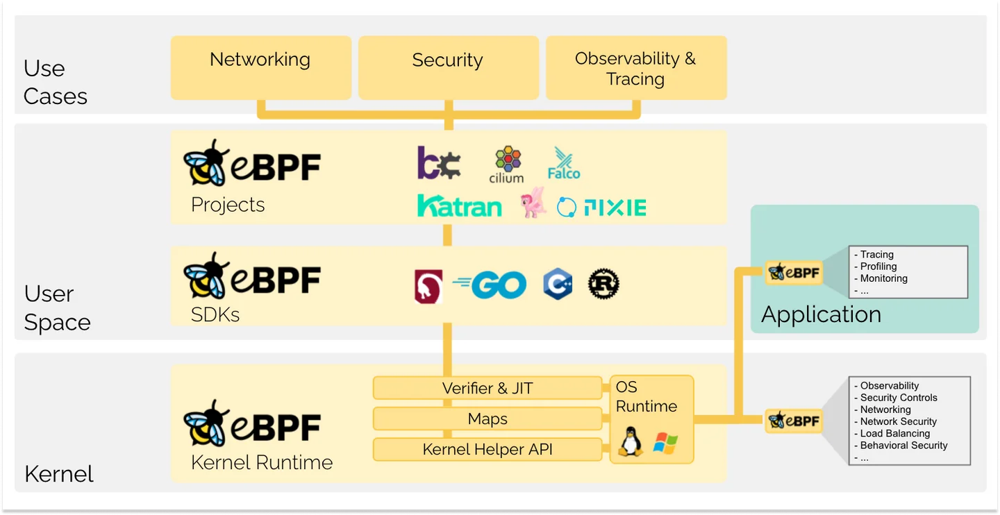
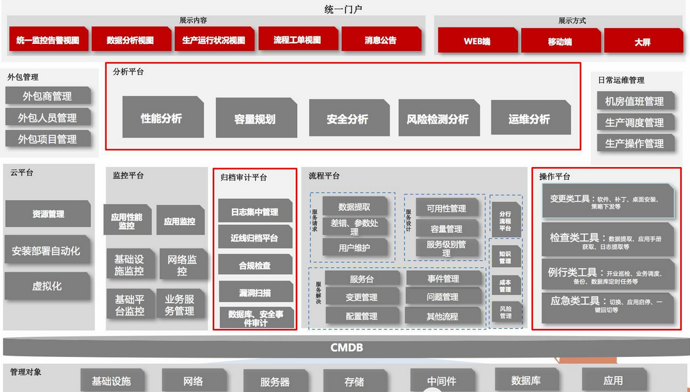

# eBPF

- 简介：eBPF 被广泛用于驱动各种用例：在现代数据中心和云原生环境中提供高性能网络和负载均衡,以低开销提取细粒度的安全可观察性数据,帮助应用程序开发人员跟踪应用程序,为性能故障排除、预防性应用程序和容器运行时安全实施等提供见解。

| eBPF 功能 |                      可实践场景                      |
| :-------: | :--------------------------------------------------: |
| **跟踪**  | 可观测性一体化平台自**运维**、云原生服务平台**观测** |
| **网络**  |      **加速**分布式系统协议、服务器**负载均衡**      |
| **安全**  |         检测恶意入侵、强化型服务器**防火墙**         |

## Part 1 跟踪

- 当今 IT 界基础设施更新迭代加快、应用程序层出不穷,面对急剧扩大的开发规模,传统的平台及运行维护方式已不适用,迫切需要建设新一代服务平台及配套运维系统,云服务平台应运而生。与传统服务器不同的是,云服务平台具有稳定、安全、弹性、维护成本低、易用性和可扩展性强等突出优点,整合了计算、存储、网络等核心要素。如今云服务平台开发已如火如荼,与之相配套的运行维护平台也急需升级换代。理想化的一体化运维平台架构及功能大抵如下图所示。目前已有多种机器学习算法能进一步对收集的数据进行综合分析,实现故障预测、容量预测、多维指标分析等能力。与此同时,新兴技术 eBPF 的快速发展则能极大提高运维平台数据收集、故障定位、部署更新、安全防护、可观测性管理等能力。

Reference: <https://cloud.tencent.com/developer/article/1595017>

_skywalking-rover_ [使用 eBPF 准确定位服务网格中的关键性能问题]
Reference: <https://zhuanlan.zhihu.com/p/538145234> <https://github.com/apache/skywalking-rover>

_Kindling_ [基于 eBPF 的云原生可观测性开源项目]
Reference: <https://github.com/KindlingProject/kindling>

_Pixie_ [开源 kubernetes-native-in-cluster 可观察平台] 它提供了 Kubernetes 工作负载的即时可见性,无需手动检测,同时使用 uprobes 和 kprobes 来支持跨服务和应用程序的可观察性,利用 eBPF 自动获取遥测数据,其边缘机制能将这些数据与 Kubernetes 元数据连接起来,在保持数据局部性的同时提供可见性。
Reference: <https://github.com/pixie-io/pixie>

- 可观测性不局限于收集各种监测数据并关联展示，更涉及根据整个系统的输出结果进行部署更新、推断预测等。在实际的业务场景中，通常与可观测性相关联紧密的数据便是“指标”、“日志”和“链路追踪”。然而，这些数据源中的每一项都有不同的收集方法，除此，针对这些数据项进行采集可能需要多种不同的产品和代理。而eBPF可以以一种安全且跨系统一致的方式收集遥测数据以实现可观测性，并且对当前系统性能和资源使用影响最小。
Reference: <https://cloud.tencent.com/developer/article/2216622>

| eBPF 观测应用 |  实例 |
|:--:|:--:|
|  网络观测     |    Cilium 基于 eBPF 在不需要代理或使用大量系统资源的情况下深入追踪网络流量走向             |
| Kubernetes(k8s)一个开源的 Linux 容器自动化运维平台 | 通过跨 Kubernetes Cluster 在内核级别收集粒度数据来提高可观察性 |
|性能观测    |    每个进程的 CPU 和内存利用率等能力   |
| 安全观测 | Hubble 基于 eBPF 来收集网络流量数据（例如行为的突然变化、特定进程的活动微爆发）表明潜在的利用或攻击 |

Reference: <https://github.com/cilium/hubble>

## Part 2 网络

- 在网络加速场景中，DPDK 技术（数据平面开发工具包）大行其道,在某些场景 DPDK 成了唯一选择。而 eBPF 提供了一个 bpf_msg_redirect_hash 函数,用来将应用发出的包直接转发到对端的 socket,可以极大地加速包在内核中的处理流程。在分布式系统协议中, eBPF 可以用于加速网络数据包的处理,提高网络性能。目前,有一些使用 eBPF 加速分布式系统协议的项目,例如 Cilium、Envoy 等。其中,Cilium 是一个基于 eBPF 的网络和安全解决方案,可以用于 Kubernetes 等容器编排平台的网络和安全。Envoy 是一个开源的 L7 代理和通信总线,可以用于微服务架构中的服务发现、负载均衡、流量管理等。

|常用分布式系统协议||
|:--:|:--:|
|Paxos||
|Raft||
|ZAB||
Reference: <https://zhuanlan.zhihu.com/p/147691282>

Paper: [Electrode: Accelerating Distributed Protocols with eBPF]
Reference: <https://yangzhou1997.github.io/paper/electrode-nsdi23.pdf>

_Merbridge_ [Merbridge - 使用 eBPF 实现网络加速]
Reference: <https://istio.io/latest/zh/blog/2022/merbridge/> <https://github.com/merbridge/merbridge>

[使用 eBPF 加速节点内 TCP 通信]
Reference: <https://kubeovn.github.io/docs/v1.11.x/advance/accelerate-intra-node-tcp-with-ebpf/>

- eBPF可以用于负载均衡的原因是，eBPF可以使用加载到内核中的程序在源头进行负载平衡，而不是使用虚拟IP。这样可以消除服务连接的所有NAT开销，从而提高负载均衡的性能。

|常用负载工具||
|:--:|:--:|
|Nginx||
|LVS||
|HAProxy||
|F5||
Reference: <https://blog.csdn.net/chen_jimo_c/article/details/104949769>

_Katran_ 一种基于软件的负载均衡解决方案,利用了两项最新的内核工程创新：eXpress Data Path（XDP）和 eBPF 虚拟机。 Katran 被部署在 Facebook 的 PoP 服务器上,用于提高网络负载均衡的性能和可扩展性,并减少在没有数据包流入时的循环等待。
Reference: <https://www.infoq.cn/article/2018/06/Facebook-Katran>

[高性能网络实战：借助 eBPF 来优化负载均衡的性能]
Reference: <https://zhuanlan.zhihu.com/p/592981662>

## Part 3 安全

- eBPF可以用于安全防护的原因是，eBPF可以使用加载到内核中的程序来监控和过滤网络流量，从而检测和防御网络攻击, 同时eBPF还可以用于监控系统调用，以检测和防御恶意入侵内核的不规范操作。

[Linux 中基于 eBPF 的恶意利用与检测机制]
Reference: <https://tech.meituan.com/2022/03/29/how-to-detect-bad-ebpf-used-in-linux.html>

[云原生安全攻防｜使用 eBPF 逃逸容器技术分析与实践]
Reference: <https://security.tencent.com/index.php/blog/msg/206>

[基于 ebpf 的防火墙--bpf-iptables]
Reference: <https://blog.csdn.net/gengzhikui1992/article/details/109774760> <https://github.com/mbertrone/bpf-iptables>

[在防火墙中使用 eBPF 构建可编程数据包过滤]
Reference: <https://blog.cloudflare.com/programmable-packet-filtering-with-magic-firewall/>

[eBPF/XDP 实现防火墙功能]
Reference: <https://blog.csdn.net/cugriver/article/details/122905062>

## 其他

[Kubernetes 入门：Pod、节点、容器和集群都是什么？]<https://zhuanlan.zhihu.com/p/32618563>
[用 eBPF 观测 HTTP]<https://zhuanlan.zhihu.com/p/551257831>
[eBPF 基本架构及使用] <https://www.cnblogs.com/dengchj/p/14919393.html>
