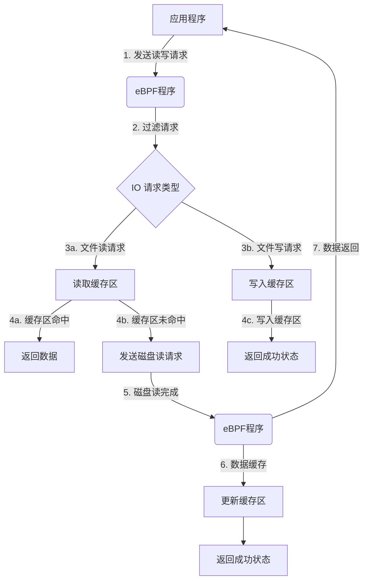
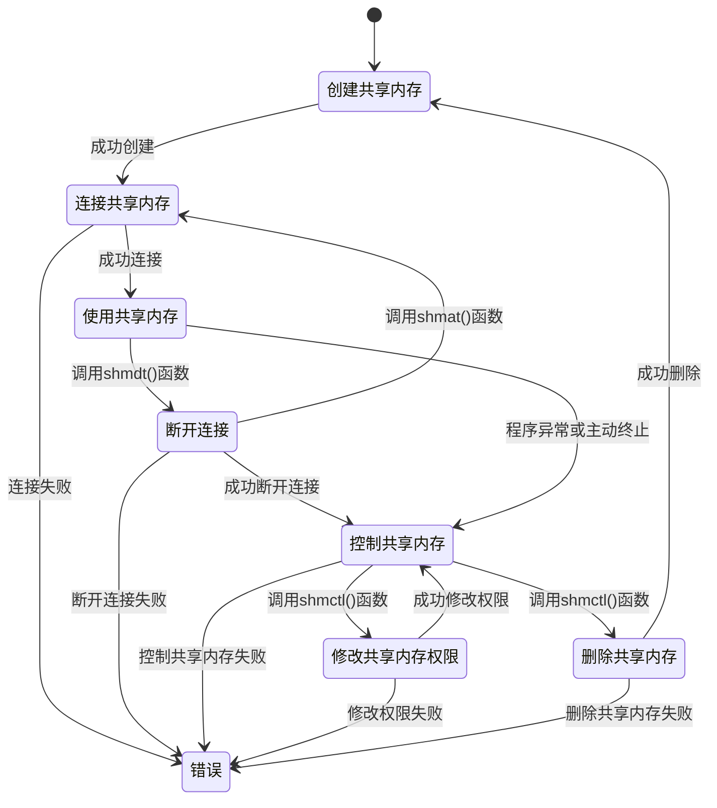
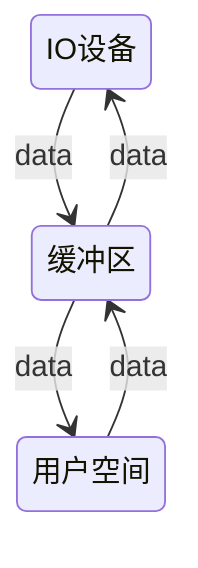
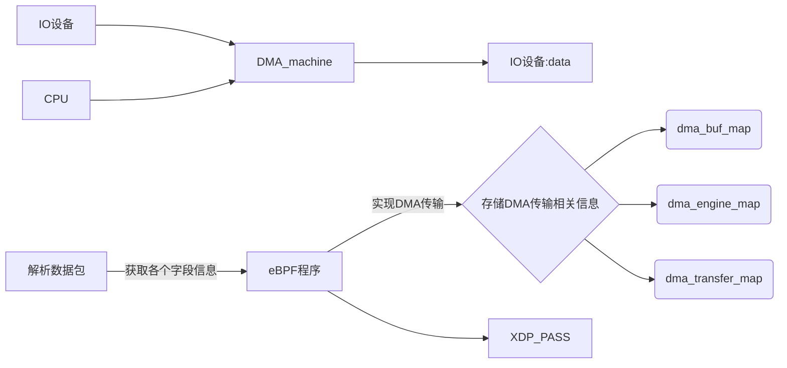

- [Analysis of Feasibility](#analysis-of-feasibility)
  - [技术依据](#技术依据)
    - [1.分布式文件操作系统](#1分布式文件操作系统)
    - [2 DMA or Shared Memory ?](#2-dma-or-shared-memory-)
      - [DMA 参与下的数据拷贝](#dma-参与下的数据拷贝)
      - [----使用eBPF实现DMA](#----使用ebpf实现dma)
    - [gpt的可行性评估:](#gpt的可行性评估)
    - [3.使用Prometheus+Grafana进行性能监控与测试](#3使用prometheusgrafana进行性能监控与测试)
  - [创新点](#创新点)
    - [DMA](#dma)
    - [SM(Shared Memory)](#smshared-memory)
  - [计划步骤](#计划步骤)
  - [参考资料](#参考资料)


# Analysis of Feasibility

## 技术依据

### 1.分布式文件操作系统
部署并优化前人项目DisGraFS^[1]^.

### 2 DMA or Shared Memory ?

经过前几次的会议和调研报告,我们将思路focus到了3个方向:


**1.共享内存**
- 优点：

可以在不同的进程之间共享数据，提高程序的并发性和效率,对数据的传输和处理速度比较快，适用于实时性要求较高的应用。
- 缺点：需要操作系统的支持，对操作系统的版本和配置有一定的要求；对数据的访问和同步需要进行额外的处理，增加了编程复杂性；不适用于跨机器的数据传输。
- 前景和可行性：
实现共享内存技术需要一定的编程经验和对操作系统的了解，但相对来说比较可行。

共享内存相关控制

**2.kernel-bypass**
- 优点：可以绕过操作系统内核，直接访问硬件和网络设备，提高数据传输和处理的速度和吞吐量；可以在用户空间进行更灵活和高效的数据处理，提高程序的性能和可维护性；可以通过 eBPF 和 XDP 技术实现更多样化和高级的网络性能优化，例如数据包过滤、修改和状态跟踪。
- 缺点：需要对操作系统和网络协议有更深入的了解和掌握；可能会增加系统的安全风险和稳定性问题。

考虑到项目可行性，我们没有选择kernel-bypass

**3.DMA**
- 优点：可以提高数据传输的速度和吞吐量；对 CPU 的占用较小；
- 缺点：需要硬件支持，对硬件要求较高；不适用于所有类型的数据传输，例如共享内存和用户空间的数据传输；对数据传输的类型和大小有一定的限制。
  
> 使用eBPF与XDP技术实现一个兼备DMA能力的内核
> 
在没有任何优化技术使用的背景下，操作系统为此会进行 4 次数据拷贝：

4 次 copy：



物理设备 Input-> 内存(内核态)->内存内部拷贝(经由CPU调控)->内存(内核态)->Output

####  DMA 参与下的数据拷贝
####        ----使用eBPF实现DMA


- dma_buf_map映射：用于存储DMA缓冲区的物理地址和大小。在这个映射中，每个键对应一个DMA缓冲区的ID，每个值是一个struct dma_buf结构体，包含了DMA缓冲区的物理地址和大小。通过这个映射，可以在eBPF程序中方便地访问和管理DMA缓冲区。

- dma_engine_map映射：用于存储DMA引擎的状态。在这个映射中，每个键对应一个DMA引擎的ID，每个值是一个struct dma_engine结构体，包含了DMA引擎的状态。通过这个映射，可以在eBPF程序中方便地访问和管理DMA引擎的状态。

- dma_transfer_map映射：用于存储DMA传输的状态、结果、错误等信息。在这个映射中，每个键对应一个DMA传输的ID，每个值是一个struct dma_transfer结构体，包含了DMA传输的状态、结果、错误等信息。通过这个映射，可以在eBPF程序中方便地访问和管理DMA传输的相关信息，例如传输是否完成、是否出现错误等。

在Linux系统中，DMA可以通过eBPF实现，copilot帮我写了一段代码：

```c
#include <linux/bpf.h>
#include <linux/if_ether.h>
#include <linux/if_packet.h>
#include <linux/ip.h>
#include <linux/in.h>
#include <linux/tcp.h>

#define DMA_BUF_SIZE 4096

struct dma_buf {
    unsigned long phys_addr;
    unsigned int size;
};

struct dma_engine {
    unsigned int id;
    unsigned int status;
};

struct dma_transfer {
    unsigned int id;
    unsigned int status;
    unsigned int result;
    unsigned int error;
    unsigned int complete;
    unsigned int timeout;
    unsigned int cancel;
    unsigned int pause;
    unsigned int resume;
};

struct bpf_map_def SEC("maps") dma_buf_map = {
    .type = BPF_MAP_TYPE_ARRAY,
    .key_size = sizeof(unsigned int),
    .value_size = sizeof(struct dma_buf),
    .max_entries = 1024,
};

struct bpf_map_def SEC("maps") dma_engine_map = {
    .type = BPF_MAP_TYPE_ARRAY,
    .key_size = sizeof(unsigned int),
    .value_size = sizeof(struct dma_engine),
    .max_entries = 1024,
};

struct bpf_map_def SEC("maps") dma_transfer_map = {
    .type = BPF_MAP_TYPE_ARRAY,
    .key_size = sizeof(unsigned int),
    .value_size = sizeof(struct dma_transfer),
    .max_entries = 1024,
};

SEC("xdp")
int xdp_prog(struct xdp_md *ctx)
{
    void *data_end = (void *)(long)ctx->data_end;
    void *data = (void *)(long)ctx->data;

    struct ethhdr *eth = data;
    if (eth + 1 > (struct ethhdr *)data_end) {
        return XDP_DROP;
    }

    struct iphdr *ip = data + sizeof(struct ethhdr);
    if (ip + 1 > (struct iphdr *)data_end) {
        return XDP_DROP;
    }

    struct tcphdr *tcp = data + sizeof(struct ethhdr) + sizeof(struct iphdr);
    if (tcp + 1 > (struct tcphdr *)data_end) {
        return XDP_DROP;
    }

    // TODO: Implement DMA transfer using eBPF

    return XDP_PASS;
}

```

这段示例代码包含了一个名为dma_buf_map的eBPF映射，用于存储DMA缓冲区的物理地址和大小；一个名为dma_engine_map的eBPF映射，用于存储DMA引擎的状态；一个名为dma_transfer_map的eBPF映射，用于存储DMA传输的状态、结果、错误等信息。

在xdp_prog函数中，可以实现DMA传输的代码。具体实现方式取决于所使用的DMA引擎和设备.

### gpt的可行性评估:

**DMA方案的可行性**：

- DMA技术需要硬件支持，在硬件设备不支持DMA的情况下无法使用。
- DMA技术需要编写驱动程序和底层代码，技术难度较高，需要熟练掌握操作系统和硬件相关的知识和技能。
- DMA技术需要对系统进行较大的改动，可能会带来不稳定性和安全性问题。

**共享内存方案的可行性**：

- 共享内存技术可以使用系统提供的API进行实现，技术难度相对较低。
- 共享内存技术对硬件设备没有特殊要求，适用范围较广。
共享内存技术的实现过程中需要考虑并发控制和线程安全等问题。


### 3.使用Prometheus+Grafana进行性能监控与测试

"分布式监控是部署在分布式系统内的监控组件，它可以监视和显示集群中各节点的状态信息，它有运行在各个节点的进程，可以采集不同节点之间的通信消息，采集各个节点的资源利用率，最后将采集到的数据汇总到一个数据库，进行分析处理后以直观的图形化界面进行呈现。

- Prometheus

Prometheus 是一个开源系统监控和警报工具包，它将实时的指标数据（metrics）记录并存储在通过 Http 拉取模型构建的时间序列数据库中，有着较灵活的询问功能和实时告警功能。

- Grafana

Grafana 是一个跨平台的开源的度量分析和可视化工具，可以通过将采集的数据查询然后可视化的展示，并及时通知。

## 创新点

### DMA

1. 使用eBPF技术实现DMA传输：传统的DMA传输是通过内核驱动程序实现的，而您的项目使用eBPF技术实现DMA传输，可以在内核态中实现DMA传输，从而减少数据拷贝次数，提高系统的性能。

2. 使用XDP技术减少数据包处理的延迟和CPU占用率：XDP技术是一种高性能网络数据包处理技术，可以在网络驱动程序接收数据包时，使用eBPF程序来处理数据包，从而减少数据包处理的延迟和CPU占用率。通过结合XDP和eBPF技术，可以进一步提高系统的性能。

3. 实现兼备DMA能力的内核：您的项目旨在实现一个兼备DMA能力的内核，这是一个非常有创新性的想法。通过使用eBPF和XDP技术，可以在内核态中实现DMA传输和数据包处理，从而减少数据拷贝次数和CPU占用率，提高系统的性能。

### SM(Shared Memory)

1. 灵活性：eBPF和XDP技术允许用户自定义网络应用程序的逻辑，可以根据需要进行灵活的共享内存设计和实现，适应不同的场景和需求。

2. 安全性：eBPF和XDP技术具有良好的安全性，可以防止恶意应用程序对共享内存的非法访问和操作，保护系统的稳定性和安全性。

3. 可扩展性：eBPF和XDP技术可以方便地扩展和升级，可以根据需要进行新功能的添加和旧功能的替换，保持技术的前沿性和竞争力。

## 计划步骤

:one: 复现前辈的分布式文件系统并完成监控环境的部署 

:two: 实现单机上eBPF内核实现减少数据拷贝次数的数据传输

:three: 将2部署到分布式文件系统上并提高安全性和鲁棒性

:four: 进行性能监测和比较,得出优化效果

## 参考资料

\[1][DisGraFS](https://github.com/OSH-2021/x-DisGraFS)

\[2] [一个讲后台文件IO的github仓库](https://github.com/spongecaptain/SimpleClearFileIO)


\[3] [XDP的github教程库](https://github.com/xdp-project/xdp-tutorial/)

