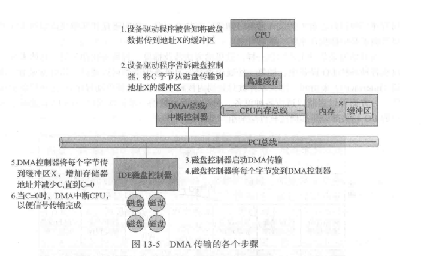
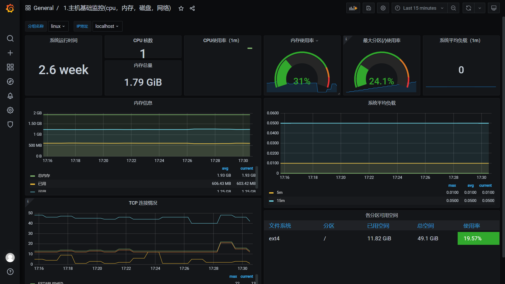

[TOC]

## 理论依据

### IO性能:

（摘自教材）

I/O性能直接影响系统性能，但传统IO效率很低，导致IO效率的原因有：

1. 从CPU角度考虑：对于CPU执行设备驱动程序代码和随着进程阻塞和解除阻塞而公平并高效地调度，它增加了很大的负荷。由此导致的上下文切换增加了CPU及其硬件缓存的负担。

2. 从内存总线角度考虑：I/O也暴露了内核的中断处理机制的低效。此外，对于控制器和物理内存之间的数据复制，以及应用程序数据空间和内核缓存之间的数据复制，I/O加重了内存总线的负荷。
   虽然中断的效率要高于轮询，但每个中断导致系统执行状态改变，执行中断处理，再恢复状态，导致完整的上下文切换开销。

3. 网络流量也能导致高的上下文切换速率。

   例如，考虑从一台机器远程登录到另一台机器。在本地机器上输入的字符必须传到远程机器。在本地机器上，输入字符引起键盘中断;字符通过中断处理程序传到设备驱动程序，到内核，再到用户进程。用户进程执行一个网络IO系统调用，以将该字符送到远程机器。该字符流入本地内核，通过网络层来构造网络分组，再到网络设备驱动程序。网络设备驱动程序传输分组到网络控制器，以便发送字符并生成中断。中断通过内核传递回来，以便导致网络I/O系统调用完成。
   这时，远程系统的网络硬件收到数据包，并生成中断。通过网络协议解包得到字符，并传到适当的网络守护进程。网络守护进程确定与哪个远程登录会话有关，并传递数据包到适当的会话子进程。在整个流程中，有上下文切换和状态切换(图13-15)。通常，接收者会将该字符送回给发送者;这种方式会使工作量加倍。


### DMA:

#### 使用DMA的目的: 

减轻CPU负担

具体来说，对于执行大量传输的设备，例如磁盘驱动器，如果通过CPU来观察状态位并且按字节来发送数据到控制器寄存器（称为程序控制I/O ( Programmed I/O，PIO))，则似乎浪费了。许多计算机为了避免因PIO而增加CPU负担，将一部分任务交给一个专用的处理器DMA控制器。

#### DMA传输过程：

在启动DMA传输时,主机将DMA命令块写到内存。该块包含传输来源地址的指针、传输目标地址的指针、传输的字节数。CPU将这个命令块的地址写到DMA控制器，然后继续其他工作。DMA控制器继续直接操作内存总线，将地址放到总线，在没有主CPU的帮助的情况下执行传输。
DMA控制器与设备控制器之间的握手，通过一对称为DMA请求( DMA-request)和DMA确认（DMA-acknowledge)的线路来进行。当有数据需要传输时，设备控制器发送信号到 DMA请求线路。这个信号使得DMA 控制器占用内存总线，发送所需地址到内存地址总线，并发送信号到DMA确认线路。当设备控制器收到DMA 确认信号时，它就传输数据到内存,并且清除 DMA请求信号。
当完成整个传输时，DMA 控制器中断CPU。图13-5描述了这个过程。当DMA控制器占用内存总线时，CPU被暂时阻止访问内存，但是仍然可以访问主缓存或辅助缓存内的数据项。



为了改善I/O效率，可以采用多种方法:

1. 减少上下文切换的次数。
2. 减少设备和应用程序之间传递数据时的内存数据的拷贝次数。
3. 通过大传输、智能控制器、轮询（如果忙等可以最小化)，减少中断频率。
4. 通过DMA智能控制器和通道来为主CPU承担简单数据复制，增加并发。
5. 将处理原语移到硬件，允许控制器操作与CPU和总线操作并发。
6. 平衡CPU、内存子系统、总线和I/O 的性能，因为任何一处的过载都会引起其他部分的空闲。

在本项目中，主要通过DMA减少上下文切换和减少内存拷贝次数


## 技术路线：

1. #### DisGraFS的部署

DisGraFS采用JuiceFS作为底层的分布式文件系统。目前，JuiceFS有两个版本，在DisGraFS中，学长们采用的是开源版本

为了访问JuiceFS内的数据，需要先将JuiceFS挂载为当前操作系统的一个磁盘/文件夹。具体到DisGraFS，客户端和Ray分布式计算集群都需要挂载JuiceFS：客户端需要直接通过挂载的接口来操作文件，而Ray集群需要从JuiceFS中将用户上传的文件取出进行语义识别。

juiceFS具体部署可以参考官方文档，这里不赘述，部署后进行挂载。

在bash中运行Linux版的`juicefs`

```
./juicefs mount redis://:disgrafs@juicefs.disgrafs.tech ~/jfs -v --writeback
```

Linux下可以挂载到任意文件夹，但如果挂载的文件夹需要sudo权限，那么也要用sudo运行`juicefs`。同样按下`Ctrl + C`结束程序即可自动卸载。

**注意！**直接从网络上下载的`juicefs`可执行文件在一些Linux系统上由于不受信而无法执行，这时需要先执行`chmod 777 juicefs`。

而后使用DisGraFS客户端文件完成分布式图文件系统部署工作。

2. #### 编写eBPF程序并加载到内核中（参考BPF for Storage: An Exokernel-Inspired Approach）

eBPF是一种在内核中运行的程序，使用eBPF的步骤大致如下：

- 编写eBPF程序，使用C语言或者其他支持的语言，定义eBPF程序的逻辑和功能
- 编译eBPF程序，使用clang或者其他编译器，将eBPF程序编译成二进制格式
- 加载eBPF程序，使用bpf()系统调用或者其他工具，如bpftool、libbpf等，将eBPF程序加载到内核中，并绑定到相应的钩子点
- 运行eBPF程序，当触发相应的事件时，如网络包到达、系统调用执行等，eBPF程序会自动运行，并执行相应的操作
- 交互eBPF程序，使用bpf()系统调用或者其他工具，如bpftrace、bpf_perf_event等，与eBPF程序进行交互，如读取或修改eBPF映射中的数据、获取eBPF事件的输出

一个eBPF实现DMA的程序样例

```c
// ebpf_dma.c
#include <linux/bpf.h>
#include <bpf/bpf_helpers.h>

// 定义一个bpf_map类型的数据结构，用来存储DMA缓冲区的地址和大小
struct {
  __uint(type, BPF_MAP_TYPE_ARRAY);
  __uint(max_entries, 1);
  __type(key, u32);
  __type(value, struct dma_buffer);
} dma_map SEC(".maps");

// 定义一个结构体，用来表示DMA缓冲区
struct dma_buffer {
  void *addr; // 缓冲区的虚拟地址
  size_t size; // 缓冲区的大小
};

// 定义一个eBPF程序，用来在网络设备收到数据包时，将数据包复制到DMA缓冲区中
SEC("xdp")
int xdp_dma(struct xdp_md *ctx) {
  // 获取数据包的指针和长度
  void *data = (void *)(long)ctx->data;
  void *data_end = (void *)(long)ctx->data_end;
  size_t len = data_end - data;

  // 获取dma_map中的第0个元素，即DMA缓冲区的信息
  u32 key = 0;
  struct dma_buffer *buf = bpf_map_lookup_elem(&dma_map, &key);
  if (!buf) {
    return XDP_ABORTED; // 如果没有找到DMA缓冲区，就丢弃数据包
  }

  // 检查DMA缓冲区是否有足够的空间
  if (len > buf->size) {
    return XDP_ABORTED; // 如果数据包长度超过DMA缓冲区大小，就丢弃数据包
  }

  // 将数据包复制到DMA缓冲区中
  bpf_probe_write_user(buf->addr, data, len);

  // 返回XDP_PASS，让数据包继续传递给内核协议栈
  return XDP_PASS;
}

char _license[] SEC("license") = "GPL";
```

工作流程：

1. 挂载文件系统后，文件系统驱动程序向用户空间发送请求，用户空间查找对应标志检查是否支持该框架，如果支持则将eBPF程序加载到内核中（通过bpf_load_prog系统调用实现）。如果eBPF验证器检查扩展完整性失败，则使用普通的文件系统的功能，成功则启动JIT编译器处理扩展生成字节码。这里驱动程序本身不执行任何IO操作，也不自己处理请求。
2. 扩展安装在bpf_prog_type映射中，调用跳转需要文件系统驱动程序执行bpf_tail_call，同时一旦eBPF程序加载完毕，进程需要通知驱动程序内核扩展的信息
3. 文件系统接到eBPF加载完毕的通知，就可以开始执行在eBPF虚拟机环境下运行的扩展，文件IO可通过优化过的快速路径进行。


实现细节：

为文件系统提供eBPF支持，具体来说即借助eBPF添加额外的内核辅助函数，设计新的映射类型，以支持用户空间和内核的通信和高效IO。而这里同时也要修改文件系统驱动程序，使其首先调用eBPF扩展，在加载eBPF程序后，我们可以绕过用户空间守护程序，直接向下层文件系统传递IO请求。

3. #### 利用编写好的eBPF程序对DisGraFS的IO进行优化

4. #### 性能检测与比较

Grafana是一个可视化工具，可以根据一个数据源来监测文件系统IO性能，查看包括内存，CPU占用率等各种指标。

主机基础监控效果如下：



iostat是一个Linux系统下的磁盘监控工具，它可以实时地收集和报告磁盘的使用情况和性能数据，包括IOPS、吞吐量和延迟等。iostat也可以显示CPU的使用情况。

iostat的基本用法是：iostat [选项\] [间隔时间] [次数]。

其中，选项可以用来指定显示的内容和格式，如-c表示只显示CPU统计，-d表示只显示设备报告，-x表示显示扩展的I/O统计，-k表示以千字节为单位显示数据，-m表示以兆字节为单位显示数据等。间隔时间和次数可以用来指定显示的频率和次数，如iostat -k 2 3表示每隔2秒显示一次磁盘和CPU统计，共显示3次

可以尝试将iostat的输出导入grafana来比较分布式文件系统的IO性能