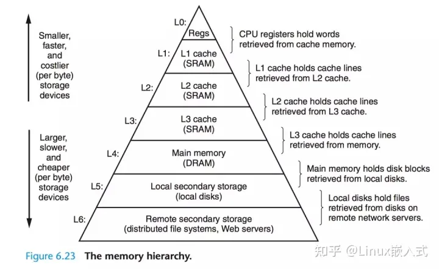
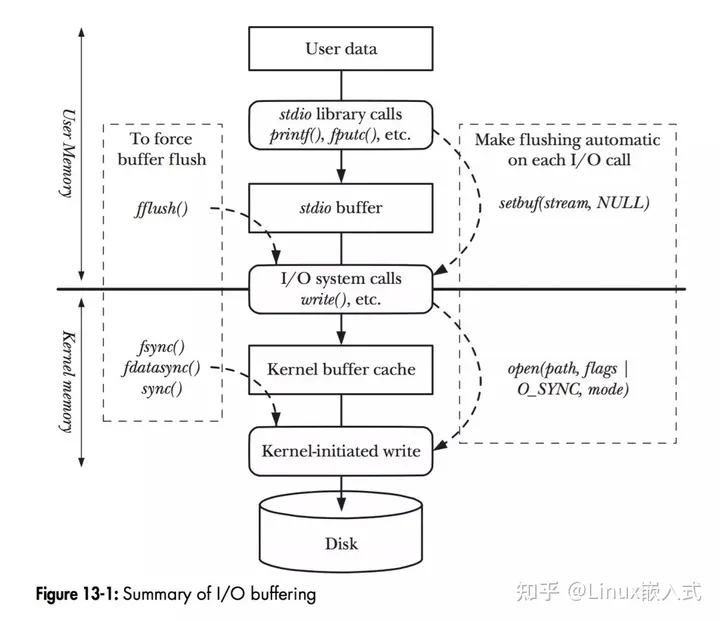
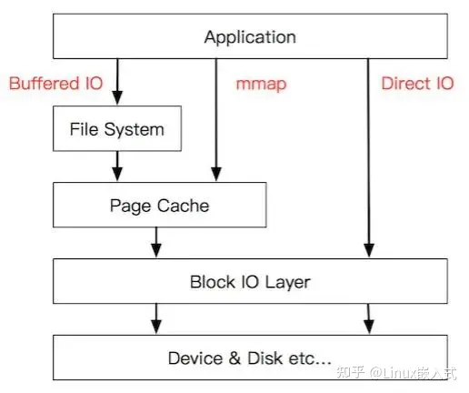
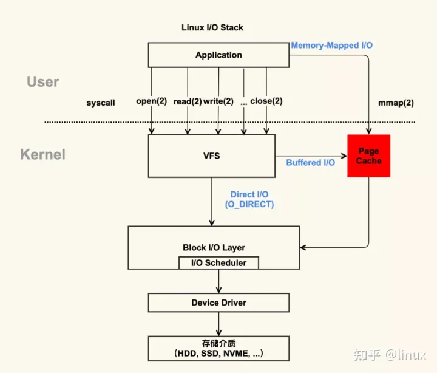
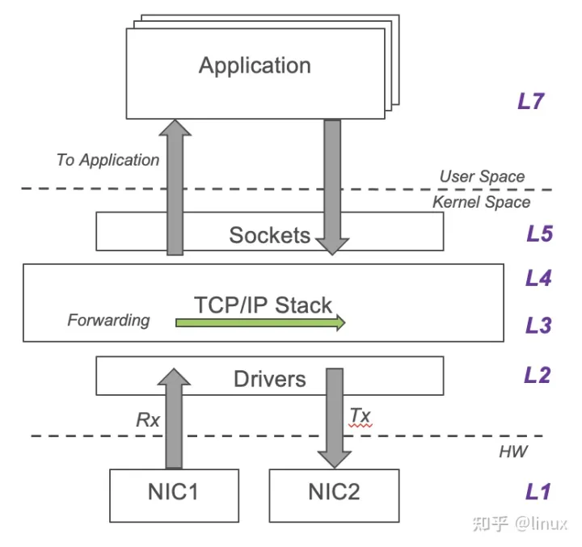
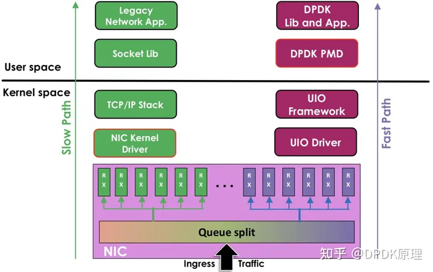
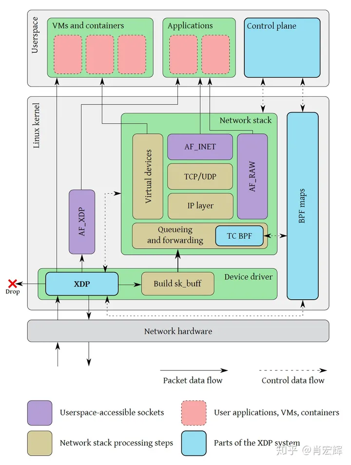
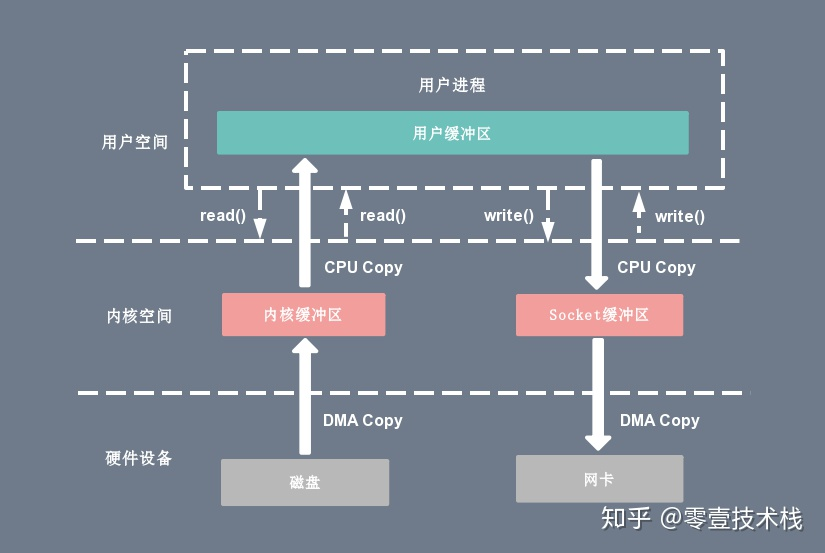

[TOC]

# 可行性分析

## 理论依据

### 分布式文件系统特性及选型

分布式文件系统（Distributed File System）管理的物理存储资源不直接连接在本地节点上，而是通过计算机网络与离散分布的不同节点相连。分布式文件系统的设计同样基于Client/Server模式：一个典型的网络可以包括多个供用户访问的服务器，也允许存在同时扮演客户机和服务器的双重角色，用户可以公开一个允许其他客户机访问的公共目录，而且访问这个目录对其他客户机来说就像使用本地驱动器一样方便。

1. 分布式文件系统的基本架构

- 存储组件：根据存储的数据类型可分为对象存储、块存储和文件存储三类，数据分配方式有哈希一致性分布（键值对）、顺序分布（有序切分）、自动均衡分布等。分布式文件系统的存储组件架构方式与数据量的大小、读写速度、维护难度息息相关。
  
|存储方式|特点|优点|缺点|应用场景|
|:--:|:--:|:--:|:--:|:--:|
|块存储|直接将裸磁盘空间整个映射给操作系统使用|通过RAID与LVM等手段对数据提供了保护；读写效率高|不利于不同操作系统主机间的数据共享|主机或数据库的磁盘阵列|
|文件存储|软硬一体化，只要有匹配的操作系统与软件就可以对外提供FTP与NFS服务|对软硬件要求低；方便文件共享；不需要专网|读写效率下降|一般用于FTP、NFS类服务器共享数据|
|对象存储|有自己的CPU、内存、网络和磁盘，比块存储和文件存储更上层，一般由云服务商提供REST API服务|具备块存储的高速读写以及文件存储的可共享特性|比块存储读写性能差，比文件存储成本高|内置大容量硬盘的分布式服务器|

- 管理组件：主要负责元数据的存储及对存储组件的管理调度，有“中心化”和“去中心化”两种技术路线，目前为了维护方便，主流技术为前者，即管理组件定为一个节点集群中的总控节点。通过总控节点调度可以实现负载均衡（工作节点通过定时发送心跳包将节点负载相关的信息发送给主控节点，主控节点计算出工作节点的负载以及需要迁移的数据，生成迁移任务放入迁移队列中等待执行）。

- 接口组件：负责提供接口服务给应用使用，与数据传输协议（tcp/udp）相关联，形态主要包括 SDK、REST、CLI 命令行终端、FUSE 挂载机制等。

2. 分布式文件系统的性能要求

- 数据持久性
- 数据一致性
- 数据安全性：在多租户场景下对用户私人重要数据有完备的权限保护机制。
- 节点高可用性：总控节点能通过心跳包等机制及时检测单机故障，并通过备份复制、日志记录、纠删码等机制对数据进行恢复。
- 节点可伸缩性：在数据量大幅度增加时能实现新增节点及节点扩容，并进行新的节点负载均衡操作。
- 读写缓存一致性
  
3. 当前主流分布式文件系统选型对比

|文件系统|数据存储|开发语言|集群节点通讯协议|FUSE挂载|POSIX兼容（是否可像本地文件系统一样使用）|特性|易用性|缺点|
|:--:|:--:|:--:|:--:|:--:|:--:|:--:|:--:|:--:|
|HDFS|文件|Java|TCP|支持|不支持|支持大数据批量读写，吞吐量高；一次写入，多次读取，顺序读写|安装简单，官方文档专业化|难以满足毫秒级别的低延时数据访问；不支持多用户并发写相同文件；不适用于大量小文件|
|Ceph|对象/文件/块|C|TCP|支持|支持|分布式，没有单点依赖|安装简单，官方文档专业化|不够成熟稳定|
|MooseFS|块|C|TCP|支持|支持|比较轻量级|安装简单，官方文档多，且提供Web界面的方式进行管理与监控|对主服务器有单点依赖|
|GlusterFS|文件/块|C|TCP/RDAM|支持|支持|无元数据服务器，堆栈式架构，具有线性横向扩展能力|安装简单，官方文档专业化|客户端节点负载增加，遍历文件目录时较为复杂和低效，不建议使用较深路径|
|FastDFS|文件/块|C|TCP|不支持|不支持|系统无需支持POSIX，降低了系统的复杂度，处理效率更高；实现了软RAID，增强系统的并发处理能力及数据容错恢复能力；支持主从文件，支持自定义扩展名；主备Tracker服务，增强系统的可用性|安装简单，国内社区相对活跃|不支持断点续传，不适合大文件存储；不支持POSIX，通用性较低；对跨公网的文件同步，存在较大延迟，需要应用做相应的容错策略；同步机制不支持文件正确性校验；通过API下载，存在单点的性能瓶颈|
|MogileFS|文件|Perl|TCP|不支持|不支持|键值对型元文件系统；效率相比MooseFS高很多|-|-|
|JuiceFS|对象+数据库|Go|TCP+S3网关、元数据引擎Redis/SQL 类/TKV类|支持|支持|完整兼容 HDFS API，可节点存算分离；适用于k8s等云原生环境；支持多端共享和内核页缓存|上手简单，官方文档专业化，社区活跃|对读有较大优化，对写则和原生的对象存储写差距不会太大|

### linux存储及缓存结构

目前受限于存储设备的存取速率和硬件成本，现代计算机的存储结构呈现为金字塔型。越往塔顶，存取效率越高、但成本也越高，所以容量也就越小。上层一般作为下层的Cache层来使用。

用户态程序中可以使用许多跨平台封装好的文件操作函数，为了减少这些函数调用带来的系统调用成本，用户态具有自己的缓冲实现，若用户代码以较小规模不断的读或写文件的话，通过buffer对读写操作进行高度聚合是可以提高程序运行效率的。但是用户态缓冲区的存在并不总是带来效率的提高，当数据高频地在用户态和内核态之间进行传输时，用户态缓冲区作为必经之路的话会明显降低IO效率。此外，系统调用的read/write和真实存储设备之间也存在一层buffer，即Kernel buffer cache。

在Linux下，文件的缓存习惯性称为Page Cache（内核页缓存），这与更低一级的设备内部缓存（Buffer Cache）相区别。 Page Cache和文件系统比较相关，文件系统负责将文件内容映射到实际的物理磁盘；Buffer Cache用于缓存存储设备块（比如磁盘扇区）的数据，而不关心是否有文件系统的存在（文件系统的元数据就缓存在Buffer Cache中）。

### linux内核中的IO读写方式

由图可见，从系统调用的接口再往下，Linux下的IO栈致大致有三个层次：

- 文件系统层：内核拷贝系统调用参数指定的用户态数据到文件系统page cache中，并适时向下层同步
- 块层：管理块设备的IO队列，对IO请求进行合并、排序（与IO调度算法有关）
- 设备层：通过DMA与内存直接交互，完成数据和具体设备之间的交互

write(socket_fd, tmp_buf, len);
传统写：用户程序进行系统调用后，参数等数据需经过用户态和内核态两个缓冲区，由CPU和DMA控制器各拷贝一次，才可与底层设备进行交互，在发起系统调用时和系统调用返回时，各有一次上下文切换；
read(file_fd, tmp_buf, len);
传统读：用户程序进行系统调用后，若这块数据已经存在于用户进程的页内存中，就直接从中读取数据至用户态缓冲区，如果数据不存在，则需先将数据从磁盘加载到内核空间的读缓存中，再拷贝到用户进程的页内存中，期间也会触发 2 次上下文切换，1 次 DMA 拷贝和 1 次 CPU 拷贝。

### Page Cache

Page Cache 的本质是由 Linux 内核管理的内存区域。若数据曾经被访问过且被加载到page cache中，则下一次访问时无需通过磁盘I/O，直接命中内存缓存即可，可提高数据访问速度；Page cache还有预读能力，基于程序的局部性原理，通过一次I/O 将多页装入 Page Cache，能够减少磁盘 I/O 次数， 进而提高系统磁盘 I/O 吞吐量。但page cache也有其劣势，最直接的缺点是需要占用额外物理内存空间，在物理内存空间紧张时可能会导致频繁的 swap 操作，反而导致系统的磁盘 I/O 负载上升。

Page cache的写同步机制（数据一致性）：广义上缓存同步方式有两种，即Write Through（写穿）和Write back（写回）。对应到Linux的Page Cache上的Write Through就是指write操作将数据拷贝到Page Cache后立即和下层进行同步的写操作，完成下层的更新后才返回。而Write back正好相反，指的是写完Page Cache就可以返回了，此时Page Cache到下层的更新操作是异步进行的。Linux下默认使用的是Write back机制。

### linux中的网络协议栈

TCP/IP 协议框架体系内，我们一般将网络划分为五层，从下到上依次为：物理层、数据链路层、网络层、传输层和应用层，下层协议对上层协议透明，即上层协议无需关注下层协议的实现逻辑和机制。

- 物理层：主要提供各种连接的物理设备，如各种网卡，串口卡等。
- 链路层：主要提供对物理层进行访问的各种接口卡的驱动程序，如网卡驱动等。
- 网络层：是负责将网络数据包传输到正确的位置，最重要的网络层协议是 IP 协议，此外还有如 ICMP，ARP，RARP 等协议。
- 传输层：为应用程序之间提供端到端连接，主要为 TCP 和 UDP 协议。
- 应用层：顾名思义，主要由应用程序提供，用来对传输数据进行语义解释的 “人机交互界面层”，比如 HTTP，SMTP，FTP 等协议。

Linux内核网络协议栈涉及其中三层，分别为数据链路层、网络层和传输层，不涉及物理层，应用层的任务也是由用户空间程序来实现的。
Linux内核网络协议栈和网络设备驱动程序为两个很重要的结构（sk_buff和net_device）。
Linux内核网络协议栈的任务：

- 接收数据包时：Linux内核网络协议栈将接收到的数据包从网络设备驱动程序传递给网络层（通常为IPv4或IPv6）。接下来，如果数据包目的地为当前设备，Linux内核网络协议栈就将其传递给传输层（应用TCP或UDP协议侦听套接字socket）；如果数据包需要转发，就将其交还给数据链路层进行传输。
- 发送数据包时：Linux内核网络协议栈将本地生成的出站数据包，从传输层依次传递给网络层和数据链路层，再由网络设备驱动程序进行传输。期间可能有根据协议规则（如NAT）对数据包进行修改、丢弃数据包、重组数据包、发送错误消息等。
网络设备驱动程序的主要任务如下：

- 接收目的地为当前主机的数据包，并将其传递给网络层，之后再将其传递给传输层。
- 传输当前主机生成的外出数据包或转发当前主机收到的数据包。

## 技术依据

### Docker容器化部署

Docker 教程从入门到精通 <https://cloud.tencent.com/developer/article/1885678>

- Image ———— 一个特殊的文件系统（静态）

    对于Linux而言，内核启动后，会挂载root文件系统为其提供用户空间支持。而Docker镜像（Image），就相当于是一个root文件系统。Docker镜像是一个特殊的文件系统，除了提供容器运行时所需的程序、库、资源、配置等文件外，还包含了一些为运行时准备的一些配置参数（如匿名卷、环境变量、用户等）。 镜像不包含任何动态数据，其内容在构建之后也不会被改变。

- Container ———— 镜像运行时的实体（动态）

    容器就像是一台台运行起来的虚拟机，里面运行了你的应用程序，每个容器是独立运行、互不影响的。容器可以被创建、启动、停止、删除、暂停等 。其实质是进程，但与直接在宿主执行的进程不同，容器进程运行于属于自己的独立的命名空间。容器存储层的生存周期和容器一样，容器消亡时，容器存储层也随之消亡。

- Repository ———— 集中存放镜像文件的地方

    Docker Registry是一个集中存储、分发镜像的服务程序。一个Docker Registry中可以包含多个仓库（Repository），每个仓库可以包含多个标签（Tag），每个标签对应一个镜像。通常，一个仓库会包含同一个软件不同版本的镜像，而标签就常用于对应该软件的各个版本 。我们可以通过<仓库名>:<标签>的格式来指定具体是这个软件哪个版本的镜像。如果不给出标签，将以latest作为默认标签。

### eBPF应用实现

eBPF完全入门指南 <https://zhuanlan.zhihu.com/p/492185920>
<https://ebpf.io/>

基于 bcc 开发：bcc 提供了对 eBPF 开发的工具链支持，前端提供 Python API，后端 eBPF 程序通过 C 实现。特点是简单易用，但是性能非最优。

### linux内核中的BPF源码支持

BPF程序的功能丰富度是和内核对BPF程序的支持**linux/kernel/bpf/**直接相关的，BPF程序可以使用的系统调用也是直接在helper.c中直接定义的。本项目为了实现eBPF的巨大潜力，不可避免地会涉及到对内核中BPF源码的阅读、理解、修改或增写，此外本项目开发的ebpf程序可能无法得到现有verifier.c体系的认可，这种情况下我们也需要修改verifier.c源码以支持eBPF程序运行。
此外可提供一个在线查看BPF程序实例的网站<https://elixir.bootlin.com/linux/v4.15/source/samples/bpf>

### DPDK技术（流行kernel-bypass技术方案）

DPDK(Data Plane Development Kit)是数据平面开发工具包，由能加速在各种CPU架构上运行的数据包处理库组成，是一种高性能抓包技术。传统的数据包捕获瓶颈往往在于Linux Kernel，数据流需要经过内核态和用户态数据拷贝的消耗，系统调用的消耗，中断处理的消耗等。

- （左边）：网卡 -> 驱动 -> 内核协议栈 -> Socket 接口 -> 业务。
- （右边）：网卡 -> DPDK 轮询模式 -> DPDK 基础库 -> 业务。
DPDK对此进行了一定程度的优化，核心可以概括为:

- UIO+mmap 实现零拷贝（zero copy）
- UIO+PMD 减少中断和CPU上下文切换
- HugePages 减少TLB miss

UIO+PMD，前者旁路了内核，后者主动轮询避免了硬中断，DPDK 从而可以在用户态进行收发包的处理。带来了零拷贝（Zero Copy）、无系统调用（System call）的优化。同时，还避免了软中断的异步处理，也减少了上下文切换带来的 Cache Miss。

1. UIO，DPDK 的基石

Linux 提供了 UIO（User Space I/O）机制，使用 UIO 可以通过 read() 感知中断，通过 mmap() 实现和网卡设备的通讯。UIO 的实现机制是：对用户态暴露文件接口。当注册一个 UIO 设备 uioX 时，就会出现系统文件 /dev/uioX，对该文件的读写就是对网卡设备内存的读写。除此之外，对网卡设备的控制还可以通过 /sys/class/uio 下的各个文件的读写来完成。
DPDK 架构在 Linux 内核中安装了 IGB_UIO模块，以此借助 UIO 技术来截获中断，并重设中断回调行为，从而绕过内核协议栈后续的处理流程，并且 IGB_UIO 会在内核初始化的过程中将网卡硬件寄存器映射到用户态。此外，DPDK 还在用户态实现了一套精巧的内存池技术，内核态和用户态之间的的内存交互不进行拷贝，只做控制权转移。这样，当收发数据包时，就减少了内存拷贝的开销。

2. PMD（Poll Mode Driver），DPDK 的核心优化

Linux 内核在抓包时有两种方式可供选择，一种是中断方式，另外一种是轮询方式，两种方式各有优缺点。目前的linux内核协议栈主要为硬中断处理方式。

针对 Intel 网卡，DPDK 实现了基于轮询方式的 PMD网卡驱动，该驱动由用户态的 API 以及 PMD Driver 构成。内核态的 UIO Driver 屏蔽了网卡发出的中断信号，然后由用户态的 PMD Driver 采用主动轮询的方式。除了链路状态通知仍必须采用中断方式以外，均使用无中断方式直接操作网卡设备的接收和发送队列。PMD Driver 从网卡上接收到数据包后，会直接通过 DMA 方式传输到预分配的内存中，同时更新无锁环形队列中的数据包指针，不断轮询的应用程序很快就能感知收到数据包，并在预分配的内存地址上直接处理数据包，整个过程非常简洁。
然而网络空闲时 CPU 会长期处于空转状态，带来了电力能耗的问题。所以，DPDK 引入了 中断 DPDK 模式，即 PMD 在长时间没数据包需要处理时自动进入睡眠，改为中断通知，接收到收包中断信号后，切换为主动轮询。这就是所谓的链路状态中断通知。
此外，PMD 还同时支持物理和虚拟两种网络接口，支持 Intel等网卡设备，以及支持基于 KVM、VMware等虚拟化网络接口。

### XDP技术（以BPF为核心）

DPDK技术虽然性能较高，但其缺点也显而易见：改变了现有操作系统的工作方式，很难与现有操作系统集成，应用此技术的网络应用程序需要重新实现之前由操作系统提供的一些功能，（如4-7层网络协议），破坏了原有操作系统内核提供的安全性等。

XDP技术减少上下文切换次数的思路与DPDK不同，它将网络包处理流程放到了内核中位于网络协议栈之前的位置。这样，在处理网络数据包时，不用经历kernel/userspace context switching的代价，也不用经历网络协议栈的复杂流程，同时又保留了操作系统控制网络硬件的能力。目前XDP现在已经完全集成到了Linux内核中。

XDP系统由4个主要部分组成：

- XDP driver hook：这是XDP程序的接入点，当网络数据包从硬件中收到时会被执行。
- eBPF virtual machine：执行XDP程序的字节码，并且JIT编译到机器码
- BPF maps：key/value store，用来在整个XDP系统中做数据的交互
- eBPF verifier：在程序加载到内核之前静态的分析代码以确保代码会crash或者损坏运行的内核
  
1. XDP driver hook

XDP的挂载点在驱动中的位置非常靠前，甚至早于kernel为packet分配sk_buff。如果一个网卡挂载了XDP程序，那么每当网卡收到一个packet，XDP程序都会通过网卡驱动的hook点运行一次。这里的运行是以内核中的库函数调用形式完成，这意味着不需要context switching到用户空间。
在XDP程序中，只能看到一个context对象，这个对象包含了两个数据：packet数据和相关的元数据。因为XDP的hook点在构建sk_buff之前，所以XDP程序中第一件事情是要根据网络协议解析packet，完成一些封装解封装的场景。context对象中的元数据包括了这个packet从哪个网卡收到，接收队列是哪个等信息。

在XDP程序的结束，需要对packet做出一个结论。结论有4种可能：

- XDP_DROP或XDP_ABORTED：丢包，区别在于后者会触发一个eBPF程序错误
- XDP_TX：将处理后的packet发回给相同的网卡
- XDP_PASS：将处理后的packet传递给内核协议栈
- XDP_REDIRECT：需要一个额外的参数来表明Redirect的目的地，这个额外的参数由在XDP程序返回之前通过一个helper函数设置。

2. BPF maps

eBPF程序是受内核事件驱动而执行，每次执行都是在一个相同的初始状态，并且在代码中不能有类似全局变量的持久化内存存储。为了弥补这一点，Linux内核提供了helper函数来访问BPF maps。BPF map可以被运行在内核中不同位置的eBPF程序共享，也可以被eBPF程序和用户空间程序共享。map类型包括了通用的hash map，数组，radix tree。BPF map可以是全局的，也可以是per-CPU的。XDP程序还可以通过BPF map定义自己的全局数据，也可以通过kernel helper函数访问kernel内的工具，kernel helper函数可以让XDP程序在不使用完整的内核协议栈的前提下，选择性的使用内核网络协议栈的功能，例如路由表。

BPF maps有几个作用：

- 同一个eBPF程序的不同调用之间的数据保存，例如对packet做统计
- 不同eBPF之间的全局协调工具，例如，一个eBPF程序可以监测CPU负载，并且在CPU负载过高时，指示XDP程序丢包
- 用户空间程序和内核eBPF程序之间的通信机制，这里可以用于SDN场景下Control plane和Data plane之间数据交互

### DMA技术

### zIO技术不同实现方式对比

在 Linux 中零拷贝技术主要有 3 个实现思路：用户态直接 I/O、减少数据拷贝次数以及写时复制技术（可忽略）。

|不同IO方式|实现特点|系统调用函数|拷贝次数（CPU+DMA）|上下文切换次数|
|:--:|:--:|:--:|:--:|:--:|
|mmap + write|mmap建立了内核读缓冲区与用户空间缓冲区的虚拟内存映射，从而省去了一次CPU拷贝然而从read buffer到socket buffer的CPU拷贝仍存在，且内存映射总是要求对齐页边界，可能会造成内存浪费|tmp_buf = mmap(file_fd, len);write(socket_fd, tmp_buf, len);|1+2|4|
|sendfile|数据在内核空间内部的纯粹传输，省去了数据在用户空间和内核空间之间的来回拷贝|sendfile(socket_fd, file_fd, len);|1+2|2|
|sendfile+DMA gather copy|在sendfile的基础上，DMA引入了 gather 操作，代替CPU将内核read buffer中的数据位置信息等记录到相应的 socket buffer中，并将数据批量地从读缓冲区（read buffer）拷贝到网卡设备中|sendfile及DMA的网卡硬件支持|0+2|2|
|splice|splice可以在内核空间的读缓冲区（read buffer）和网络缓冲区（socket buffer）之间建立管道（pipeline），从而避免了两者之间的 CPU 拷贝操作|splice(fd_in, off_in, fd_out, off_out, len, flags);|0+2|2|
|用户态直接IO|用户态程序可直接访问硬件设备，数据直接跨过内核进行传输，只适用于不需要内核缓冲区处理的应用程序，且缺乏安全保护机制|自缓存应用程序|0|0|
|缓冲区共享|让每个进程都维护一个缓冲区池，这个缓冲区池被内核空间和用户空间共享，可避免一系列拷贝操作，但该技术需要软硬件紧密合作，目前还处于试验阶段并不成熟，实现比较好的是Solaris 上的 fbuf|整体API改写|0|0|

## 技术路线

## 参考资料

详解块存储、文件存储、对象存储区别 <https://zhuanlan.zhihu.com/p/280128756>
分布式文件系统对比与选型参考 <https://blog.csdn.net/yym373872996/article/details/105650908>
浅析三款大规模分布式文件系统架构设计 <https://zhuanlan.zhihu.com/p/620985766>
分布式文件系统设计，该从哪些方面考虑？ <https://cloud.tencent.com/developer/article/1645680>
详细讲解Linux内核IO技术栈原理 <https://zhuanlan.zhihu.com/p/484945013>
深入剖析Linux IO原理和几种零拷贝机制的实现 <https://zhuanlan.zhihu.com/p/83398714>
DMA零拷贝技术 <https://zhuanlan.zhihu.com/p/377237946>
深入理解Linux 的Page Cache <https://zhuanlan.zhihu.com/p/436313908>
Linux操作系统原理—内核网络协议栈 <https://zhuanlan.zhihu.com/p/379915285>
Linux内核网络（一）——初探内核网络 <https://zhuanlan.zhihu.com/p/363718587#>
DPDK——数据平面开发技术 <https://zhuanlan.zhihu.com/p/551653482>
DPDK解析 <https://zhuanlan.zhihu.com/p/363622877>
一文看懂eBPF｜eBPF实现原理 <https://zhuanlan.zhihu.com/p/484788508>
Kernel Dataplane XDP简介 <https://zhuanlan.zhihu.com/p/321387418#>
使用ebpf优化FUSE的性能 <https://zhuanlan.zhihu.com/p/518531067>
<https://github.com/oscomp/proj147-eBPF-FUSE.git>
<https://github.com/OSH-2021/x-sBPF.git>

## 可选论文参考

Electrode: Accelerating Distributed Protocols with eBPF
<https://www.usenix.org/conference/nsdi23/presentation/zhou>
Faster Software Packet Processing on FPGA NICs with eBPF Program Warping
<https://www.usenix.org/conference/atc22/presentation/bonola>
XRP: In-Kernel Storage Functions with eBPF
<https://www.usenix.org/conference/osdi22/presentation/zhong>
hXDP: Efficient Software Packet Processing on FPGA NICs
<https://www.usenix.org/conference/osdi20/presentation/brunella>
zIO: Accelerating IO-Intensive Applications with Transparent Zero-Copy IO
<https://www.usenix.org/conference/osdi22/presentation/stamler>
