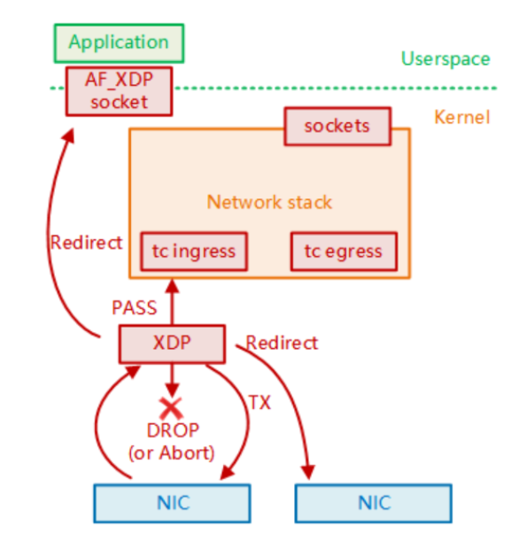
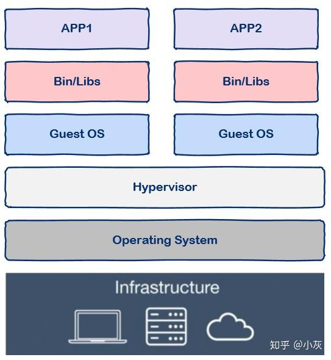
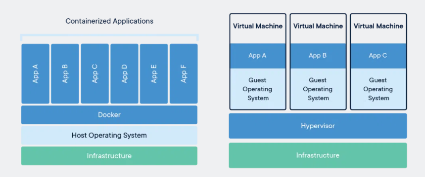
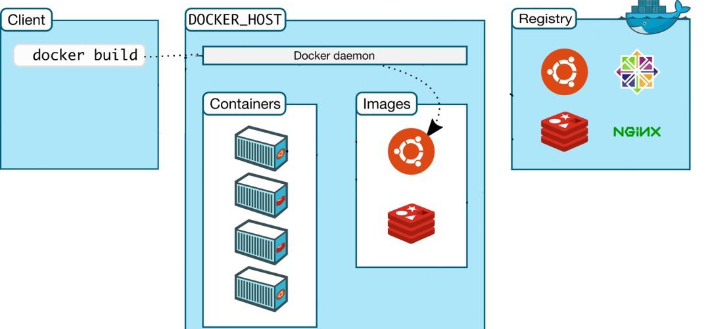
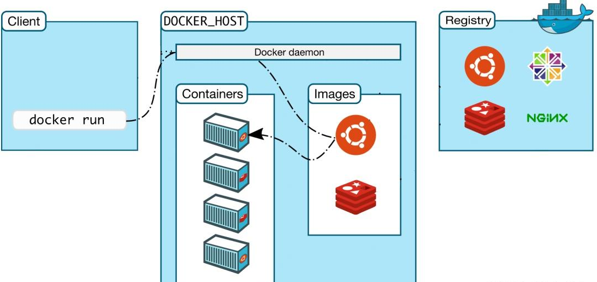
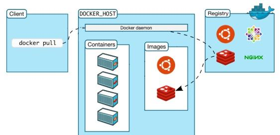

# 可行性分析

[TOC]

## 理论依据

### Linux内核态与用户态的切换

### Linux内核协议栈

### Linux内核网络栈

## 技术依据

### BPF Map

`BPF Map`用于用户空间和内核空间之间的数据交换、信息传递。

`BPF Map`是驻留在内核中的以键/值方式存储的数据结构，可以被任何知道它们的BPF程序访问。在用户空间运行的程序可以通过使用文件描述符来访问 `BPF Map`。可以在 `BPF Map`中存储任何类型的数据，只要事先正确指定数据大小。在内核中，键和值都被视为二进制的方式来存储。

**Map常见用途**

- 一个 eBPF 程序编写有关事件的指标和其他数据，供用户空间代码稍后查询；
- 用户空间代码编写配置信息，以便 eBPF 程序读取并相应地执行；
- 一个 eBPF 将数据写入 map，供另一个 eBPF 程序读取，这种方式允许跨多个内核事件同步信息；

##### **eBPF提供的映射数据结构类型**

1. 数组映射（Array Map）：数组映射是一种基于整数索引的映射，可以使用一个整数键来查找和更新元素值。数组映射通常用于实现计数器和状态信息等功能。
2. 哈希映射（Hash Map）：哈希映射是一种基于哈希表的映射，可以使用任意键值对来查找和更新元素值。哈希映射通常用于实现高效的数据查找和存储功能。
3. 红黑树映射（Red-Black Tree Map）：红黑树映射是一种基于红黑树的映射，可以使用任意键值对来查找和更新元素值。红黑树映射通常用于实现需要有序遍历的数据结构。
4. 双向链表映射（Linked List Map）：双向链表映射是一种基于双向链表的映射，可以使用一个整数键来查找和更新元素值。双向链表映射通常用于实现队列和缓冲区等数据结构。
5. 原子映射（Atomic Map）：原子映射是一种基于原子操作的映射，可以在多线程环境下实现线程安全的数据访问。原子映射通常用于实现计数器和状态信息等功能。

##### 操作

**BPF Map更新**

`bpf_map_update_elem`实现保存更新功能。

- 内核程序

  ```c
  BPF_CALL_4(bpf_map_update_elem, struct bpf_map *, map, void *, key,
  	   void *, value, u64, flags)
  ```
- 用户程序

  ```c
  LIBBPF_API int bpf_map_update_elem(int fd, const void *key, const void *value,
  				   __u64 flags);
  ```
- 区别

  - 内核程序可以直接访问映射，并原子性地更新元素。
  - 用户程序需要使用文件描符来引用映射，所以更新操作不是原子性的。

**BPF Map读取**
`bpf_map_lookup_elem`实现读取映射元素功能。

```c
void *bpf_map_lookup_elem(struct bpf_map *map, const void *key)
```

**BPF Map删除**
`bpf_map_delete_element`实现删除映射元素功能。

```c
int bpf_map_delete_elem（int fd， const void *key);¶
```

**BPF Map迭代**
`bpf_map_get_next_key`实现迭代遍历映射元素功能。

**BPF Map查找删除**
`bpf_map_lookup_and_delete_elem`实现内核查找和删除映射元素功能。

**BPF Map并发访问**
BPF通过BPF自旋锁（bpf_spin_lock和bpf_spin_unlock）来防止竞争条件, 可以在操作映射元素时对访问的映射元素进行锁定, 自旋锁仅适用于数组、哈希、cgroup存储映射。

### BPF_MAP_TYPE_DEVMAP

BPF_MAP_TYPE_DEVMAP类型的Map是一种将外部设备内存映射到内核空间中的一块连续内存区域中的机制，理论上可以支持块设备，包括硬盘、SSD等磁盘设备。

但BPF_MAP_TYPE_DEVMAP并不是直接访问磁盘设备，而是通过将磁盘的DMA缓冲区映射到内核空间中，从而实现在内存和磁盘之间高速数据传输。

#### 工作原理

1. 创建Map对象：在内核空间中使用BPF_MAP_CREATE命令创建BPF_MAP_TYPE_DEVMAP类型的Map对象。在创建时，需要指定Map的类型、键值对的大小、Map的最大元素数量等参数。同时，还需要指定外设的文件描述符和映射的内核空间地址等参数。
2. 映射设备内存：使用BPF_MAP_LOOKUP_ELEM命令将外设的DMA缓冲区映射到内核空间中的一块连续内存区域中，从而实现在内存和设备之间进行高速数据传输。在这个过程中，需要指定外设的文件描述符和映射的内核空间地址等参数。
3. 访问设备内存：通过BPF_MAP_LOOKUP_ELEM和BPF_MAP_UPDATE_ELEM命令可以对映射后的设备内存进行读写操作。这样就可以在内核空间中直接访问设备内存，而无需进行数据拷贝等操作，从而提高数据传输的效率。

BPF_MAP_TYPE_DEVMAP类型的Map通过将外设的DMA缓冲区映射到内核空间中的一块连续内存区域中，从而实现在内存和设备之间进行高速数据传输。这个机制可以大大提高数据传输的效率，特别是在高速网络和存储系统中，可以显著提高系统的性能和吞吐量。

#### 和只借助DMA相比的优势

使用BPF_MAP_TYPE_DEVMAP类型的Map相比只使用DMA，可以提高数据传输的效率和性能，主要有以下几方面的原因：

1. 避免了数据复制：在只使用DMA时，由于设备的内存和主机内存之间通常不是直接映射的，数据需要从设备的DMA缓冲区复制到主机内存中，然后再进行处理或传输。而使用BPF_MAP_TYPE_DEVMAP类型的Map时，可以将设备的DMA缓冲区直接映射到内核空间中，避免了数据复制的过程，从而提高了数据传输的效率。
2. 减少中断处理：在只使用DMA时，设备传输数据完成后需要发送中断请求给CPU，通知CPU数据已经传输完成，需要进行后续的处理。而使用BPF_MAP_TYPE_DEVMAP类型的Map时，可以将数据处理的操作交给BPF程序，从而避免了中断处理的过程，减少了CPU的干预。
3. 支持更多的设备类型：使用BPF_MAP_TYPE_DEVMAP类型的Map可以支持多种类型的设备，包括网卡、块设备、USB设备等，从而提高了系统的灵活性和可扩展性。
4. 支持更多的数据处理方式：使用BPF_MAP_TYPE_DEVMAP类型的Map可以结合BPF程序实现更多的数据处理方式，例如对网络数据包进行过滤和处理、对块设备进行缓存和加速等，从而提高了系统的性能和功能。

### 共享内存

### DMA

### XDP

#### 基本原理

XDP（eXpress Data Path）是一个在Linux内核中实现的高性能网络数据包处理框架，能够在网络协议栈的最底层进行数据包的处理和转发，具有极低的延迟和高吞吐量。XDP提供了一种新的数据包处理方式，能够在网卡接收到数据包后直接在内核态进行处理，避免了将数据包拷贝到用户态的开销，从而大大提高了网络应用的性能。

XDP通过eBPF（Extended Berkeley Packet Filter）技术实现，在内核态中加载和执行eBPF程序，实现数据包的过滤、修改和转发等功能。eBPF程序可以使用C语言或LLVM IR语言编写，经过编译后生成一段二进制代码，可以在内核中动态加载和执行。



#### 优点

1. 高性能：XDP能够在网卡接收到数据包后直接在内核态进行处理，避免将数据包拷贝到用户态的开销，从而大大提高网络应用的性能。
2. 灵活编程：XDP提供了一组API和工具，使开发者可以方便地实现自己的数据包处理逻辑，例如防火墙、负载均衡、DDoS防御、网络监测等，支持灵活的规则匹配和动态更新。
3. 可扩展性：XDP框架的设计很灵活，可以通过动态加载和卸载eBPF程序，支持动态调整数据包处理逻辑，从而满足不同场景的需求。
4. 安全性：XDP程序运行在内核态，具有更高的权限和更好的安全性，可以避免用户态程序的漏洞和攻击。

#### 使用

**主要使用场景**——网络场景

**XDP框架提供了以下几个主要的API和工具**

1. xdp_prog：用于在网卡的XDP挂载点上加载和执行eBPF程序，实现数据包的处理和转发。
2. libbpf：用于编译和加载eBPF程序，提供了一组API和工具，使开发者可以方便地管理和调试eBPF程序。
3. bpftool：用于管理和调试eBPF程序，提供了一组命令行工具，可以查询和修改eBPF程序的状态和参数。
4. tc命令：用于配置和管理内核中的Traffic Control（TC）规则，可以在数据包发送和接收的各个阶段插入eBPF程序，实现数据包的过滤、修改和转发等功能。

**例子——XDP技术处理网络包提高IO效率**

- 准备工作

  将eBPF程序绑定到网卡的XDP挂载点上

  ```bash
  sudo bpftool prog load ./prog.o /sys/fs/bpf/xdp_prog
  sudo ip link set dev eth0 xdp object /sys/fs/bpf/xdp_prog sec xdp
  ```
- 程序示例

  ```c
  #include <linux/bpf.h>
  #include <linux/if_ether.h>
  #include <linux/ip.h>
  #include <linux/in.h>
  #include <linux/udp.h>
  #include <linux/xdp.h>
  
  SEC("xdp")
  int bpf_prog(struct xdp_md *ctx)
  {
      void *data = (void *)(long)ctx->data;
      void *data_end = (void *)(long)ctx->data_end;
  
      struct ethhdr *eth = data;
      if (eth + 1 > data_end) {
          return XDP_DROP;
      }
  
      struct iphdr *ip = (struct iphdr *)(eth + 1);
      if (ip + 1 > data_end) {
          return XDP_DROP;
      }
  
      struct udphdr *udp = (struct udphdr *)(ip + 1);
      if (udp + 1 > data_end) {
          return XDP_DROP;
      }
  
      u16 src_port = udp->source;
      u16 dst_port = udp->dest;
      if (src_port == htons(1234) && dst_port == htons(5678)) {
          eth->h_dest[0] = eth->h_source[0];
          eth->h_dest[1] = eth->h_source[1];
          eth->h_dest[2] = eth->h_source[2];
          eth->h_dest[3] = eth->h_source[3];
          eth->h_dest[4] = eth->h_source[4];
          eth->h_dest[5] = eth->h_source[5];
  
          eth->h_source[0] = 0x02;
          eth->h_source[1] = 0x00;
          eth->h_source[2] = 0x00;
          eth->h_source[3] = 0x00;
          eth->h_source[4] = 0x00;
          eth->h_source[5] = 0x01;
  
          return XDP_TX;
      }
  
      return XDP_PASS;
  }
  ```

  该程序使用XDP技术处理网络包，从xdp_md结构体中获取网络包的指针和长度信息，并解析出以太网头、IP头和UDP头等信息。函数中判断网络包的源端口和目标端口是否为1234和5678，并根据需要修改以太网头的源和目的MAC地址。最后使用XDP_TX返回值来直接传送网络包给网卡，从而减少了网络包处理中的拷贝次数。

  **xdp_md结构体**

  xdp_md（eXpress Data Path Meta-Data）结构体是XDP框架中的一个重要数据结构，用于在eBPF程序中访问网络数据包的元数据信息。该结构体定义如下：

  ```c
  struct xdp_md {
      __u32 data;
      __u32 data_end;
      __u32 data_meta;
      __u32 ingress_ifindex;
      __u32 rx_queue_index;
  };
  ```

  各字段定义如下：

  1. `data`：指向数据包的起始地址。
  2. `data_end`：指向数据包的结束地址。
  3. `data_meta`：指向数据包元数据的起始地址，可以用于存储一些自定义的元数据信息。
  4. `ingress_ifindex`：表示数据包接收的网络接口的索引。
  5. `rx_queue_index`：表示数据包接收的网络接口的接收队列的索引。

  通过访问xdp_md结构体中的字段，eBPF程序可以获取到网络数据包的各种元数据信息，例如数据包的起始地址、结束地址、接收接口的索引等。这些信息可以用于进行数据包的过滤、修改和转发等操作，实现自定义的网络数据包处理逻辑。

  不过需要注意，xdp_md结构体中的 `data`和 `data_end`字段只表示数据包的有效载荷部分，不包括数据包头和尾部的其他信息。如果需要访问数据包头和尾部的其他信息，可以通过其他数据结构如skb、sk_buff等来获取。
- 监测

  ```bash
  sudo tcpdump -i eth0 -nn udp port 5678
  sudo ping -c 1 localhost
  sudo tcpdump -i lo -nn udp port 1234
  ```

### Docker

#### 实现原理

Linux下Docker被称为NameSpace和Control groups的原语。

- NameSpace

  Linux下的一种资源隔离方案，NameSpace下的资源互不干扰。
- Control groups

  即cgroup，目的为控制容器中进程对资源的访问。



#### 特点

- 是image的可运行实例。可以使用 DockerAPI 或 CLI 创建、启动、停止、移动或删除容器。
- 可以在本地计算机、虚拟机上运行或部署到云中。
- 可移植（可以在任何操作系统上运行）。
- 与其他容器隔离，运行自己的软件、二进制文件和配置。

#### 容器 *vs* 虚拟机

虚拟机通过操作系统实现隔离，而容器技术只隔离应用程序应用程序的运行时环境（运行所依赖的库、配置等），但容器之间可以共享同一个操作系统。因此容器的启动速度快于虚拟机。



#### Docker的工作原理

docker使用client-server模式，docker client负责处理用户输入的命令，如 `docker build`、`docker run`;真正执行工作的是server (docker daemon)。

1. docker build——编译dockerfile

   client接收到请求后转发给docker daemon，由后者根据dockerfile创建出可执行程序image。

   
2. docker run

   docker daemon接收到该命令后找到具体的image，加载到内存开始执行。

   
3. docker pull

   docker daemon接收该命令后向docker registry发送下载image，从公共仓库Docker Hub下载公共image。

   

#### Docker的使用

1. 官方给出的Dockerfile示例代码

   ```dockerfile
   # syntax=docker/dockerfile:1
   
   FROM node:18-alpine
   WORKDIR /app
   COPY . .
   RUN yarn install --production
   CMD ["node", "src/index.js"]
   EXPOSE 3000
   ```
2. 生成容器映像

   `docker build -t getting-started .`
3. 启动应用程序

   `docker run -dp 3000:3000 getting-started`

   > -dp:
   >
   > 使用该标志在“分离”模式下（在后台）运行新容器。还可以使用该标志在主机的端口 3000 到容器的端口 3000 之间创建映射。 如果没有端口映射，将无法访问该应用程序。
   >
4. 查看容器

   `docker ps`


## DMA和XDP配合加速分布式文件系统IO的启示

1. 数据包过滤和路由：在分布式文件系统中，数据包的传输通常是通过网络接口进行的。XDP（eXpress Data Path）是Linux内核中的一种高性能数据包处理框架，可以在数据包到达网络接口的最早时间戳上进行处理。通过编写相应的BPF（Berkeley Packet Filter）程序，可以在XDP层面上对数据包进行过滤和路由，从而减少不必要的数据传输和提高数据传输的可靠性。

   例如，在分布式文件系统中，可以使用XDP来过滤掉不需要传输的数据包，只保留需要传输的数据包，减少数据传输的延迟和网络带宽的占用。
2. DMA加速数据传输：DMA（Direct Memory Access）是一种数据传输技术，可以实现数据在内存和外设之间的高速传输，减少CPU的负载和数据传输的延迟。在分布式文件系统中，可以使用DMA技术来加速数据传输，提高系统的性能和效率。

   例如，在分布式文件系统中，可以使用DMA技术将数据从磁盘读取到内存中，再通过网络接口传输到其他节点，从而减少CPU的负载和数据传输的延迟。
3. 数据缓存和预读取：在分布式文件系统中，数据的访问通常需要从磁盘读取到内存中，从而进行处理和传输。为了提高数据的访问效率和响应速度，可以使用数据缓存和预读取技术。

   例如，在一个分布式文件系统中，可以使用DMA技术将数据从磁盘读取到内存中，并将数据缓存在内存中，以便后续的访问和处理。同时，还可以预读取一定量的数据到内存中，以提高数据的访问效率和响应速度。这样可以减少磁盘的读取次数和数据传输的延迟，提高系统的性能和效率。

**GPT的回答**

可以使用eBPF（extended Berkeley Packet Filter）和XDP（eXpress Data Path）配合加速分布式文件系统的IO（Input/Output）操作，包括DMA（Direct Memory Access）和数据包过滤等技术。

分布式文件系统通常需要在多个节点之间进行数据传输和处理，因此需要高效的IO操作和网络传输。使用eBPF和XDP技术可以在内核态中实现高效的数据传输和处理，从而提高文件系统的IO性能。

具体来说，可以使用BPF_MAP_TYPE_DEVMAP类型的Map将外设的DMA缓冲区映射到内核空间中的一块连续内存区域中，从而实现在内存和设备之间进行高速数据传输。同时，还可以使用eBPF程序实现数据处理和传输的流程和方式，以进一步提高数据传输的效率。

另外，可以使用XDP技术对网络数据包进行过滤和处理，从而减少不必要的网络传输和IO操作。XDP可以在网卡驱动程序中拦截和处理网络数据包，以实现高效的数据包过滤和处理。


[Docker Docs: How to build, share, and run applications | Docker Documentation](https://docs.docker.com/)

[linux/bpf.h at v5.0 · torvalds/linux (github.com)](https://github.com/torvalds/linux/blob/v5.0/include/uapi/linux/bpf.h)

[BPF_MAP_TYPE_DEVMAP and BPF_MAP_TYPE_DEVMAP_HASH — The Linux Kernel documentation](https://docs.kernel.org/bpf/map_devmap.html)

[深入浅出 eBPF | 专注于 Linux 内核技术eBPF (Linux/Kernel/XDP/BCC/BPFTrace/Cilium)](https://www.ebpf.top/)

[tools/lib/bpf/bpf.h](https://github.com/torvalds/linux/blob/v5.0/tools/lib/bpf/bpf.h)

[kernel/bpf/helpers.c](https://github.com/torvalds/linux/blob/v5.0/kernel/bpf/helpers.c)
