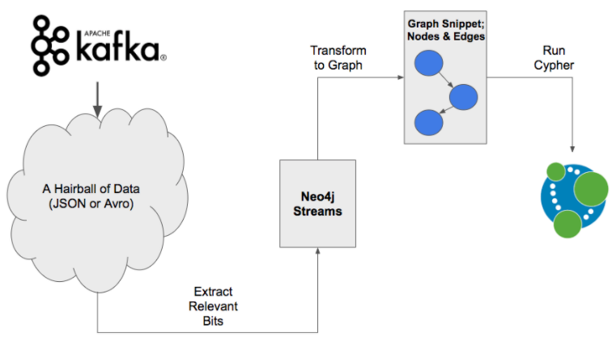

# 项目概览

> 实现一个高效的、用户友好的、高可扩展性的分布式图文件系统

## 图文件系统

现有的文件系统大多基于树形结构，采用文件命名、路径分类等存储和检索技术，非常依赖逻辑性和记忆性，与人类思维不符。典型的图文件系统采用各种算法自动对各种文件进行标记，通过寻找共同的标记进行建图，并且在图数据库中对图进行维护。但目前图存储适用的管理规模仍较小，在大型化、团队化的应用场景下难有转圜余地。

> 图数据库是一个使用**图结构**对数据进行存储和管理的**非关系型**数据库，它使用节点、边和属性来表示和存储数据。其最大特点有3个：高维、高性能、高效率。相比于传统的关系型数据库中的关系表（二维表），图数据库采用的是可描述复杂关联关系的高维拓扑结构，在十亿级别的数据量时，仍能保持较好的性能。图数据库可以高效进行关联查询、数据插入，并且**提供了针对图查询的语言**。

## 各分布式文件系统可参考价值

常见的DFS有，GFS，HDFS，MogileFS，Lustre，Ceph，MooseFS，FastFS等。
GFS：系统对文件的修改操作是**追加**而不是覆盖；
HDFS：要保证硬件**设备高发高频故障时的高容错性**，提供**浏览器接口和java api**；
Ceph：数据的放置采取CRUSH算法,客户端**根据算法直接确定对象的存储位置并直接访问存储节点**,采用对象式存储方式，要**避免高版本依赖性的代码**；
MooseFS：在客户端操作完成后将对文件的操作记录发送给 Master 服务器进行同步并**完成日志的备份工作**。

## 各指数图数据库在存储上可参考价值

Neo4j：高性能的NOSQL图形数据库，使用查询语言cypher。Cypher的语法提供了一种**视觉和逻辑的方式**来匹配图中节点和关系的模式，侧重优化查询效率；Neo4j提供多种API接口；在层数较低时查询效率可观，但层数较多时查询效率低，且不支持分布式存储。

TigerGraph：实时原生并行图数据库，使用查询语言GSQL。GSQL**支持多种数据分析规范（即多路径遍历**），可针对模型数据特点提供**假定预定义模式**提高访问效率；TigerGraph可云端部署也可本地部署；对图数据自动分区；提供**内置数据压缩功能**；使用一种**可随数据增长而伸缩的消息传递架构**；但图创建后需要手动维护，GSQL语法规则复杂，学习成本高；编程API接口有一定的限制。

Azure Cosmos DB：完全托管的 NoSQL 数据库，使用查询语言Gremlin。Azure Cosmos DB 使用自动管理、更新和修补；**可通过无服务器和自动缩放选项处理容量管理，使容量与需求相匹配**；支持多平台，使用开源 API、多个 SDK、无架构数据和对操作数据的无 ETL 分析进行快速构建；但对可视化及云端部署的支持性不强。

## 各指数图数据库在管理上可参考价值

Pregel：（Google）。存储时Pregel**将不同数据节点进行分割，分别加载到不同的计算节点中**。查询时整体遵循BSP计算模型，每个图查询由多个超步加以完成，每个超步中，图数据节点计算采用以节点为中心的编程模型。

​Giraph: （Apache）。 Giraph本身是一个无 Reducer的 Mapreduce任务，图数据查询处理易于和 Hadoop环境进行集成。

​Trinity：（微软研究院）。该系统能够**同时支持低延迟的在线查询和高吞吐量的离线分析**。为了避免外存随机扫描的影响， Trinity将图数据保存在内存云中，并且设计了复杂的内存机制来管理边长数据。

​Graphlab和PowerGraph：Graphlab是一个**支持异步执行方式、利用共享内存**的大图数据管理框架。Graphlab引入了**数据节点访问的锁机制**来提高异步执行中的数据一致性；PowerGraph引入了**边划分的策略**，建立高度数节点的副本并划分关联边到不同的计算节点，使得每个计算节点上拥有均衡数量的边，从而提高查询执行效率。

## 利用用户态文件系统进行效率提升

**用户态文件系统**是指完全在用户态上即可实现的文件系统。传统上操作系统在内核层面上对文件系统提供支持，而通常内核态的代码难以调试，生产效率较低；若在用户态实现文件系统，则能够大幅度提高生产率，减少了操作系统的工作量，特别适用于各种虚拟文件系统和分布式文件系统。

FUSE是一个实现在用户空间的文件系统框架，通过FUSE内核模块的支持，使用者只需要根据fuse提供的接口实现具体的文件操作就可以实现一个文件系统。
Dokan Library帮助程序员在windows系统下轻松建立用户级文件系统，不需要写设备驱动，与FUSE类似。

## 参考基于语义或上下文感知的文件系统进行效率提升

基于语义的文件系统根据数据的语义及用途来组织文件，通过**文件标签**为用户提供了一种符合直觉的文件搜索方式。
上下文感知的文件系统**通过时间和位置等额外信息**对用户进行动态感知，从而使用户在需要的时候自动获得需要的文件。

TagFS：允许用户自行添加标签，并对标签进行语义上的搜索；同时将无分级的标签系统与语义查询映射到常用的层级文件系统，结合了二者的优势。

Graph File System：用语义代替基于路径的层级定位，要取得一个文件就不再需要记住属性顺序；在任何位置，用户都可以创建标准目录或者语义目录，两种结构可交替存在，其中语义目录以一个标准目录作为其直接祖先，并在此目录中定义了新的语义空间。

## 总览

DiaGraphs这种基于图结构的文件系统相比传统树形或层级文件系统有很大优势：

- 不依赖于用户对文件进行的自命名和归类，其查询关键词仅仅取决于文件的内容，非常适用于多用户情境。
- 文件/数据库的维护、关键词提取、查询过程中的计算等任务可以不再集中于一台机器，实现算力、存储和网络资源的合理的分配。
- 客户端无需在本地安装任何软件即可通过网页访问系统，服务端不依赖于特定平台，高可扩展性可以使更多边缘资源易于整合入系统，也确保了系统对各种平台用户的可用性。
