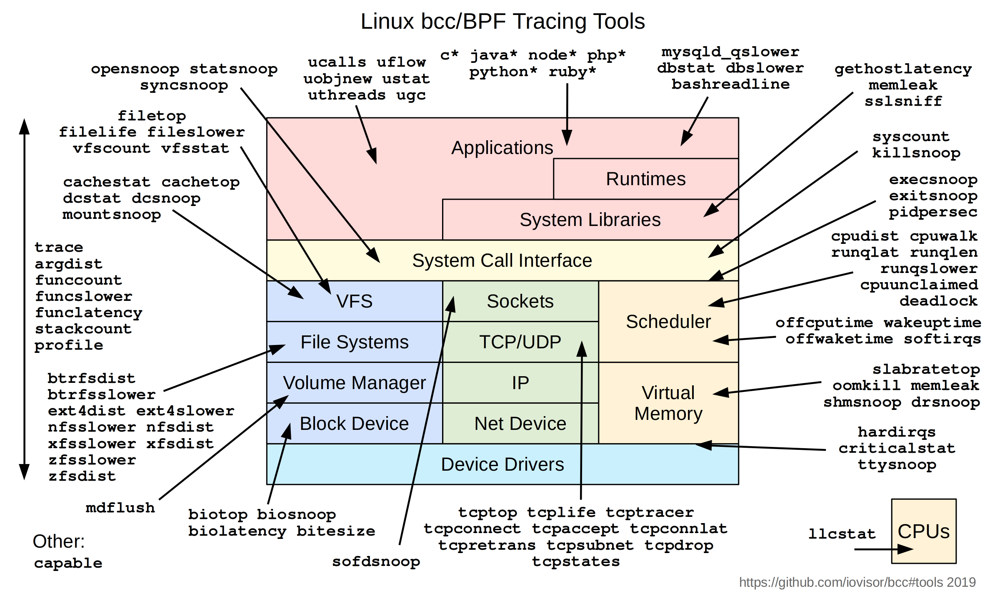
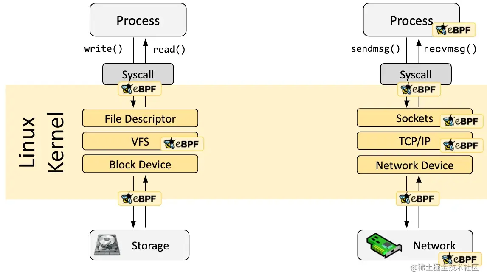
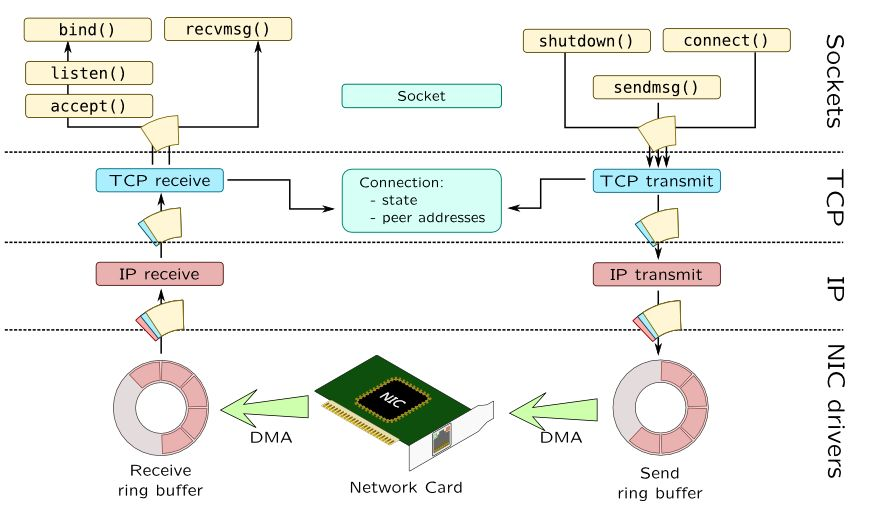
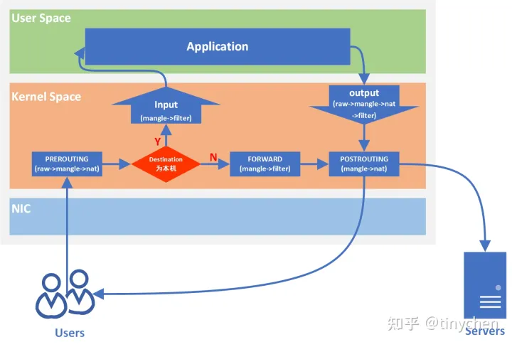
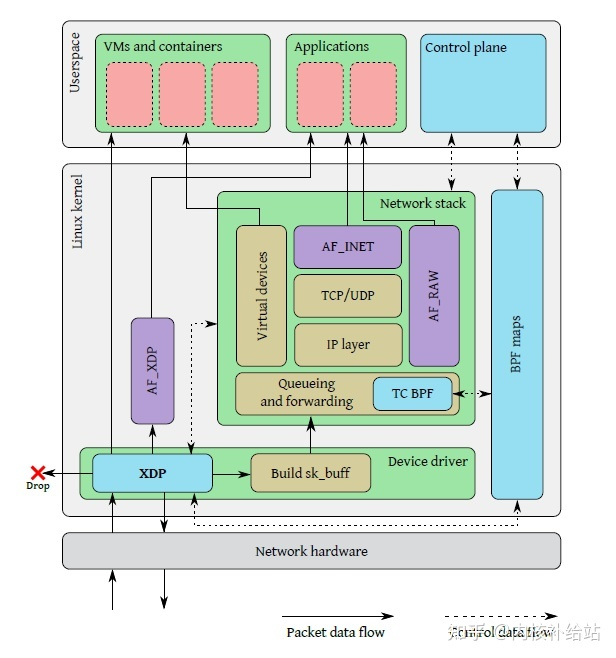
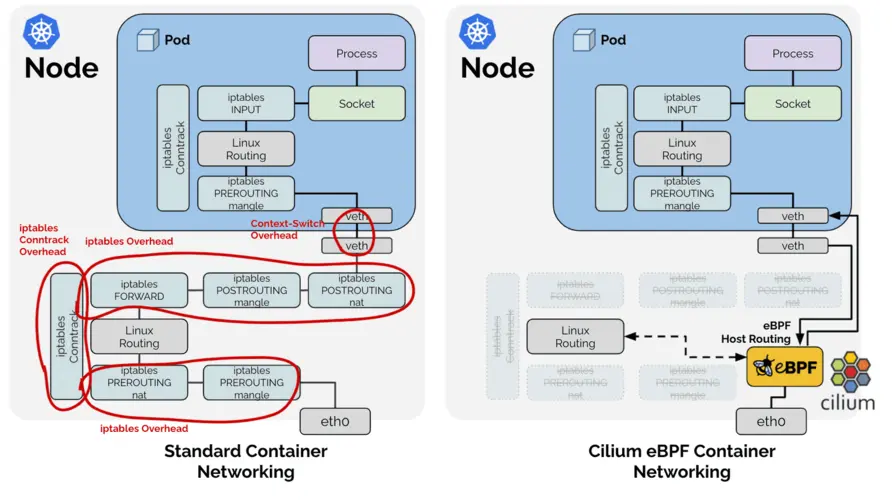
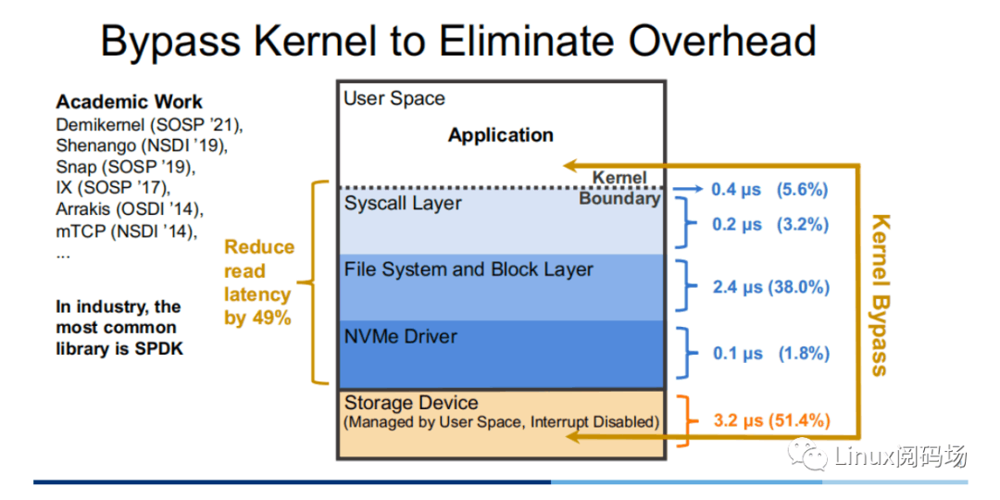
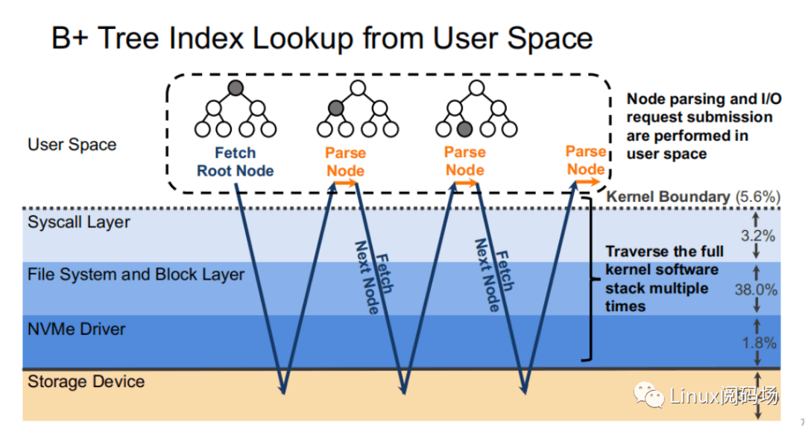
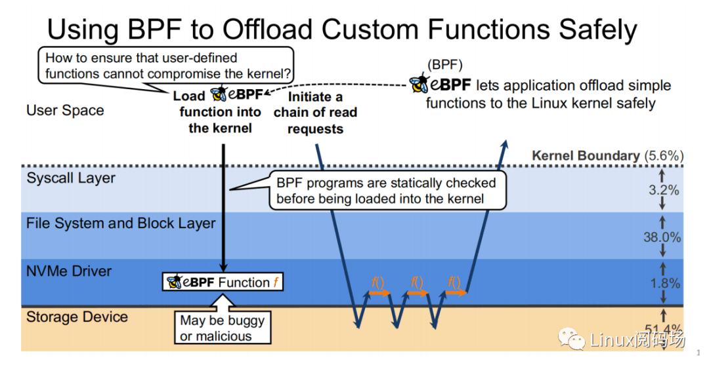

# ebpf能干什么及我们想用ebpf干什么

## 传统iptables/netfilter技术进行流量处理

iptables/netfilter原是上个时代Linux网络提供的优秀防火墙技术，扩展性强，能够满足当时大部分网络应用需求。其通过与Linux内核网络协议栈内有包过滤功能的hook交互来完成工作，这些内核hook构成了netfilter框架。每个进入网络系统的包（接收或发送）在经过协议栈时都会触发这些hook，程序可以通过注册hook函数的方式在一些关键路径上处理网络流量。
随着互联网流量越来越大, 网卡性能越来越强，Linux内核协议栈在10Mbps/100Mbps网卡的慢速时代是没有任何问题的，但现在到了1000Mbps/10Gbps/40Gbps网卡的时代，数据被更快地收入，此时与内核协议栈有关的网络流量处理逻辑便显得复杂且效率低下。

iptables的四表五链：

四表：iptable_filter，iptable_mangle，iptable_nat，iptable_raw，默认表是filter。

- filter 表：用来对数据包进行过滤，具体的规则要求决定如何处理一个数据包。
    对应的内核模块为：iptable_filter，其表内包括三个链：input、forward、output;
- nat 表：nat 全称：network address translation 网络地址转换，主要用来修改数据包的 IP 地址、端口号信息。
    对应的内核模块为：iptable_nat，其表内包括三个链：prerouting、postrouting、output;
- mangle 表：主要用来修改数据包的服务类型，生存周期，为数据包设置标记，实现流量整形、策略路由等。
    对应的内核模块为：iptable_mangle，其表内包括五个链：prerouting、postrouting、input、output、forward;
- raw 表：主要用来决定是否对数据包进行状态跟踪。
    对应的内核模块为：iptable_raw，其表内包括两个链：output、prerouting;

五链：PREROUTING，INPUT，FORWARD，OUTPUT，POSTROUTING。

- input 链：当收到访问防火墙本机地址的数据包时，将应用此链中的规则；
- output 链：当防火墙本机向外发送数据包时，将应用此链中的规则；
- forward 链：当收到需要通过防火中转发给其他地址的数据包时，将应用此链中的规则，注意如果需要实现forward转发需开启Linux内核中的ip_forward功能；
- prerouting 链：在对数据包做路由选择之前，将应用此链中的规则；
- postrouting 链：在对数据包做路由选择之后，将应用此链中的规则；

基于此性能瓶颈提出了两种优化重构方案：

- DPDK让用户态程序直接处理网络流，bypass掉内核，使用独立的CPU专门干这个事。
- XDP让灌入网卡的eBPF程序直接处理网络流，bypass掉内核，使用网卡NPU专门干这个事。

## XDP：使用eBPF实现网络加速（改善iptables/netfilter的规模瓶颈，提高Linux内核协议栈IO性能）

XDP总体设计包括以下几个部分：

- XDP驱动：即网卡中XDP程序的一个挂载点，每当网卡接收到一个数据包就会执行这个XDP程序。XDP程序可以对数据包进行逐层解析、按规则进行过滤，或者对数据包进行封装或者解封装，修改字段对数据包进行转发等。
- BPF虚拟机：一个XDP程序首先是由用户用受限制的C语言编写的，然后通过clang前端编译生成BPF字节码，字节码加载到内核之后运行在eBPF虚拟机上，虚拟机通过JIT编译将XDP字节码编译成底层二进制指令。eBPF虚拟机支持XDP程序的动态加载和卸载。
- BPF映射：存储键值对，作为用户态程序和内核态XDP程序之间的通信媒介，类似于进程间通信的共享内存访问。用户态程序可以在BPF映射中预定义规则，XDP程序匹配映射中的规则对数据包进行过滤等操作；XDP程序将数据包统计信息存入BPF映射，用户态程序可访问BPF映射获取数据包统计信息。
- BPF程序校验器：确保XDP程序加载到内核之后不会导致内核崩溃或者带来其他的安全问题。程序校验器就是在将XDP字节码加载到内核之前对字节码进行安全检查。

参考原文：<https://zhuanlan.zhihu.com/p/558509760?utm_id=0>
应用实例：<https://istio.io/latest/zh/blog/2022/merbridge/>

## XRP: 在利用kernelBypass的优势、基于XDP的基础上实现内存IO加速

Kernel Bypass技术虽然能够降低内核存储栈的开销，但也存在着如下缺点：

- 没有适当粒度的访问控制
- 需要采⽤轮询⽅式来判断 I/O 是否完成，浪费 CPU 周期，同时 CPU 资源不能⾼效地在多进程中共享

XRP 既能享受到 kernel bypass 的性能优势，同时⼜⽆须牺牲 CPU 的使⽤率和访问控制。

XRP 的全称是 eXpress Resubmission Path(快速重提交路径)。与 SPDK 完全绕开内核存储栈，采⽤polling的⽅式来访问存储的⽅式不同，XRP 则是借鉴XDP的实现思路，将中间请求直接在 NVMe 驱动层进⾏重提交，从⽽避免让中间请求通过冗⻓的存储栈后再提交，达到加速的⽬的。在使⽤ XRP 的存储访问⽅式中，只有第⼀次请求和最后⼀次响应会经过⼀个完整的存储栈路径。显然，在允许范围内，B+ tree的树⾼越⾼，XRP 的加速效果也就越明显。

在实现NVMe驱动层重提交请求方面，XRP 引⼊了⼀种新的 BPF 类型(BPF_PROG_TYPE_XRP)，包含了 5 个字段，分别是

- char* data：⼀个缓冲区，⽤于缓冲从磁盘中读取出来的数据
- int done：布尔语意，表示 resubmission 逻辑是否应当返回给 user，还是应当继续 resubmitting I/O 请求
- uint64_t next_addr：逻辑地址数组，存放的是下次 resubmission 的逻辑地址
- uint64_t size：存放的是下次 resubmission 的请求的⼤⼩
- char* scratch：user 和 BPF 函数的私有空间，⽤来传递从 user 到 BPF 函数的参数。BPF 函数也可以⽤这段空间来保存中间数据。

在链式读请求方面，XRP分别继承了 BPF-KV（⼀个简易的基于 B+ Tree的键值存储引擎）和 WIREDTIGER（mongoDB 的后端键值存储引擎）的优势。

参考原文：<https://heapdump.cn/article/4385115?>
