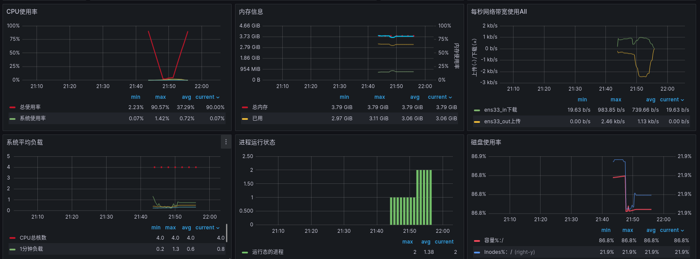

<!-- vscode-markdown-toc -->

# Final report


- **基于eBPF与DisGraFS的网络IO优化**
- 
- **FutureWithinBuzzyBees!**

##  1. <a name='Contents'></a>Contents
* 1. [Contents](#Contents)
* 2. [DisgraFS](#DisgraFS)
	* 2.1. [Previous Version](#PreviousVersion)
	* 2.2. [Our Version](#OurVersion)
* 3. [eBPF's Solution](#eBPFsSolution)
	* 3.1. [Theory](#Theory)
		* 3.1.1. [网络传输](#)
		* 3.1.2. [eBPF基本思路](#eBPF)
	* 3.2. [XDP](#XDP)
		* 3.2.1. [http_filter](#http_filter)
		* 3.2.2. [CPU's balance](#CPUsbalance)
		* 3.2.3. [socket_redirect](#socket_redirect)
		* 3.2.4. [AFXDP](#AFXDP)
		* 3.2.5. [性能监测](#-1)
* 4. [展望](#-1)


##  2. <a name='DisgraFS'></a>DisgraFS

###  2.1. <a name='PreviousVersion'></a>Previous Version


- 客户端依赖大(需要客户端安装JuiceFS)
- 无法真正上传/下载文件


###  2.2. <a name='OurVersion'></a>Our Version


- 摆脱客户端依赖(只需服务器部署JuiceFS)
- 实现真正上传/下载文件


##  3. <a name='eBPFsSolution'></a>eBPF's Solution

###  3.1. <a name='Theory'></a>Theory
- target "accelerating Cloud Native applications"
随着实时应用程序对实时性越来越高，人们不断渴求于性能增强，以加快服务速度。此处使用eBPF加速后端各种微服务之间的通信。

####  3.1.1. <a name=''></a>网络传输


####  3.1.2. <a name='eBPF'></a>eBPF基本思路

> "BPF允许将用户定义的过滤器转换为指令，这些指令在内核内的具有小寄存器集的简单VM内运行，并指定拒绝或接受网络数据包的哪个子集。在指令集中构建了安全功能（例如，没有无限循环来保证有界完成等）.
> 
> 上述BPF，后来被称为“经典”BPF，被扩展为具有增强的指令集、新功能，包括支持在内核中挂接多个事件、除了数据包过滤之外的操作、提高性能的实时汇编程序，以及用于在内核中注入代码的字节码优化器和验证器（请参阅此处的详细信息）。其结果是一个通用的数据包过滤器框架，可用于在Linux内核中注入BPF程序，以在运行时扩展其功能。这种增强形式被称为扩展BPF或eBPF"

eBPF正被广泛用于使用内核跟踪（kprobes/tracing）的可观察性，因为内核中的代码运行速度极快（不涉及上下文切换），而且由于它是基于事件的，因此更准确。此外，eBPF正在一些环境中使用，在这些环境中，基于IP地址的传统安全监控和访问控制是不够的（例如，在基于容器的环境中，如Kubernetes）。在图1中，可以看到Linux内核中的各种挂钩，其中eBPF程序可以挂钩执行。


- kernel space component:其中需要根据一些内核事件进行决策或数据收集，例如nic上的packet rx、生成shell的系统调用等。
- user space component:可以在其中访问由内核代码以某种共享数据结构（映射等）编写的数据。
  

Linux内核支持不同类型的eBPF程序，每个程序都可以连接到内核中可用的特定挂钩（见图1）。这些程序在与这些挂钩相关联的事件被触发时执行，例如，进行诸如setsockopt（）之类的系统调用，网络驱动程序在数据包缓冲描述符的DMA之后挂钩XDP，等等。

所有类型都在内核/include/uapi/linux/bpf.h头文件中枚举，其中包含eBPF程序所需的面向用户的定义。

###  3.2. <a name='XDP'></a>XDP

XDP（eXpress Data Path）提供了一个内核态、高性能、可编程 BPF 包处理框架。这个框架在软件中最早可以处理包的位置（即网卡驱动收到包的 时刻）运行 BPF 程序。如下图所示：


以下是XDP程序在连接到网络接口后可以对其接收的数据包执行的一些操作：

- -XDP_DROP – 丢弃且不处理数据包。eBPF程序可以分析流量模式并使用过滤器实时更新XDP应用程序以丢弃特定类型的数据包（例如，恶意流量）。
- XDP_PASS – 指示应将数据包转发到正常网络堆栈以进行进一步处理。XDP程序可以在此之前修改包的内容。
- XDP_TX – 将数据包（可能已被修改）转发到接收它的同一网络接口。
- XDP_REDIRECT – 绕过正常的网络堆栈并通过另一个NIC将数据包重定向到网络。
  
####  3.2.1. <a name='http_filter'></a>http_filter

一个实例:解析HTTP数据包并提取（并打印）GET/POST请求中包含的URL。通过该实例我们可以观察eBPF是如何处理网络数据流的.

原理是基于bcc工具链中的http_filter对http请求进行拦截并解析http Header(相当于创建一个BPF虚拟机使用套接字接受http请求),注意到linux内核提供了`BPF.SOCKET_FILTER`接口，接受到packet后计算`payload_offset = ETH_HLEN + ip_header_length + tcp_header_length;`,然后通过`load_byte()`,按字节读入header.随后对header进行解析即可

```c
int http_filter(struct __sk_buff *skb) ;
//eBPF读入packet方法
int load_byte();
//BPF_map<Key, Leaf>
BPF_TABLE(map_type, key_type, leaf_type, table_name, num_entry)
```

通过这个例子我们可以简单地梳理一遍这个filter的思路,
1. 使用BPF编程加载eBPF程序。
2. 创建原始套接字并将其绑定到指定的网络接口并将eBPF程序附加到原始套接字。
3. 通过文件描述符创建套接字对象。
4. 进入循环，不断从套接字中读取数据包。
5. 解析数据包，提取IP头部和TCP头部信息。

其中,该eBPF程序通过过滤和判断网络数据包的头部信息，识别其中的HTTP请求(细节涉及到网络从物理层通过以太网,IP,TCP协议的传输,而eBPF的钩子机制使其可以在传输到内核前监测并处理数据包.)。如果匹配到HTTP请求，就将其保留并传递给用户空间(PASS)，否则丢弃该数据包(DROP)。这样可以实现对网络流量中的HTTP请求的简单捕获和过滤。

####  3.2.2. <a name='CPUsbalance'></a>CPU's balance
实现对传入数据包的动态负载均衡。通过将传入的数据包在多个CPU之间均衡分配，可以达到以下几个方面的用处：

1. 提高系统的并发处理能力：通过将数据包分散到多个CPU上处理，可以提高系统的并发处理能力。每个CPU都可以独立地处理一部分数据包，从而减轻单个CPU的负载压力，提高系统的吞吐量和响应能力。
2. 平衡负载：动态负载均衡可以根据每个CPU的当前负载情况，将数据包分配给负载较轻的CPU。这样可以避免某些CPU负载过高，而其他CPU负载较低的情况，实现系统资源的合理分配，提高系统的整体性能和效率。
3. 提高系统的容错性：通过将数据包分散到多个CPU上处理，即使其中一个CPU出现故障或负载过高，其他CPU仍然可以继续处理数据包，确保系统的可用性和稳定性。
4. 灵活配置权重：使用了权重值来配置每个CPU的处理能力。通过调整不同CPU的权重值，可以根据实际需求分配不同的计算资源。较高权重的CPU将处理更多的数据包，从而充分利用其处理能力。

BPF映射类型的运用

在 eBPF 程序中，不能直接使用传统的 C 语言数组或数据结构，因为 eBPF 程序是在内核中执行的，而不是在用户空间中执行。由于内核和用户空间有不同的内存访问限制和安全机制，因此需要使用特定的数据结构和操作来进行数据的处理和存储。

1. BPF_CPUMAP 类型的映射表 (`BPF_CPUMAP(cpumap, __MAX_CPU__)`)： 这个映射表用于将数据包重定向到不同的 CPU。每个键值对表示一个数据包，其中键是数据包的索引或标识，值是数据包应该重定向到的目标 CPU 的索引。这里选择使用 BPF_CPUMAP 类型，是因为它提供了在 eBPF 程序中进行 CPU 映射的功能。
2. BPF_ARRAY 类型的数组 (`BPF_ARRAY(dest, uint32_t, 1)`)： 这个数组用于存储每个数据包的目标 CPU 索引。因为每个数据包只需要存储一个目标 CPU 的索引，所以数组的大小为 1。选择使用 BPF_ARRAY 类型，是因为它提供了在 eBPF 程序中进行数组操作的功能，可以方便地读取和修改数组元素的值。
3. BPF_PERCPU_ARRAY 类型的数组 (`BPF_PERCPU_ARRAY(rxcnt, long, 1)`)： 这个数组用于记录每个 CPU 上接收到的数据包数量。因为每个 CPU 都需要记录自己接收到的数据包数量，所以使用 BPF_PERCPU_ARRAY 类型，它提供了在 eBPF 程序中进行多个 CPU 计数的功能。每个数组元素都会分配给一个 CPU，因此可以并发地更新计数器，而不会出现竞争条件。

通过选择不同类型的数据结构，可以使 eBPF 程序更加灵活地处理数据，并根据需要进行数据的映射、存储和计数。这些数据结构提供了 eBPF 程序所需的功能和性能，以满足特定的需求和使用场景。

利用grafana进行性能检测：



下面进行性能的对比
|                       | 优化前   | 优化后   |
| --------------------- | -------- | -------- |
| 单个CPU使用率的峰值   | 90.57%   | 52.86%   |
| 网络带宽吞吐率        | 2.46kb/s | 4.46kb/s |
| 磁盘写入速率          | 4        | 10       |
| 磁盘读取速率          | 8        | 27       |
| 每1秒内IO操作耗时占比 | 0.382%   | 0.565%   |
| Tcp_inSegs            | 3.68     | 10.2     |
| Tcp_outSegs           | 3.69     | 10.2     |
| socket_used           | 1055     | 1055     |


1. sockets_used: 正在使用的套接字数量，包括TCP和UDP。

2. Tcp_InSegs: 接收的TCP报文段数量。

3. Tcp_OutSegs: 发送的TCP报文段数量。

   这些指标表示接收和发送的TCP报文段数量，可以用于监测网络的数据传输情况和活跃度。较高的数值可能表示较大的数据传输量，但同时也可能暗示网络拥塞或重传情况。

   

####  3.2.3. <a name='socket_redirect'></a>socket_redirect

在sockect_redirect中实现了当应用程序位于同一主机上时，使应用程序能够使用eBPF透明地绕过TCP/IP堆栈。

使用eBPF进行网络加速,研究套接字数据重定向的机制.

1. 使用LLVM Clang前端编译sockops BPF代码，该代码更新sockhash映射
2. 使用bpftool将上面编译的代码附加到cgroup，以便为系统中的所有套接字操作（如建立连接等）调用它。
3. 提取由上述程序创建的sockhash映射的id，并将该映射固定到虚拟文件系统，使得第二eBPF程序
4. 可以访问该map.编译tcpip_bypass代码，该代码将绕过tcpip堆栈
5. 执行套接字数据重定向。使用bpftool将上述eBPF代码附加到sockhash映射

- BPF钩子挂载:


- BPF共享maps:

```bash
#sudo tree /sys/fs/bpf/
/sys/fs/bpf/
├── bpf_sockops
├── bpf_tcpip_bypass
└── sock_ops_map
# sudo bpftool map list
4: sockhash  name sock_ops_map  flags 0x0
        key 24B  value 4B  max_entries 65535  memlock 2097152B
```

- 验证应用程序是否绕过TCP/IP堆栈：

可以将内核实时流跟踪文件trace_pipe放入shell中，以监视通过eBPF的TCP通信的跟踪
```bash
# sudo cat /sys/kernel/debug/tracing/trace_pipe
  <idle>-0       [000] d.s.1 89797.577008: bpf_trace_printk: <<< ipv4 op = 4, port 38902 --> 80
  <idle>-0       [000] d.s.1 89863.993725: bpf_trace_printk: <<< ipv4 op = 4, port 58380 --> 443
...
```
我们可以使用SOCAT派生的TCP侦听器来模拟echo服务器，并使用netcat来发送TCP连接请求。

```bash
sudo socat TCP4-LISTEN:1000,fork exec:cat
nc localhost 1000 # this should produce the trace in the kernel file trace_pipe
```
可以监测结果
```shell
# sudo cat /sys/kernel/debug/tracing/trace_pipe
        <idle>-0       [000] d.s.1 91597.541404: bpf_trace_printk: <<< ipv4 op = 4, port 40762 --> 80
        node-126065  [000] d.s.1 91598.729170: bpf_trace_printk: <<< ipv4 op = 4, port 38678 --> 443
        nc-132366  [000] d...1 91639.938416: bpf_trace_printk: <<< ipv4 op = 4, port 38838 --> 1000
        nc-132366  [000] d.s11 91639.938514: bpf_trace_printk: <<< ipv4 op = 5, port 1000 --> 38838
```

####  3.2.4. <a name='AFXDP'></a>AF_XDP

xdp 没有完全绕过内核，但是可以让包跳过内核的网络栈，直接从用户空间读取，可以通过 `AF_XDP` 的 `XDP_REDIRECT` 语义实现。

通过XDP_REDIRECT我们可以将报文重定向到其他设备发送出去或者重定向到其他的CPU继续进行处理。而AF_XDP则利用 bpf_redirect_map()函数，实现将报文重定向到用户态一块指定的内存中，接下来我们看一下这到底是如何做到的。

我们使用普通的 socket() 系统调用创建一个AF_XDP套接字（XSK）。每个XSK都有两个ring：RX RING 和 TX RING。套接字可以在 RX RING 上接收数据包，并且可以在 TX RING 环上发送数据包。这些环分别通过 setockopts() 的 XDP_RX_RING 和 XDP_TX_RING 进行注册和调整大小。每个 socket 必须至少有一个这样的环。RX或TX描述符环指向存储区域（称为UMEM）中的数据缓冲区。RX和TX可以共享同一UMEM，因此不必在RX和TX之间复制数据包。

UMEM也有两个 ring：FILL RING 和 COMPLETION RING。应用程序使用 FILL RING 向内核发送可以承载报文的 addr (该 addr 指向UMEM中某个chunk)，以供内核填充RX数据包数据。每当收到数据包，对这些 chunks 的引用就会出现在RX环中。另一方面，COMPLETION RING包含内核已完全传输的 chunks 地址，可以由用户空间再次用于 TX 或 RX。


##### AF_XDP收发包过程

我们知道，XSK的操作涉及四个Ring：RX、TX、Fill和Completion Ring；都是单生产者单消费者（SCSP）模型，需要内核或者用户程序先生产了，对方才能消费；

对Fill Ring来说，用户程序作为生产者，得先生产一些元素，我们统一叫desc，这些desc指向umem中的某个chunk，这样内核才能作为消费者，拿走这些desc，找到desc指向的umem的chunk，再把收到的数据包放到该chunk中，示意图：


> ring就是一个固定长度的数组，并且同时拥有一个生产者和一个消费者，生产者向数组中逐个填写数据，消费者从数组中逐个读取生产者填充的数据，生产者和消费者都用数组的下标表示，不断累加，像一个环一样不断重复生产然后消费的动作，因此得名ring。
>
> 


发包过程如下：


收包过程如下：


动图展示：


> 注：为了简便，每个umem chunk的大小假定为1，以及图示和例程中操作空闲chunk的方式不太一样，但对四个Ring的操作是类似的，具体以程序为准。

##### AF_XDP 的性能提升从何而来？

AF_XDP socket 非常快，在这个性能提升的背后隐藏了多少秘密呢？ AF_XDP 的 idea 背后的基础可以追溯到 [Van Jacobson](https://en.wikipedia.org/wiki/Van_Jacobson) 的关于 [network channels](https://lwn.net/Articles/169961/) 的报告中。在该报告中，描述了如何直接从驱动的 RX-queue （接收队列）去创建一个无锁的 [channel](https://lwn.net/Articles/169961/) 构建 AF_XDP socket。

（前面介绍 `AF_XDP` 的内容也提到了），AF_XDP 使用的队列是 Single-Producer/Single-Consumer (SPSC) 的描述符（descriptor）环形队列：

- **Single-Producer** (SP) 绑定到了某个特定的 RX **queue id** 上，通过 NAPI-softirq 确保在软中断（softirq）触发期间，只有一个 CPU 来处理一个 RX-queue id。

  > NAPI 是 Linux 上采用的一种提高网络处理效率的技术，它的核心概念就是不采用中断的方式读取数据，否则包太多了，不停触发中断。而代之以首先采用中断唤醒数据接收的服务程序，然后 POLL 的方法来轮询数据。

- **Single-Consumer** (SC) 则是一个应用，从环中读取指向 UMEM 区域的描述符（descriptor）。

因此不需要对每个包都分配一次内存。可以在事先为 UMEM 内存区域进行分配（因此 UMEM 是有界的）。UMEM 包含了一些大小相同的块，环中的指针会引用它们的地址来引用这些块。这个地址就是在整个 UMEM 区域中的偏移量。用户空间负责为 UMEM 分配内存，分配的方法很灵活，可以用 malloc、mmap、huge pages 等形式。这个内存空间通过在 `setsockopt()` 方法中设置 `XDP_UMEM_REG` 触发相应的系统调用，注册到内核中。**需要注意的是**：这样就意味着你需要负责及时地将 frame 返回给 UMEM，并且需要为你的应用提前分配足够的内存。

Van Jacobson 在报告中谈到的 [transport signature](http://www.lemis.com/grog/Documentation/vj/lca06vj.pdf)，在 XDP/eBPF 程序中体现为选择将 frame `XDP_REDIRECT` 到哪个 AF_XDP socket。

##### AF_XDP需要做哪些准备？

###### 1.1 创建AF_XDP的socket

```ini
xsk_fd = socket(AF_XDP, SOCK_RAW, 0);
```

这一步没什么好展开的。

###### 1.2 为UMEM申请内存

上文提到UMEM是一块包含固定大小chunk的内存，我们可以通过malloc/mmap/hugepages申请。下文大部分代码出自kernel samples。

```cpp
    bufs = mmap(NULL, NUM_FRAMES * opt_xsk_frame_size,
                         PROT_READ | PROT_WRITE,
                         MAP_PRIVATE | MAP_ANONYMOUS | opt_mmap_flags, -1, 0);
    if (bufs == MAP_FAILED) {
        printf("ERROR: mmap failed\n");
        exit(EXIT_FAILURE);
    }
```

###### 1.3 向AF_XDP socket注册UMEM

```rust
        struct xdp_umem_reg mr;
        memset(&mr, 0, sizeof(mr));
        mr.addr = (uintptr_t)umem_area; // umem_area即上面通过mmap申请到内存起始地址
        mr.len = size;
        mr.chunk_size = umem->config.frame_size;
        mr.headroom = umem->config.frame_headroom;
        mr.flags = umem->config.flags;

        err = setsockopt(umem->fd, SOL_XDP, XDP_UMEM_REG, &mr, sizeof(mr));
        if (err) {
                err = -errno;
                goto out_socket;
        }
```

其中xdp_umem_reg结构定义在 usr/include/linux/if_xdp.h中：

```rust
struct xdp_umem_reg {
        __u64 addr; /* Start of packet data area */
        __u64 len; /* Length of packet data area */
        __u32 chunk_size;
        __u32 headroom;
        __u32 flags;
};
```

**成员解析：**

- addr就是UMEM内存的起始地址；
- len是整个UMEM内存的总长度；
- chunk_size就是每个chunk的大小；
- headroom，如果设置了，那么报文数据将不是从每个chunk的起始地址开始存储，而是要预留出headroom大小的内存，再开始存储报文数据，headroom在隧道网络中非常常见，方便封装外层头部；
- flags, UMEM还有一些更复杂的用法，通过flag设置，后面再进一步展开；

###### 1.4 创建FILL RING 和 COMPLETION RING

我们通过 setsockopt() 设置 FILL/COMPLETION/RX/TX ring的大小（在我看来这个过程相当于创建，不设置大小的ring是没有办法使用的）。

FILL RING 和 COMPLETION RING是UMEM必须，RX和TX则是 AF_XDP socket二选一的，例如AF_XDP socket只收包那么只需要设置RX RING的大小即可。

```lua
        err = setsockopt(umem->fd, SOL_XDP, XDP_UMEM_FILL_RING,
                         &umem->config.fill_size,
                         sizeof(umem->config.fill_size));
        if (err) {
                err = -errno;
                goto out_socket;
        }
        err = setsockopt(umem->fd, SOL_XDP, XDP_UMEM_COMPLETION_RING,
                         &umem->config.comp_size,
                         sizeof(umem->config.comp_size));
        if (err) {
                err = -errno;
                goto out_socket;
        }
```

上述操作相当于创建了 FILL RING 和 和 COMPLETION RING，创建ring的过程主要是初始化 producer 和 consumer 的下标，以及创建ring数组。

**问题来了：**

上文提到，用户态程序是 FILL RING 的生产者和 CONPLETION RING 的消费者，上面2个 ring 的创建是在内核中创建了 ring 并初始化了其相关成员。那么用户态程序如何操作这两个位于内核中的 ring 呢？所以接下来我们需要将整个 ring 映射到用户态空间。

###### 1.5 将FILL RING 映射到用户态

第一步是获取内核中ring结构各成员的偏移，因为从5.4版本开始后，ring结构中除了 producer、consumer、desc外，又新增了一个flag成员。所以用户态程序需要先获取 ring 结构中各成员的准确便宜，才能在mmap() 之后准确识别内存中各成员位置。

```cpp
        err = xsk_get_mmap_offsets(umem->fd, &off);
        if (err) {
                err = -errno;
                goto out_socket;
        }
```

xsk_get_mmap_offsets() 函数主要是通过getsockopt函数实现这一功能：

```kotlin
        err = getsockopt(fd, SOL_XDP, XDP_MMAP_OFFSETS, off, &optlen);
        if (err)
                return err;
```

一切就绪，开始将内核中的 FILL RING 映射到用户态程序中：

```rust
        map = mmap(NULL, off.fr.desc + umem->config.fill_size * sizeof(__u64),
                   PROT_READ | PROT_WRITE, MAP_SHARED | MAP_POPULATE, umem->fd,
                   XDP_UMEM_PGOFF_FILL_RING);
        if (map == MAP_FAILED) {
                err = -errno;
                goto out_socket;
        }

        umem->fill = fill;
        fill->mask = umem->config.fill_size - 1;
        fill->size = umem->config.fill_size;
        fill->producer = map + off.fr.producer;
        fill->consumer = map + off.fr.consumer;
        fill->flags = map + off.fr.flags;
        fill->ring = map + off.fr.desc;
        fill->cached_cons = umem->config.fill_size;
```

上面代码需要关注的一点是 mmap() 函数中指定内存的长度——**off.fr.desc + umem->config.fill_size \* sizeof(__u64)**，umem->config.fill_size * sizeof(__u64)没什么好说的，就是ring数组的长度，而 off.fr.desc 则是ring结构体的长度，我们先看下内核中ring结构的定义：

```rust
struct xdp_ring_offset {
        __u64 producer;
        __u64 consumer;
        __u64 desc;
};
```

这是没有flag的定义，无伤大雅。这里desc的地址其实就是ring数组的起始地址了。而off.fr.desc是desc相对 ring 结构体起始地址的偏移，相当于结构体长度。我们用一张图来看下ring所在内存的结构分布：


后面一堆赋值代码没什么好讲的，umem->fill 是用户态程序自定义的一个结构体，其成员 producer、consumer、flags、ring都是指针，分别指向实际ring结构中的对应成员，umem->fill中的其他成员主要在后面报文收发时用到，起辅助作用。

###### 1.6 将COMPLETION RING 映射到用户态

跟上面 FILL RING 的映射一样，只贴代码好了：

```rust
        map = mmap(NULL, off.cr.desc + umem->config.comp_size * sizeof(__u64),
                   PROT_READ | PROT_WRITE, MAP_SHARED | MAP_POPULATE, umem->fd,
                   XDP_UMEM_PGOFF_COMPLETION_RING);
        if (map == MAP_FAILED) {
                err = -errno;
                goto out_mmap;
        }

        umem->comp = comp;
        comp->mask = umem->config.comp_size - 1;
        comp->size = umem->config.comp_size;
        comp->producer = map + off.cr.producer;
        comp->consumer = map + off.cr.consumer;
        comp->flags = map + off.cr.flags;
        comp->ring = map + off.cr.desc;
```

###### 1.7 创建RX RING和TX RING然后mmap

这里和 FILL RING 以及 COMPLETION RING的做法基本完全一致，只贴代码：

```rust
        if (rx) {
                err = setsockopt(xsk->fd, SOL_XDP, XDP_RX_RING,
                                 &xsk->config.rx_size,
                                 sizeof(xsk->config.rx_size));
                if (err) {
                        err = -errno;
                        goto out_socket;
                }
        }
        if (tx) {
                err = setsockopt(xsk->fd, SOL_XDP, XDP_TX_RING,
                                 &xsk->config.tx_size,
                                 sizeof(xsk->config.tx_size));
                if (err) {
                        err = -errno;
                        goto out_socket;
                }
        }

        err = xsk_get_mmap_offsets(xsk->fd, &off);
        if (err) {
                err = -errno;
                goto out_socket;
        }

        if (rx) {
                rx_map = mmap(NULL, off.rx.desc +
                              xsk->config.rx_size * sizeof(struct xdp_desc),
                              PROT_READ | PROT_WRITE, MAP_SHARED | MAP_POPULATE,
                              xsk->fd, XDP_PGOFF_RX_RING);
                if (rx_map == MAP_FAILED) {
                        err = -errno;
                        goto out_socket;
                }

                rx->mask = xsk->config.rx_size - 1;
                rx->size = xsk->config.rx_size;
                rx->producer = rx_map + off.rx.producer;
                rx->consumer = rx_map + off.rx.consumer;
                rx->flags = rx_map + off.rx.flags;
                rx->ring = rx_map + off.rx.desc;
        }
        xsk->rx = rx;

        if (tx) {
                tx_map = mmap(NULL, off.tx.desc +
                              xsk->config.tx_size * sizeof(struct xdp_desc),
                              PROT_READ | PROT_WRITE, MAP_SHARED | MAP_POPULATE,
                              xsk->fd, XDP_PGOFF_TX_RING);
                if (tx_map == MAP_FAILED) {
                        err = -errno;
                        goto out_mmap_rx;
                }

                tx->mask = xsk->config.tx_size - 1;
                tx->size = xsk->config.tx_size;
                tx->producer = tx_map + off.tx.producer;
                tx->consumer = tx_map + off.tx.consumer;
                tx->flags = tx_map + off.tx.flags;
                tx->ring = tx_map + off.tx.desc;
                tx->cached_cons = xsk->config.tx_size;
        }
        xsk->tx = tx;
```

###### 1.8 调用bind()将AF_XDP socket绑定的指定设备的某一队列

```rust
        sxdp.sxdp_family = PF_XDP;
        sxdp.sxdp_ifindex = xsk->ifindex;
        sxdp.sxdp_queue_id = xsk->queue_id;
        sxdp.sxdp_flags = xsk->config.bind_flags;

        err = bind(xsk->fd, (struct sockaddr *)&sxdp, sizeof(sxdp));
        if (err) {
                err = -errno;
                goto out_mmap_tx;
        }
```

##### 内核态xdp程序

XDP程序利用 bpf_reditrct() 函数可以将报文重定向到其他设备发送出去或者重定向到其他CPU继续处理，后来又发展出了bpf_redirect_map()函数，可以将重定向的目的地保存在map中。AF_XDP 正是利用了 bpf_redirect_map() 函数以及 BPF_MAP_TYPE_XSKMAP 类型的 map 实现将报文重定向到用户态程序。

> libbpf/libxdp提供的xsk_socket__create函数，如果给其提供的配置参数struct xsk_socket_config *为空或者将其中的libbpf_flags / libxdp_flags置为0，就会默认加载一个简单的XDP程序到所给出的接口，把所有配置的queue_id对应的网卡队列收到的包都redirect到该xsk；
>
> 如果将其中的libbpf_flags / libxdp_flags置为XSK_LIBBPF_FLAGS__INHIBIT_PROG_LOAD或XSK_LIBXDP_FLAGS__INHIBIT_PROG_LOAD，就可以禁止默认XDP程序的加载，后边就得自己写程序自己加载和更新xsks_map映射了，但这样能让程序更可控一些；

我们还是自己写一个XDP程序，过滤出IPv4 TCP报文，将其redirect到XSK，其余数据包则是通过XDP_PASS给内核去继续处理；顺便通过ELF约定格式，预定义BPF_MAP_TYPE_XSKMAP类型的xsks_map，等会儿用户程序创建好xsk了需要更新[queue_idx, xsk_fd]键值对到该映射中；

程序如下：

```c
/* 
SPDX-License-Identifier: GPL-2.0 
AF_XDP的内核态程序
仅仅过滤TCP协议并发送到AF_XDP的用户态程序
*/

#include <linux/bpf.h>
#include <linux/if_ether.h>
#include <linux/ip.h>
#include <linux/in.h>
#include <linux/tcp.h>

#include <bpf/bpf_endian.h>
#include <bpf/bpf_helpers.h>

struct {
	__uint(type, BPF_MAP_TYPE_XSKMAP);
	__uint(max_entries, 64);
	__type(key, int);
	__type(value, int);
} xsks_map SEC(".maps");

SEC("xdp")
int xdp_prog(struct xdp_md *ctx)
{
	__u32 off;
	//数据包的起始地址和结束地址
	void *data_end = (void *)(long)ctx->data_end;
	void *data = (void *)(long)ctx->data;
	//以太网头部
	struct ethhdr *eth = data;
	//IP头部
	struct iphdr *ip = data + sizeof(*eth);
	//TCP头部
	// struct tcphdr *tcp = data + sizeof(*eth) + sizeof(*ip);
	//偏移量
	off = sizeof(struct ethhdr);
	if (data + off > data_end) // To pass verifier
		return XDP_PASS;
	//判断是否为IPV4协议
	if (bpf_htons(eth->h_proto) == ETH_P_IP) {
        off += sizeof(struct iphdr);
		if (data + off > data_end) // To pass verifier
			return XDP_PASS;
			//判断是否为TCP协议
		if (ip->protocol == IPPROTO_TCP) {
            int idx = ctx->rx_queue_index;
            /* 如果idx对应网卡队列已绑定xsk并更新到了xsks_map中，数据包就会被redirect到该xsk */
			if (bpf_map_lookup_elem(&xsks_map, &idx)) {
				return bpf_redirect_map(&xsks_map, idx, 0);
			}
		}
	}
	return XDP_PASS;
}

char _license[] SEC("license") = "GPL";
```

##### 用户态xdp程序

既然是redirect到用户空间，主要工作都在用户空间，包括创建umem、xsk、处理各个ring收发包、处理数据包等。

###### 主函数

```c
int main(int argc, char **argv)
{
	//变量声明
	int ret;
	void *packet_buffer;
	uint64_t packet_buffer_size;
	DECLARE_LIBBPF_OPTS(bpf_object_open_opts, opts);
	DECLARE_LIBXDP_OPTS(xdp_program_opts, xdp_opts, 0);
	struct rlimit rlim = {RLIM_INFINITY, RLIM_INFINITY};
	struct xsk_umem_info *umem;
	struct xsk_socket_info *xsk_socket;
	pthread_t stats_poll_thread;
	int err;
	char errmsg[1024];

	// 注册全局退出处理函数
	signal(SIGINT, exit_application);

	// 解析命令行参数
	parse_cmdline_args(argc, argv, long_options, &cfg, __doc__);

	/* 检查必需的选项 */
	if (cfg.ifindex == -1) {
		fprintf(stderr, "ERROR: Required option --dev missing\n\n");
		usage(argv[0], __doc__, long_options, (argc == 1));
		return EXIT_FAIL_OPTION;
	}

	/* 加载自定义程序（如果配置了）*/
	if (cfg.filename[0] != 0) {
		struct bpf_map *map;

		custom_xsk = true;
		xdp_opts.open_filename = cfg.filename;
		xdp_opts.prog_name = cfg.progname;
		xdp_opts.opts = &opts;

		if (cfg.progname[0] != 0) {
			xdp_opts.open_filename = cfg.filename;
			xdp_opts.prog_name = cfg.progname;
			xdp_opts.opts = &opts;

			prog = xdp_program__create(&xdp_opts);
		} else {
			prog = xdp_program__open_file(cfg.filename,
						  NULL, &opts);
		}
		// 检查程序加载错误
		err = libxdp_get_error(prog);
		if (err) {
			libxdp_strerror(err, errmsg, sizeof(errmsg));
			fprintf(stderr, "ERR: loading program: %s\n", errmsg);
			return err;
		}
		// 将程序附加到网络接口
		err = xdp_program__attach(prog, cfg.ifindex, cfg.attach_mode, 0);
		if (err) {
			libxdp_strerror(err, errmsg, sizeof(errmsg));
			fprintf(stderr, "Couldn't attach XDP program on iface '%s' : %s (%d)\n",
				cfg.ifname, errmsg, err);
			return err;
		}

		/* 获取 xsks_map */
		map = bpf_object__find_map_by_name(xdp_program__bpf_obj(prog), "xsks_map");
		xsk_map_fd = bpf_map__fd(map);
		if (xsk_map_fd < 0) {
			fprintf(stderr, "ERROR: no xsks map found: %s\n",
				strerror(xsk_map_fd));
			exit(EXIT_FAILURE);
		}
	}

	/* 允许无限制地锁定内存，
	以便可以锁定所有用于数据包缓冲区的内存
	 */
	if (setrlimit(RLIMIT_MEMLOCK, &rlim)) {
		fprintf(stderr, "ERROR: setrlimit(RLIMIT_MEMLOCK) \"%s\"\n",
			strerror(errno));
		exit(EXIT_FAILURE);
	}

	/* 分配用于数据包缓冲区的内存
	Allocate memory for NUM_FRAMES of the default XDP frame size */
	packet_buffer_size = NUM_FRAMES * FRAME_SIZE;
	if (posix_memalign(&packet_buffer,
			   getpagesize(), /* PAGE_SIZE aligned */
			   packet_buffer_size)) {
		fprintf(stderr, "ERROR: Can't allocate buffer memory \"%s\"\n",
			strerror(errno));
		exit(EXIT_FAILURE);
	}

	/* 初始化 umem */
	umem = configure_xsk_umem(packet_buffer, packet_buffer_size);
	if (umem == NULL) {
		fprintf(stderr, "ERROR: Can't create umem \"%s\"\n",
			strerror(errno));
		exit(EXIT_FAILURE);
	}

	/* 配置和打开 AF_XDP（xsk）套接字*/
	xsk_socket = xsk_configure_socket(&cfg, umem);
	if (xsk_socket == NULL) {
		fprintf(stderr, "ERROR: Can't setup AF_XDP socket \"%s\"\n",
			strerror(errno));
		exit(EXIT_FAILURE);
	}

	/*启动统计信息显示线程*/
	if (verbose) {
		ret = pthread_create(&stats_poll_thread, NULL, stats_poll,
				     xsk_socket);
		if (ret) {
			fprintf(stderr, "ERROR: Failed creating statistics thread "
				"\"%s\"\n", strerror(errno));
			exit(EXIT_FAILURE);
		}
	}

	/* 接收和处理数据包 */
	rx_and_process(&cfg, xsk_socket);

	/* 清理资源 */
	xsk_socket__delete(xsk_socket->xsk);
	xsk_umem__delete(umem->umem);

	return EXIT_OK;
}
```

这段代码的主要功能是创建和配置 AF_XDP（xsk）套接字，并使用该套接字接收和处理数据包。它还包括加载和附加自定义的 XDP 程序，设置内存锁定限制，分配缓冲区内存等。以下是每个部分的简要解释：

- 解析命令行参数并检查必需选项。
- 如果配置了自定义程序，加载并附加该程序到网络接口，并获取 `xsks_map` 的文件描述符。
- 设置内存锁定的限制，允许锁定足够的内存来存储数据包缓冲区。
- 分配数据包缓冲区内存并初始化 `umem`（用户态内存）。
- 配置和打开 AF_XDP（xsk）套接字。
- 如果启用了详细输出，启动统计信息显示线程。
- 接收和处理数据包，执行 `rx_and_process` 函数。
- 清理资源，包括删除套接字和释放内存。

###### 数据包处理与响应

由于在用户态的原始数据包处理涉及用户态TCP协议栈的设立，体量较大，因此这里做简单假设（仅仅处理TCP HTTP GET请求，其他请求直接drop）

```c
// 用于处理接收到的数据包并生成响应
static bool process_packet(struct xsk_socket_info *xsk,
			   uint64_t addr, uint32_t len)
{
	uint8_t *pkt = xsk_umem__get_data(xsk->umem->buffer, addr);

	 // 根据一些简化的假设处理数据包并生成响应
	int ret;
	uint32_t tx_idx = 0;
	struct ethhdr *eth = (struct ethhdr *) pkt;
	struct iphdr *ip = (struct iphdr *) (eth + 1);
    struct tcphdr *tcp = (struct tcphdr *) (ip + 1);

	// 判断数据包是否满足生成响应的条件
	if (ntohs(eth->h_proto) != ETH_P_IP ||
        len < (sizeof(*eth) + sizeof(*ip) + sizeof(*tcp)) ||
        ip->protocol != IPPROTO_TCP)
        return false;

	// 处理TCP连接
    bool handled = tcp_process(xsk, pkt, len, eth, ip, tcp);

    // 如果TCP连接未被处理，则直接将数据包发送出去
    if (!handled) {
        ret = xsk_ring_prod__reserve(&xsk->tx, 1, &tx_idx);
        if (ret != 1) {
            /* No more transmit slots, drop the packet */
            return false;
        }

        xsk_ring_prod__tx_desc(&xsk->tx, tx_idx)->addr = addr;
        xsk_ring_prod__tx_desc(&xsk->tx, tx_idx)->len = len;
        xsk_ring_prod__submit(&xsk->tx, 1);
        xsk->outstanding_tx++;
    }

	// 更新统计信息
	xsk->stats.tx_bytes += len;
	xsk->stats.tx_packets++;
	return true;
}
```

其中tcp_process函数如下：

```c
// 用户态TCP协议栈的核心函数，仅考虑处理HTTP GET请求
static bool tcp_process(struct xsk_socket_info *xsk, uint8_t *pkt,
                        uint32_t len, struct ethhdr *eth,
                        struct iphdr *ip, struct tcphdr *tcp)
{
	/*
	简单假设
	1. 仅处理HTTP GET请求
	2. 握手三次后，建立连接
	3. 客户端发送HTTP GET请求，服务器回复HTTP响应
	4. 四次挥手后，终止连接
	*/ 
	
	// 获取TCP数据包的有效载荷
	uint8_t *payload = pkt + sizeof(*eth) + sizeof(*ip) + sizeof(*tcp);
	uint32_t payload_len = ntohs(ip->tot_len) - sizeof(*ip) - sizeof(*tcp);

	// 判断是否为TCP连接建立阶段
	if (tcp->syn && !tcp->ack) {
		// 连接建立，发送 SYN+ACK 数据包
		// 构建 SYN+ACK 数据包头部
		struct tcphdr syn_ack;
		memset(&syn_ack, 0, sizeof(syn_ack));
		syn_ack.source = tcp->dest;
		syn_ack.dest = tcp->source;
		syn_ack.seq = tcp->ack_seq;
		syn_ack.ack_seq = htonl(ntohl(tcp->seq) + 1);
		syn_ack.doff = sizeof(syn_ack) / 4;
		syn_ack.syn = 1;
		syn_ack.ack = 1;
		syn_ack.window = htons(65535);
		syn_ack.check = 0;
		syn_ack.urg_ptr = 0;

		// 发送 SYN+ACK 数据包
		uint32_t ret = xsk_ring_prod__reserve(&xsk->tx, 1, &idx);
		if (ret != 1) {
			return false;
		}
		uint8_t *ack_pkt = pkt + sizeof(*eth) + sizeof(*ip);
		memcpy(ack_pkt, &syn_ack, sizeof(syn_ack));
		*xsk_ring_prod__fill_addr(&xsk->tx, idx) = ack_pkt;
		xsk_ring_prod__submit(&xsk->tx, 1);
		xsk->outstanding_tx++;

		// 连接建立成功
		return true;
	}

	// 判断是否为TCP连接终止阶段
	if (tcp->fin && tcp->ack) {
		// 连接终止，发送 FIN+ACK 数据包
		// 构建 FIN+ACK 数据包头部
		struct tcphdr fin_ack;
		memset(&fin_ack, 0, sizeof(fin_ack));
		fin_ack.source = tcp->dest;
		fin_ack.dest = tcp->source;
		fin_ack.seq = tcp->ack_seq;
		fin_ack.ack_seq = htonl(ntohl(tcp->seq) + 1);
		fin_ack.doff = sizeof(fin_ack) / 4;
		fin_ack.fin = 1;
		fin_ack.ack = 1;
		fin_ack.window = htons(65535);
		fin_ack.check = 0;
		fin_ack.urg_ptr = 0;

		// 发送 FIN+ACK 数据包
		uint32_t ret = xsk_ring_prod__reserve(&xsk->tx, 1, &idx);
		if (ret != 1) {
			return false;
		}
		uint8_t *fin_ack_pkt = pkt + sizeof(*eth) + sizeof(*ip);
		memcpy(fin_ack_pkt, &fin_ack, sizeof(fin_ack));
		*xsk_ring_prod__fill_addr(&xsk->tx, idx) = fin_ack_pkt;
		xsk_ring_prod__submit(&xsk->tx, 1);
		xsk->outstanding_tx++;

		// 连接终止成功
		return true;
	}

	// 判断是否为HTTP GET请求
	if (payload_len >= 4 && !memcmp(payload, "GET", 3)) {
		// HTTP GET 请求，发送 HTTP 响应
		// 生成 HTTP 响应
		char *http_response = "HTTP/1.1 200 OK\r\nContent-Length: 13\r\n\r\nHello, world!";
		uint32_t http_response_len = strlen(http_response);

		// 构建 HTTP 响应数据包头部
		struct tcphdr http_ack;
		memset(&http_ack, 0, sizeof(http_ack));
		http_ack.source = tcp->dest;
		http_ack.dest = tcp->source;
		http_ack.seq = tcp->ack_seq;
		http_ack.ack_seq = htonl(ntohl(tcp->seq) + payload_len);
		http_ack.doff = sizeof(http_ack) / 4;
		http_ack.ack = 1;
		http_ack.window = htons(65535);
		http_ack.check = 0;
		http_ack.urg_ptr = 0;

		// 发送 HTTP 响应数据包
		uint32_t ret = xsk_ring_prod__reserve(&xsk->tx, 1, &idx);
		if (ret != 1) {
			return false;
		}
		uint8_t *http_ack_pkt = pkt + sizeof(*eth) + sizeof(*ip);
		memcpy(http_ack_pkt, &http_ack, sizeof(http_ack));
		memcpy(http_ack_pkt + sizeof(http_ack), http_response, http_response_len);
		*xsk_ring_prod__fill_addr(&xsk->tx, idx) = http_ack_pkt;
		xsk_ring_prod__submit(&xsk->tx, 1);
		xsk->outstanding_tx++;
	}

	// 无需生成响应
	return false;
}
```

##### 测试环境下的运行实例

到/testenv目录下打开测试环境

```bash
./testenv.sh setup --name=test
eval $(./testenv.sh alias)
```

对虚拟机不断发送请求


使用make后的用户态xdp程序挂载对应的内核态xdp程序并运行相应的数据状态监视

```bash
./af_xdp_user -d test --filename af_xdp_kern.o
```

输出如下图所示，可以看到RX接收到的每一个报文都处理后从TX发出


通过xdp-loader可以查看挂载的xdp程序状态

```
sudo xdp-loader status
```


####  3.2.5. <a name='-1'></a>性能监测


##  4. <a name='-1'></a>展望

由于时间仓促，尽管项目已经取得了显著的进展，但仍然存在一些不完善之处。以下是一些项目在未来值得优化的地方

1. 改进DisgraFS的稳定性：在当前的实现中，虽然已经成功摆脱了客户端的依赖，并通过多个XDP程序对DisgraFS的mainserver中央服务器进行了优化，但还需要进一步提高系统的稳定性。这可能包括检测和修复潜在的错误、处理边缘情况，并确保系统在各种负载条件下都能正常运行。
2. 扩展性和可伸缩性：考虑到分布式文件系统通常需要处理大规模的数据和用户访问，未来的工作应该重点关注系统的扩展性和可伸缩性。这可能涉及到分布式算法的改进、负载均衡策略的优化，以及在系统中引入自适应的机制，以适应动态变化的工作负载。
3. 更深入的性能优化：虽然已经使用了多个XDP程序对DisgraFS的中央服务器进行了优化，但可以进一步探索其他性能优化策略。这可能包括针对关键路径的优化、更高效的数据缓存机制、I/O调度算法的改进等。通过深入的性能优化，可以进一步提高系统的吞吐量和响应性能。
4. 安全性和隐私保护：随着分布式文件系统的使用范围扩大，确保数据的安全性和隐私保护变得尤为重要。未来的工作可以探索在DisgraFS中引入安全机制，如数据加密、访问控制等，以保护用户数据的机密性和完整性。


