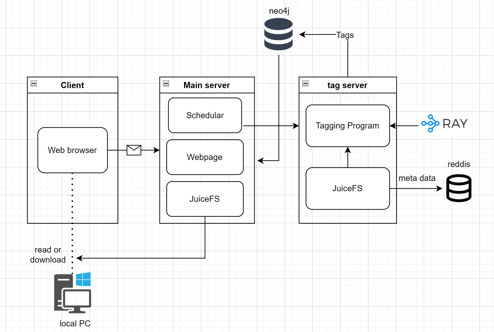

<!-- vscode-markdown-toc -->

# Final report

- **基于eBPF与DisGraFS的网络IO优化**
- 
- **FutureWithinBuzzyBees!**

##  1. Contents
* 1. [Contents](#Contents)
* 2. [DisgraFS](#DisgraFS)
	* 2.1. [Previous Version](#PreviousVersion)
	* 2.2. [Our Version](#OurVersion)
* 3. [eBPF's Solution](#eBPFsSolution)
	* 3.1. [Theory](#Theory)
		* 3.1.1. [网络传输](#)
		* 3.1.2. [eBPF基本思路](#eBPF)
	* 3.2. [XDP](#XDP)
		* 3.2.1. [http_filter](#http_filter)
		* 3.2.2. [CPU's balance](#CPUsbalance)
		* 3.2.3. [socket_redirect](#socket_redirect)
		* 3.2.4. [AFXDP](#AFXDP)
		* 3.2.5. [性能监测](#-1)
* 4. [展望](#-1)

##  2. DisgraFS

###  2.1. Previous Version

- 客户端依赖大(需要客户端安装JuiceFS)
- 无法真正上传/下载文件

###  2.2. Our Version

- 摆脱客户端依赖(只需服务器部署JuiceFS)
- 实现真正上传/下载文件

##  3. eBPF's Solution

###  3.1. Theory
- target "accelerating Cloud Native applications"
随着实时应用程序对实时性越来越高，人们不断渴求于性能增强，以加快服务速度。此处使用eBPF加速后端各种微服务之间的通信。

####  3.1.1. 网络传输

####  3.1.2. eBPF基本思路

> "BPF允许将用户定义的过滤器转换为指令，这些指令在内核内的具有小寄存器集的简单VM内运行，并指定拒绝或接受网络数据包的哪个子集。在指令集中构建了安全功能（例如，没有无限循环来保证有界完成等）.
> 
> 上述BPF，后来被称为“经典”BPF，被扩展为具有增强的指令集、新功能，包括支持在内核中挂接多个事件、除了数据包过滤之外的操作、提高性能的实时汇编程序，以及用于在内核中注入代码的字节码优化器和验证器（请参阅此处的详细信息）。其结果是一个通用的数据包过滤器框架，可用于在Linux内核中注入BPF程序，以在运行时扩展其功能。这种增强形式被称为扩展BPF或eBPF"

eBPF正被广泛用于使用内核跟踪（kprobes/tracing）的可观察性，因为内核中的代码运行速度极快（不涉及上下文切换），而且由于它是基于事件的，因此更准确。此外，eBPF正在一些环境中使用，在这些环境中，基于IP地址的传统安全监控和访问控制是不够的（例如，在基于容器的环境中，如Kubernetes）。在图1中，可以看到Linux内核中的各种挂钩，其中eBPF程序可以挂钩执行。

- kernel space component:其中需要根据一些内核事件进行决策或数据收集，例如nic上的packet rx、生成shell的系统调用等。
- user space component:可以在其中访问由内核代码以某种共享数据结构（映射等）编写的数据。
  

Linux内核支持不同类型的eBPF程序，每个程序都可以连接到内核中可用的特定挂钩（见图1）。这些程序在与这些挂钩相关联的事件被触发时执行，例如，进行诸如setsockopt（）之类的系统调用，网络驱动程序在数据包缓冲描述符的DMA之后挂钩XDP，等等。

所有类型都在内核/include/uapi/linux/bpf.h头文件中枚举，其中包含eBPF程序所需的面向用户的定义。

###  3.2. XDP

####  3.2.1. http_filter

####  3.2.2. CPU's balance

####  3.2.3. socket_redirect
在sockect_redirect中实现了当应用程序位于同一主机上时，使应用程序能够使用eBPF透明地绕过TCP/IP堆栈。

使用eBPF进行网络加速,研究套接字数据重定向的机制
####  3.2.4. AFXDP

####  3.2.5. 性能监测

##  4. 展望

