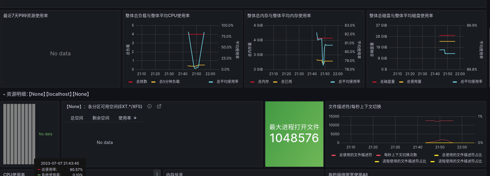

<!-- vscode-markdown-toc -->

# Final report


- **基于eBPF与DisGraFS的网络IO优化**
- 
- **FutureWithinBuzzyBees!**

##  1. <a name='Contents'></a>Contents
* 1. [Contents](#Contents)
* 2. [DisgraFS](#DisgraFS)
	* 2.1. [Previous Version](#PreviousVersion)
	* 2.2. [Our Version](#OurVersion)
* 3. [eBPF's Solution](#eBPFsSolution)
	* 3.1. [Theory](#Theory)
		* 3.1.1. [网络传输](#)
		* 3.1.2. [eBPF基本思路](#eBPF)
	* 3.2. [XDP](#XDP)
		* 3.2.1. [http_filter](#http_filter)
		* 3.2.2. [CPU's balance](#CPUsbalance)
		* 3.2.3. [socket_redirect](#socket_redirect)
		* 3.2.4. [AFXDP](#AFXDP)
		* 3.2.5. [性能监测](#-1)
* 4. [展望](#-1)


##  2. <a name='DisgraFS'></a>DisgraFS

###  2.1. <a name='PreviousVersion'></a>Previous Version


- 客户端依赖大(需要客户端安装JuiceFS)
- 无法真正上传/下载文件


###  2.2. <a name='OurVersion'></a>Our Version


- 摆脱客户端依赖(只需服务器部署JuiceFS)
- 实现真正上传/下载文件


##  3. <a name='eBPFsSolution'></a>eBPF's Solution

###  3.1. <a name='Theory'></a>Theory
- target "accelerating Cloud Native applications"
随着实时应用程序对实时性越来越高，人们不断渴求于性能增强，以加快服务速度。此处使用eBPF加速后端各种微服务之间的通信。

####  3.1.1. <a name=''></a>网络传输


####  3.1.2. <a name='eBPF'></a>eBPF基本思路

> "BPF允许将用户定义的过滤器转换为指令，这些指令在内核内的具有小寄存器集的简单VM内运行，并指定拒绝或接受网络数据包的哪个子集。在指令集中构建了安全功能（例如，没有无限循环来保证有界完成等）.
> 
> 上述BPF，后来被称为“经典”BPF，被扩展为具有增强的指令集、新功能，包括支持在内核中挂接多个事件、除了数据包过滤之外的操作、提高性能的实时汇编程序，以及用于在内核中注入代码的字节码优化器和验证器（请参阅此处的详细信息）。其结果是一个通用的数据包过滤器框架，可用于在Linux内核中注入BPF程序，以在运行时扩展其功能。这种增强形式被称为扩展BPF或eBPF"

eBPF正被广泛用于使用内核跟踪（kprobes/tracing）的可观察性，因为内核中的代码运行速度极快（不涉及上下文切换），而且由于它是基于事件的，因此更准确。此外，eBPF正在一些环境中使用，在这些环境中，基于IP地址的传统安全监控和访问控制是不够的（例如，在基于容器的环境中，如Kubernetes）。在图1中，可以看到Linux内核中的各种挂钩，其中eBPF程序可以挂钩执行。


- kernel space component:其中需要根据一些内核事件进行决策或数据收集，例如nic上的packet rx、生成shell的系统调用等。
- user space component:可以在其中访问由内核代码以某种共享数据结构（映射等）编写的数据。
  

Linux内核支持不同类型的eBPF程序，每个程序都可以连接到内核中可用的特定挂钩（见图1）。这些程序在与这些挂钩相关联的事件被触发时执行，例如，进行诸如setsockopt（）之类的系统调用，网络驱动程序在数据包缓冲描述符的DMA之后挂钩XDP，等等。

所有类型都在内核/include/uapi/linux/bpf.h头文件中枚举，其中包含eBPF程序所需的面向用户的定义。

###  3.2. <a name='XDP'></a>XDP

####  3.2.1. <a name='http_filter'></a>http_filter

一个实例:解析HTTP数据包并提取（并打印）GET/POST请求中包含的URL。通过该实例我们可以观察eBPF是如何处理网络数据流的.

原理是基于bcc工具链中的http_filter对http请求进行拦截并解析http Header(相当于创建一个BPF虚拟机使用套接字接受http请求),注意到linux内核提供了`BPF.SOCKET_FILTER`接口，接受到packet后计算`payload_offset = ETH_HLEN + ip_header_length + tcp_header_length;`,然后通过`load_byte()`,按字节读入header.随后对header进行解析即可

```c
int http_filter(struct __sk_buff *skb) ;
//eBPF读入packet方法
int load_byte();
//BPF_map<Key, Leaf>
BPF_TABLE(map_type, key_type, leaf_type, table_name, num_entry)
```

####  3.2.2. <a name='CPUsbalance'></a>CPU's balance
实现对传入数据包的动态负载均衡。通过将传入的数据包在多个CPU之间均衡分配，可以达到以下几个方面的用处：

1. 提高系统的并发处理能力：通过将数据包分散到多个CPU上处理，可以提高系统的并发处理能力。每个CPU都可以独立地处理一部分数据包，从而减轻单个CPU的负载压力，提高系统的吞吐量和响应能力。
2. 平衡负载：动态负载均衡可以根据每个CPU的当前负载情况，将数据包分配给负载较轻的CPU。这样可以避免某些CPU负载过高，而其他CPU负载较低的情况，实现系统资源的合理分配，提高系统的整体性能和效率。
3. 提高系统的容错性：通过将数据包分散到多个CPU上处理，即使其中一个CPU出现故障或负载过高，其他CPU仍然可以继续处理数据包，确保系统的可用性和稳定性。
4. 灵活配置权重：使用了权重值来配置每个CPU的处理能力。通过调整不同CPU的权重值，可以根据实际需求分配不同的计算资源。较高权重的CPU将处理更多的数据包，从而充分利用其处理能力。

BPF映射类型的运用

在 eBPF 程序中，不能直接使用传统的 C 语言数组或数据结构，因为 eBPF 程序是在内核中执行的，而不是在用户空间中执行。由于内核和用户空间有不同的内存访问限制和安全机制，因此需要使用特定的数据结构和操作来进行数据的处理和存储。

1. BPF_CPUMAP 类型的映射表 (`BPF_CPUMAP(cpumap, __MAX_CPU__)`)： 这个映射表用于将数据包重定向到不同的 CPU。每个键值对表示一个数据包，其中键是数据包的索引或标识，值是数据包应该重定向到的目标 CPU 的索引。这里选择使用 BPF_CPUMAP 类型，是因为它提供了在 eBPF 程序中进行 CPU 映射的功能。
2. BPF_ARRAY 类型的数组 (`BPF_ARRAY(dest, uint32_t, 1)`)： 这个数组用于存储每个数据包的目标 CPU 索引。因为每个数据包只需要存储一个目标 CPU 的索引，所以数组的大小为 1。选择使用 BPF_ARRAY 类型，是因为它提供了在 eBPF 程序中进行数组操作的功能，可以方便地读取和修改数组元素的值。
3. BPF_PERCPU_ARRAY 类型的数组 (`BPF_PERCPU_ARRAY(rxcnt, long, 1)`)： 这个数组用于记录每个 CPU 上接收到的数据包数量。因为每个 CPU 都需要记录自己接收到的数据包数量，所以使用 BPF_PERCPU_ARRAY 类型，它提供了在 eBPF 程序中进行多个 CPU 计数的功能。每个数组元素都会分配给一个 CPU，因此可以并发地更新计数器，而不会出现竞争条件。

通过选择不同类型的数据结构，可以使 eBPF 程序更加灵活地处理数据，并根据需要进行数据的映射、存储和计数。这些数据结构提供了 eBPF 程序所需的功能和性能，以满足特定的需求和使用场景。

利用grafana进行性能检测：



下面进行性能的对比

####  3.2.3. <a name='socket_redirect'></a>socket_redirect

在sockect_redirect中实现了当应用程序位于同一主机上时，使应用程序能够使用eBPF透明地绕过TCP/IP堆栈。

使用eBPF进行网络加速,研究套接字数据重定向的机制.

1. 使用LLVM Clang前端编译sockops BPF代码，该代码更新sockhash映射
2. 使用bpftool将上面编译的代码附加到cgroup，以便为系统中的所有套接字操作（如建立连接等）调用它。
3. 提取由上述程序创建的sockhash映射的id，并将该映射固定到虚拟文件系统，使得第二eBPF程序
4. 可以访问该map.编译tcpip_bypass代码，该代码将绕过tcpip堆栈
5. 执行套接字数据重定向。使用bpftool将上述eBPF代码附加到sockhash映射

- BPF钩子挂载:


- BPF共享maps:

```bash
#sudo tree /sys/fs/bpf/
/sys/fs/bpf/
├── bpf_sockops
├── bpf_tcpip_bypass
└── sock_ops_map
# sudo bpftool map list
4: sockhash  name sock_ops_map  flags 0x0
        key 24B  value 4B  max_entries 65535  memlock 2097152B
```

- 验证应用程序是否绕过TCP/IP堆栈：

可以将内核实时流跟踪文件trace_pipe放入shell中，以监视通过eBPF的TCP通信的跟踪
```bash
# sudo cat /sys/kernel/debug/tracing/trace_pipe
  <idle>-0       [000] d.s.1 89797.577008: bpf_trace_printk: <<< ipv4 op = 4, port 38902 --> 80
  <idle>-0       [000] d.s.1 89863.993725: bpf_trace_printk: <<< ipv4 op = 4, port 58380 --> 443
...
```
我们可以使用SOCAT派生的TCP侦听器来模拟echo服务器，并使用netcat来发送TCP连接请求。

```bash
sudo socat TCP4-LISTEN:1000,fork exec:cat
nc localhost 1000 # this should produce the trace in the kernel file trace_pipe
```
可以监测结果
```shell
# sudo cat /sys/kernel/debug/tracing/trace_pipe
        <idle>-0       [000] d.s.1 91597.541404: bpf_trace_printk: <<< ipv4 op = 4, port 40762 --> 80
        node-126065  [000] d.s.1 91598.729170: bpf_trace_printk: <<< ipv4 op = 4, port 38678 --> 443
        nc-132366  [000] d...1 91639.938416: bpf_trace_printk: <<< ipv4 op = 4, port 38838 --> 1000
        nc-132366  [000] d.s11 91639.938514: bpf_trace_printk: <<< ipv4 op = 5, port 1000 --> 38838
```

####  3.2.4. <a name='AFXDP'></a>AFXDP

####  3.2.5. <a name='-1'></a>性能监测

##  4. <a name='-1'></a>展望

