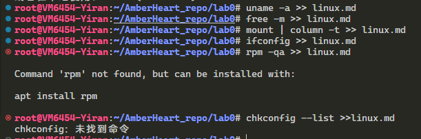

# 将linux设备信息输出到linux.md中

Linux VM6454-Yiran 5.15.85-1-pve #1 SMP PVE 5.15.85-1 (2023-02-01T00:00Z) x86_64 x86_64 x86_64 GNU/Linux
              总计         已用        空闲      共享    缓冲/缓存    可用
内存：        4096         430        2859          14         806        3665
交换：           0           0           0
/dev/mapper/user--data-vm--6454--disk--0  on  /                                type  ext4         (rw,relatime,stripe=256)
/dev/mapper/pve-vlab--software            on  /opt/vlab                        type  ext4         (ro,relatime,errors=remount-ro,stripe=16)
none                                      on  /dev                             type  tmpfs        (rw,relatime,size=492k,mode=755,uid=100000,gid=100000,inode64)
proc                                      on  /proc                            type  proc         (rw,nosuid,nodev,noexec,relatime)
proc                                      on  /proc/sys/net                    type  proc         (rw,nosuid,nodev,noexec,relatime)
proc                                      on  /proc/sys                        type  proc         (ro,relatime)
proc                                      on  /proc/sysrq-trigger              type  proc         (ro,relatime)
sysfs                                     on  /sys                             type  sysfs        (ro,nosuid,nodev,noexec,relatime)
sysfs                                     on  /sys/devices/virtual/net         type  sysfs        (rw,nosuid,nodev,noexec,relatime)
fusectl                                   on  /sys/fs/fuse/connections         type  fusectl      (rw,nosuid,nodev,noexec,relatime)
debugfs                                   on  /sys/kernel/debug                type  debugfs      (rw,nosuid,nodev,noexec,relatime)
securityfs                                on  /sys/kernel/security             type  securityfs   (rw,nosuid,nodev,noexec,relatime)
pstore                                    on  /sys/fs/pstore                   type  pstore       (rw,nosuid,nodev,noexec,relatime)
mqueue                                    on  /dev/mqueue                      type  mqueue       (rw,relatime)
efivarfs                                  on  /sys/firmware/efi/efivars        type  efivarfs     (rw,nosuid,nodev,noexec,relatime)
binfmt_misc                               on  /proc/sys/fs/binfmt_misc         type  binfmt_misc  (rw,nosuid,nodev,noexec,relatime)
proc                                      on  /dev/.lxc/proc                   type  proc         (rw,relatime)
sys                                       on  /dev/.lxc/sys                    type  sysfs        (rw,relatime)
none                                      on  /sys/fs/cgroup                   type  cgroup2      (rw,nosuid,nodev,noexec,relatime)
lxcfs                                     on  /proc/cpuinfo                    type  fuse.lxcfs   (rw,nosuid,nodev,relatime,user_id=0,group_id=0,allow_other)
lxcfs                                     on  /proc/diskstats                  type  fuse.lxcfs   (rw,nosuid,nodev,relatime,user_id=0,group_id=0,allow_other)
lxcfs                                     on  /proc/loadavg                    type  fuse.lxcfs   (rw,nosuid,nodev,relatime,user_id=0,group_id=0,allow_other)
lxcfs                                     on  /proc/meminfo                    type  fuse.lxcfs   (rw,nosuid,nodev,relatime,user_id=0,group_id=0,allow_other)
lxcfs                                     on  /proc/slabinfo                   type  fuse.lxcfs   (rw,nosuid,nodev,relatime,user_id=0,group_id=0,allow_other)
lxcfs                                     on  /proc/stat                       type  fuse.lxcfs   (rw,nosuid,nodev,relatime,user_id=0,group_id=0,allow_other)
lxcfs                                     on  /proc/swaps                      type  fuse.lxcfs   (rw,nosuid,nodev,relatime,user_id=0,group_id=0,allow_other)
lxcfs                                     on  /proc/uptime                     type  fuse.lxcfs   (rw,nosuid,nodev,relatime,user_id=0,group_id=0,allow_other)
lxcfs                                     on  /sys/devices/system/cpu          type  fuse.lxcfs   (rw,nosuid,nodev,relatime,user_id=0,group_id=0,allow_other)
udev                                      on  /dev/full                        type  devtmpfs     (rw,nosuid,relatime,size=115336564k,nr_inodes=28834141,mode=755,inode64)
udev                                      on  /dev/null                        type  devtmpfs     (rw,nosuid,relatime,size=115336564k,nr_inodes=28834141,mode=755,inode64)
udev                                      on  /dev/random                      type  devtmpfs     (rw,nosuid,relatime,size=115336564k,nr_inodes=28834141,mode=755,inode64)
udev                                      on  /dev/tty                         type  devtmpfs     (rw,nosuid,relatime,size=115336564k,nr_inodes=28834141,mode=755,inode64)
udev                                      on  /dev/urandom                     type  devtmpfs     (rw,nosuid,relatime,size=115336564k,nr_inodes=28834141,mode=755,inode64)
udev                                      on  /dev/zero                        type  devtmpfs     (rw,nosuid,relatime,size=115336564k,nr_inodes=28834141,mode=755,inode64)
devpts                                    on  /dev/pts                         type  devpts       (rw,nosuid,noexec,relatime,gid=100005,mode=620,ptmxmode=666,max=1026)
devpts                                    on  /dev/ptmx                        type  devpts       (rw,nosuid,noexec,relatime,gid=100005,mode=620,ptmxmode=666,max=1026)
devpts                                    on  /dev/console                     type  devpts       (rw,nosuid,noexec,relatime,gid=100005,mode=620,ptmxmode=666,max=1026)
devpts                                    on  /dev/tty1                        type  devpts       (rw,nosuid,noexec,relatime,gid=100005,mode=620,ptmxmode=666,max=1026)
devpts                                    on  /dev/tty2                        type  devpts       (rw,nosuid,noexec,relatime,gid=100005,mode=620,ptmxmode=666,max=1026)
none                                      on  /proc/sys/kernel/random/boot_id  type  tmpfs        (ro,nosuid,nodev,noexec,relatime,size=492k,mode=755,uid=100000,gid=100000,inode64)
tmpfs                                     on  /dev/shm                         type  tmpfs        (rw,nosuid,nodev,uid=100000,gid=100000,inode64)
tmpfs                                     on  /run                             type  tmpfs        (rw,nosuid,nodev,size=23074536k,mode=755,uid=100000,gid=100000,inode64)
tmpfs                                     on  /run/lock                        type  tmpfs        (rw,nosuid,nodev,noexec,relatime,size=5120k,uid=100000,gid=100000,inode64)
tmpfs                                     on  /run/user/0                      type  tmpfs        (rw,nosuid,nodev,relatime,size=23074532k,mode=700,uid=100000,gid=100000,inode64)
eth0: flags=4163<UP,BROADCAST,RUNNING,MULTICAST>  mtu 1500
        inet 172.31.254.100  netmask 255.255.0.0  broadcast 172.31.255.255
        inet6 2001:da8:d800:4bfc:90fc:a1ff:fef8:2e8d  prefixlen 64  scopeid 0x0<global>
        inet6 fe80::90fc:a1ff:fef8:2e8d  prefixlen 64  scopeid 0x20<link>
        ether 92:fc:a1:f8:2e:8d  txqueuelen 1000  (以太网)
        RX packets 419874  bytes 174552463 (174.5 MB)
        RX errors 0  dropped 0  overruns 0  frame 0
        TX packets 66684  bytes 17238733 (17.2 MB)
        TX errors 0  dropped 0 overruns 0  carrier 0  collisions 0

lo: flags=73<UP,LOOPBACK,RUNNING>  mtu 65536
        inet 127.0.0.1  netmask 255.0.0.0
        inet6 ::1  prefixlen 128  scopeid 0x10<host>
        loop  txqueuelen 1000  (本地环回)
        RX packets 40620  bytes 19136144 (19.1 MB)
        RX errors 0  dropped 0  overruns 0  frame 0
        TX packets 40620  bytes 19136144 (19.1 MB)
        TX errors 0  dropped 0 overruns 0  carrier 0  collisions 0

